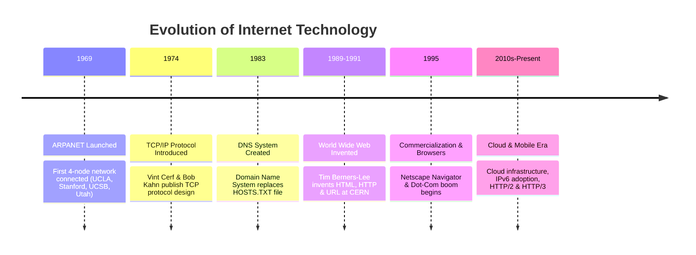
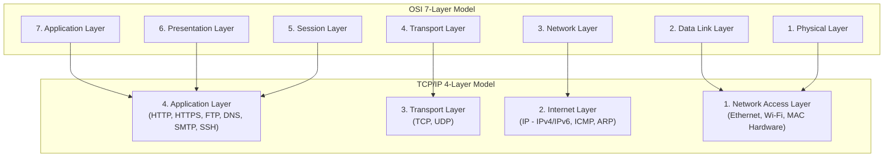
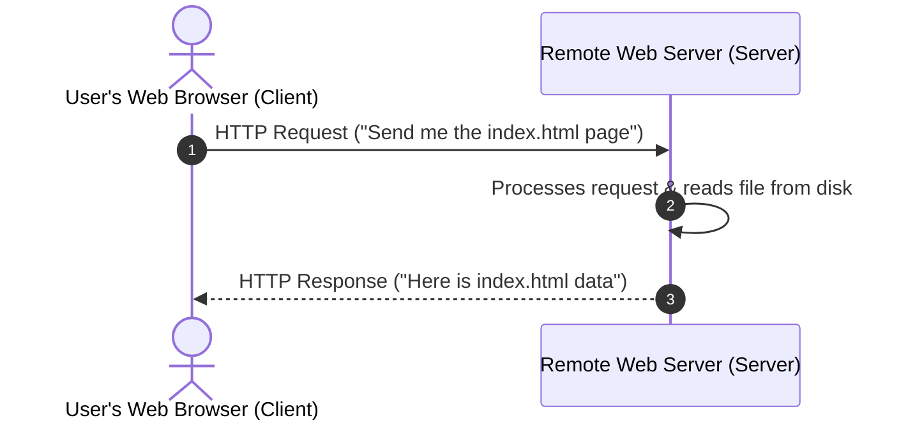

# Class 01: History of the Internet, Concepts, Architecture & TCP/IP Protocol Suite

**Course:** Web Technology & Cloud Computing Applications – I  
**Unit:** Unit I - Exploring History, Internet Concepts, Architecture & Protocols  
**Target Duration:** 2 Hours (120 Minutes Continuous Session)  
**Self-Study Guide:** Designed for complete self-study. Every technical term is explained with simple real-world analogies without omitting any technical depth.

---

## 1. Class Session Objectives
By reading and studying this lecture guide line-by-line, you will be able to:
1. Explain the historical milestones leading to the modern Internet (ARPANET to modern web).
2. Differentiate between fundamental internetworking concepts (LAN, WAN, Routers, Gateways, Nodes, Hosts).
3. Deconstruct the layered architecture of the TCP/IP protocol suite and compare it with the 7-Layer OSI Model.
4. Trace data encapsulation and decapsulation across the 4 layers of TCP/IP.
5. Differentiate between connection-oriented reliable data delivery (**TCP**) and connectionless fast data delivery (**UDP**).

---

## 2. Recommended 2-Hour Time Allocation

| Time Range | Duration | Activity / Teaching Strategy |
|---|---|---|
| **00:00 - 00:20** | 20 Mins | **Recap & Hook:** Discussion on "What happens when you type `google.com`?" History of ARPANET to modern WWW. |
| **00:20 - 00:50** | 30 Mins | **Deep Dive Theory:** Internet Architecture, Packets, Routers, Circuit vs Packet Switching, and TCP/IP 4-Layer Model. |
| **00:50 - 01:20** | 30 Mins | **Visual & Diagrammatic Walkthrough:** Mermaid flowchart analysis of OSI vs TCP/IP Layering & Encapsulation. |
| **01:20 - 01:45** | 25 Mins | **Whiteboard & Code Demonstration:** Packet Header Inspection, TCP vs UDP Node.js code breakdown. |
| **01:45 - 02:00** | 15 Mins | **Spot Quiz & Session Wrap-Up:** Questions for students (answers stored in `.agents/`), Next Class Teaser. |

---

## 3. Visual Flowcharts & Architectural Diagrams

### A. Historical Evolution Timeline of the Internet


### B. TCP/IP 4-Layer Model vs. 7-Layer OSI Model


### C. Circuit Switching vs. Packet Switching Mechanism
```mermaid
graph TD
    subgraph Circuit Switching (Legacy Telephone Network)
        C_Sender[Sender Computer] ===|Dedicated Physical Path Reserved| Sw1[Switch A] === Sw2[Switch B] === C_Receiver[Receiver Computer]
    end

    subgraph Packet Switching (Modern Internet Protocol)
        P_Sender[Sender File] --> P1[Packet 1 via Path A]
        P_Sender --> P2[Packet 2 via Path B]
        P_Sender --> P3[Packet 3 via Path C]
        
        P1 --> Router1[Router 1] --> Dest[Receiver Reassembles Packets]
        P2 --> Router2[Router 2] --> Dest
        P3 --> Router3[Router 3] --> Dest
    end
```

### D. Data Encapsulation and Decapsulation Protocol Stack
```mermaid
graph TD
    subgraph Encapsulation Process (Sender Side - Top to Bottom)
        S1["[ Application Data / Message ]"] --> S2["[ TCP Header | Application Data ] (Segment)"]
        S2 --> S3["[ IP Header | TCP Header | Application Data ] (Packet)"]
        S3 --> S4["[ Ethernet Header | IP Header | TCP Header | Application Data | Trailer ] (Frame)"]
    end
```

---

## 4. Key Jargon & Beginner Vocabulary Dictionary

> [!NOTE]
> * **Network:** A collection of two or more computers connected together (via cables or Wi-Fi) so they can share data and resources.
> * **Internet:** A global "network of networks" that connects billions of computers worldwide using standardized rules.
> * **Protocol:** A formal set of rules and conventions that dictates how computers format, transmit, receive, and process data. Think of it as a shared language.
> * **Host / Node:** Any device connected to a network (such as a laptop, smartphone, smart TV, or web server) that has an IP/MAC address and can send or receive data.
> * **Data Packet:** A small chunk of digital data into which larger files (like images or web pages) are split before being sent over a network.
> * **Router:** A specialized hardware device that operates at Layer 3 (Internet Layer), forwarding data packets between different networks along optimal paths.
> * **Gateway:** A network node that serves as an entrance/exit point between two completely different networks operating on different protocols.
> * **Bandwidth:** The maximum volume of data that can be transmitted over a network connection in a given amount of time (measured in Mbps or Gbps).
> * **Client:** A computer or software program (like Google Chrome) that requests services or information from another computer.
> * **Server:** A powerful computer program that runs continuously, waiting to respond to requests sent by client devices.

---

## 5. In-Depth Topic Breakdown

### 5.1 History & Evolution of the Internet

#### A. ARPANET (1969): The Genesis of Network Interconnection
In the late 1960s, during the Cold War era, the United States Department of Defense funded a research organization called **DARPA** (Defense Advanced Research Projects Agency). They wanted to build a decentralized communications network that could survive nuclear attacks or partial system failures.

In **1969**, they created **ARPANET** (Advanced Research Projects Agency Network). It initially linked just four computers located at four universities:
1. University of California, Los Angeles (UCLA)
2. Stanford Research Institute (SRI)
3. University of California, Santa Barbara (UCSB)
4. University of Utah

> [!TIP]
> **Historical Fact:** The very first message sent over ARPANET was intended to be the word **"LOGIN"**. However, the system crashed after transmitting just the first two letters! Thus, the first internet message ever transmitted was simply **"LO"**.

#### B. The Breakthrough: Circuit Switching vs. Packet Switching

To understand why the Internet works so well today, we must contrast two methods of sending information across a distance:

##### 1. Circuit Switching (The Old Telephone Network Method)
* **How it works:** When you made a traditional landline phone call, human operators or automated switches created a single, physical, unbroken circuit path dedicated exclusively to your call from start to finish.
* **Drawback:** While your call was active, no one else could use those wires. If you remained silent for 5 minutes during the phone call, the connection space was wasted. If any single wire along that path broke, the entire call dropped immediately.

##### 2. Packet Switching (The Modern Internet Method)
* **How it works:** Instead of reserving a dedicated physical circuit, the data you want to send (an email, a photograph, or a video file) is sliced up into thousands of tiny pieces called **Data Packets**.
* **Analogy:** Imagine sending a 500-page book to a friend in another city. Instead of sending the heavy book in one massive crate on a single truck, you tear out each page, put each page in a separate stamped envelope, address every envelope to your friend's home, and drop them into different post boxes.
* **Routing Flexibility:** Some envelopes might travel by train, others by airplane, and others by truck. They may arrive out of order (Page 12 arrives before Page 3). However, your friend looks at the page numbers printed on each envelope, reassembles them in exact sequence (Pages 1 to 500), and reads the book!
* **Why Packet Switching is Superior:** If one highway or network cable is cut, routers automatically redirect the remaining packets along alternative open paths. The connection is never lost!

---

### 5.2 Internetworking Concepts & Client-Server Architecture

* **Nodes & Hosts:** Any device connected to the network possessing an IP address and MAC address.
* **Routers & Gateways:** Devices operating at Layer 3 (Internet Layer) that forward data packets between disparate networks based on IP routing tables.
* **Client-Server Architecture:** Centralized servers listen on dedicated ports (e.g., Port 80 for HTTP, Port 443 for HTTPS) to process requests from client browsers.



---

### 5.3 Detailed TCP/IP Layer Breakdown

#### Summary Table of TCP/IP Layers, Data Units & Protocols:

| TCP/IP Layer | Primary Function | Data Unit Name | Key Protocols |
|---|---|---|---|
| **4. Application Layer** | User interface, higher-level application data exchange | Data / Message | HTTP, HTTPS, FTP, DNS, SSH, SMTP |
| **3. Transport Layer** | End-to-end communication, port addressing, flow control | Segment (TCP) / Datagram (UDP) | TCP, UDP |
| **2. Internet Layer** | Logical IP addressing & packet routing across networks | Packet | IP (IPv4/IPv6), ICMP, ARP |
| **1. Network Access Layer** | Physical transmission of raw bits over wire/air | Frame / Bits | Ethernet (802.3), Wi-Fi (802.11), MAC |

#### Detailed Layer-by-Layer Function Explanations:

1. **Layer 1: Network Access Layer (Link Layer)**
   * **What it does:** Deals with physical hardware cables (Ethernet cables, Fiber optics) and wireless signals (Wi-Fi, 4G/5G). It moves raw electronic signals, light pulses, or radio waves between adjacent physical network hardware.
   * **Hardware Address:** Uses **MAC Addresses** (Media Access Control Address), which are hardcoded unique hardware identifiers stamped onto your computer's network interface card at the factory (e.g., `AA:BB:CC:11:22:33`).

2. **Layer 2: Internet Layer (Network Layer)**
   * **What it does:** Responsible for addressing and routing data packets across multiple networks worldwide.
   * **Core Protocol:** **IP (Internet Protocol)**. IP assigns a unique logical IP address to every device (e.g., `192.168.1.1` or `142.250.190.46`). Routers inspect this layer to decide which network path a packet should take to reach its final destination.

3. **Layer 3: Transport Layer**
   * **What it does:** Ensures that data is successfully delivered from a specific application on the source computer to a specific application on the destination computer.
   * **Port Numbers:** Uses **Port Numbers** (like digital door numbers) to identify specific applications. For example: Port 80 = HTTP, Port 443 = HTTPS, Port 25 = SMTP.
   * **Two Core Protocols:**
     1. **TCP (Transmission Control Protocol):** Connection-oriented and 100% reliable. It guarantees that all packets arrive without errors and in exact order.
     2. **UDP (User Datagram Protocol):** Connectionless and fast. It sends data without checking if the recipient received it (used for live gaming, video calls, audio streaming).

4. **Layer 4: Application Layer**
   * **What it does:** The top layer that directly interacts with software applications (like your browser, email client, or file transfer program).
   * **Protocols:** Includes **HTTP/HTTPS** (web browsing), **FTP** (file transfers), **SMTP** (sending emails), and **DNS** (converting domain names to IP addresses).

---

### 5.4 Data Encapsulation & Decapsulation Process

How does data move down from Layer 4 to Layer 1 when sending, and up from Layer 1 to Layer 4 when receiving? Through **Encapsulation**!

> [!IMPORTANT]
> **Analogy of Encapsulation:** Imagine you write a letter (Application Data).
> 1. You put the letter into an inner envelope and write port numbers on it (**Transport Layer - Segment**).
> 2. You place that inside a larger mail envelope and write source/destination IP addresses on it (**Internet Layer - Packet**).
> 3. You place that inside a sturdy shipping container stamped with physical hardware addresses (**Network Access Layer - Frame**).
> 4. The shipping container travels across the ocean/wire (**Physical Bits**).

When the recipient receives the container, they perform **Decapsulation**: they peel off each outer envelope layer step-by-step until they read your original letter!

---

## 6. Practical Protocol Inspection & Code Examples

### A. TCP vs UDP Protocol Comparison (Node.js Simulated Example)

#### 1. TCP Connection Example (Reliable, Handshake, Connection-Oriented)

In TCP, a connection must be established via a **3-Way Handshake** (`SYN` $\rightarrow$ `SYN-ACK` $\rightarrow$ `ACK`) before any real data can be transferred.

```javascript
// TCP Connection Example (Reliable, Handshake, Connection-Oriented)
const net = require('net');

const tcpServer = net.createServer((socket) => {
    console.log('Client connected via TCP 3-Way Handshake');
    socket.write('ACK: Connected to TCP Server\n');
    socket.on('data', (data) => {
        console.log('Received Data Guaranteed Order:', data.toString());
    });
});

tcpServer.listen(8080, () => {
    console.log('TCP Server listening on port 8080');
});
```

##### Line-by-Line Code Breakdown:
1. `const net = require('net');`: Loads Node.js's native networking module for handling Layer 3/4 TCP connections.
2. `net.createServer(...)`: Creates a TCP server that waits for clients to perform the 3-Way Handshake connection routine.
3. `socket.write(...)`: Transmits guaranteed data packets down the established TCP socket stream.
4. `tcpServer.listen(8080)`: Opens Port 8080 on the computer so incoming TCP requests can reach this specific program.

---

#### 2. UDP Socket Example (Fast, Connectionless, Unreliable)

In UDP, there is **no handshake** and **no connection check**. The server simply blasts data packets onto the network. If packets get dropped or arrive out of order, UDP does not retransmit them.

```javascript
// UDP Socket Example (Fast, Connectionless, Unreliable)
const dgram = require('dgram');
const udpServer = dgram.createSocket('udp4');

udpServer.on('message', (msg, rinfo) => {
    console.log(`UDP Packet received from ${rinfo.address}:${rinfo.port} -> ${msg.toString()}`);
});

udpServer.bind(41234, () => {
    console.log('UDP Server bound to port 41234');
});
```

##### Line-by-Line Code Breakdown:
1. `const dgram = require('dgram');`: Loads Node.js's datagram module used for lightweight UDP communication.
2. `dgram.createSocket('udp4')`: Creates an IPv4 UDP socket. Notice there is no `connect` event because UDP does not establish connections!
3. `udpServer.on('message', ...)`: Triggers whenever a UDP datagram packet lands on port 41234, regardless of who sent it.

---

## 7. Interactive Discussion & Spot Quiz

### Discussion Questions
1. Why did the Internet adopt Packet Switching over Circuit Switching?
2. Compare TCP and UDP: Why is streaming live video preferred on UDP while web browsing requires TCP?

### Spot Quiz
1. Which layer of the TCP/IP model is responsible for assigning source and destination IP addresses to data packets?
   - A) Application Layer
   - B) Transport Layer
   - C) Internet Layer
   - D) Network Access Layer
2. What are the three flags used in the TCP 3-Way Handshake?
   - A) PING, PONG, ACK
   - B) SYN, SYN-ACK, ACK
   - C) REQ, RES, CLOSE
   - D) START, DATA, STOP

---

## 8. Class Summary & Next Session Teaser

* **Summary:** Today we covered the origins of ARPANET, the fundamental shift to packet switching, the 4-layer TCP/IP model vs 7-layer OSI model, and how protocols at each layer cooperate through Encapsulation to transmit data across global networks.
* **Next Class Teaser (Class 02):** Next session we will explore **IP Addressing (IPv4 vs IPv6)**, Subnetting basics, the **Domain Name System (DNS)** resolution hierarchy, and how URLs map to IP addresses across the WWW!
