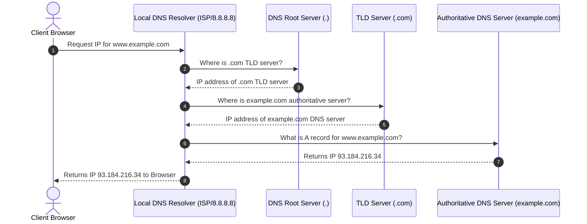
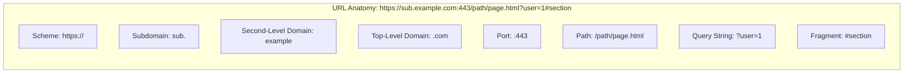
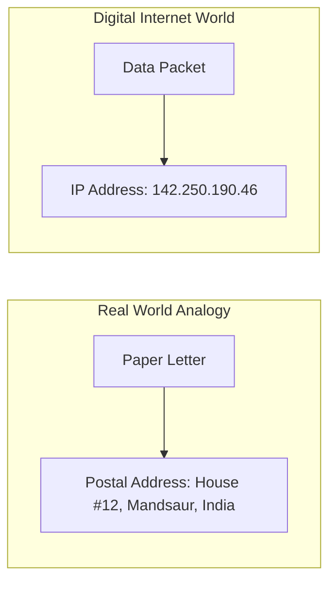

# Class 02: Internet Addressing (IPv4/IPv6), DNS Hierarchy & Structure of WWW

**Course:** Web Technology & Cloud Computing Applications – I  
**Unit:** Unit I - Exploring History, Internet Concepts, Architecture & Protocols  
**Target Duration:** 2 Hours (120 Minutes Continuous Session)  
**Self-Study Guide:** Designed for complete self-study. Every technical term is explained with simple real-world analogies without omitting any technical depth.

---

## 1. Class Session Objectives
By the end of this 2-hour continuous session, students will be able to:
1. Distinguish between IPv4 and IPv6 addressing formats and address space calculations.
2. Analyze Domain Name System (DNS) architecture and step-by-step recursive query resolution.
3. Understand Domain Name structures (TLD, SLD, Subdomain, Root servers).
4. Explain the core components and architecture of the World Wide Web (WWW).

---

## 2. Recommended 2-Hour Time Allocation

| Time Range | Duration | Activity / Teaching Strategy |
|---|---|---|
| **00:00 - 00:20** | 20 Mins | **Recap & Hook:** Review TCP/IP layers. Interactive demonstration using `ping` and `nslookup` in command prompt. |
| **00:20 - 00:50** | 30 Mins | **Deep Dive Theory:** IPv4 octets, Classes (A-E), IPv6 HEX notation, DNS Root Servers & TLDs. |
| **00:50 - 01:20** | 30 Mins | **Visual Diagram Breakdown:** Mermaid sequence diagram tracing a full DNS lookup workflow. |
| **01:20 - 01:45** | 25 Mins | **Hands-On Code / Terminal Exercise:** Tracing IP routes with `tracert` / `dig` and parsing URL components. |
| **01:45 - 02:00** | 15 Mins | **Spot Quiz & Session Wrap-Up:** Student quiz questions, Next Class Teaser. |

---

## 3. Visual Flowcharts & Architectural Diagrams

### A. Recursive DNS Resolution Sequence Diagram


### B. URL Anatomy & Domain Structure


### C. Conceptual IP Address Mapping Analogy


---

## 4. Key Jargon & Beginner Vocabulary Dictionary

> [!NOTE]
> * **IP Address (Internet Protocol Address):** A unique numerical label assigned to every computer or device connected to a network, allowing devices to locate and communicate with one another.
> * **IPv4 (IP Version 4):** A 32-bit numerical addressing system written as 4 numbers separated by dots (e.g., `192.168.1.1`).
> * **IPv6 (IP Version 6):** A modern 128-bit hexadecimal addressing system created to replace IPv4, written as 8 groups of 4 hexadecimal digits separated by colons (e.g., `2001:0db8:85a3::8a2e:0370:7334`).
> * **DNS (Domain Name System):** An internet service that translates human-readable web addresses (like `google.com`) into computer-readable IP addresses (like `142.250.190.46`).
> * **TLD (Top-Level Domain):** The suffix at the very end of a domain name, such as `.com`, `.org`, `.edu`, or `.in`.
> * **Authoritative Name Server:** The final, definitive DNS server that holds the master IP address record for a specific website domain.
> * **URL (Uniform Resource Locator):** The complete web address typed into a browser to retrieve a specific web page or resource (e.g., `https://www.meu.edu.in/courses/bca`).
> * **Port Number:** A numerical identifier (0 to 65535) added to an IP address to specify which specific program or service should handle incoming traffic on a server.

---

## 5. In-Depth Topic Breakdown

### 5.1 IP Addressing: IPv4 vs IPv6

Imagine you want to send a physical paper letter to a friend. You cannot just write their name on the envelope and drop it into a mailbox. The post office requires a street address, house number, city, and postal pincode. Similarly, every computer connected to the Internet requires a unique address so routers know where to deliver data packets. This is called an **IP Address**.

#### Detailed Comparison Matrix:

| Parameter | IPv4 | IPv6 |
|---|---|---|
| **Address Length** | 32 Bits (4 Bytes) | 128 Bits (16 Bytes) |
| **Address Space** | $2^{32} \approx 4.3 \times 10^9$ (4.3 Billion) | $2^{128} \approx 3.4 \times 10^{38}$ (340 Undecillion) |
| **Format Notation** | Dotted Decimal (e.g., `192.168.1.1`) | Hexadecimal Colons (e.g., `2001:0db8:85a3::8a2e:0370:7334`) |
| **Header Size** | Variable (20 to 60 Bytes) | Fixed (40 Bytes) |
| **Configuration** | Manual or via DHCP | SLAAC (Stateless) or DHCPv6 |

#### A. IPv4 (Internet Protocol Version 4)
* **Structure:** 32-bit binary addressing scheme divided into 4 blocks called **Octets** (each 8 bits long) and converted to decimal numbers separated by dots.
* **Example:** `192.168.1.1`
* **Address Capacity Calculation:**
  $$\text{Total IPv4 Addresses} = 2^{32} \approx 4,294,967,296 \text{ (approx. 4.3 Billion Addresses)}$$

> [!WARNING]
> **The IPv4 Exhaustion Problem:** In 1983, 4.3 billion addresses seemed like more than enough for the entire world! However, with the explosion of smartphones, laptops, smart TVs, IoT devices, and cloud servers, the world completely ran out of unassigned IPv4 addresses in 2011.

#### B. IPv6 (Internet Protocol Version 6)
* **Structure:** 128-bit addressing scheme written in hexadecimal notation (numbers $0\text{--}9$ and letters $A\text{--}F$) separated by colons.
* **Example:** `2001:0db8:85a3:0000:0000:8a2e:0370:7334`
* **Address Capacity Calculation:**
  $$\text{Total IPv6 Addresses} = 2^{128} \approx 3.4 \times 10^{38} \text{ (340 Undecillion Addresses!)}$$

---

### 5.2 DNS Record Types

* **A Record:** Maps domain name to an IPv4 address.
* **AAAA Record:** Maps domain name to an IPv6 address.
* **CNAME (Canonical Name):** Alias pointing one domain name to another domain.
* **MX (Mail Exchange):** Directs emails to specified mail servers.
* **NS (Name Server):** Specifies authoritative DNS servers for the domain.
* **TXT Record:** Holds arbitrary text data (used for SPF, DKIM, domain ownership validation).

---

### 5.3 Detailed Step-by-Step Recursive DNS Resolution Workflow

When you type `www.example.com` into your browser, what happens behind the scenes in the 100 milliseconds before the web page loads? A 4-step lookup takes place across four types of DNS servers:

1. **DNS Recursive Resolver (ISP or Public DNS like 8.8.8.8):** The first server your computer asks. It acts like a helpful librarian who goes out and searches for the answer on your behalf.
2. **Root Name Server (`.`):** There are 13 main root server clusters worldwide. The root server does not know the exact IP address, but it directs the resolver to the correct Top-Level Domain (TLD) server.
3. **TLD Name Server (`.com`):** Manages all domains ending in a specific extension (e.g., `.com`, `.edu`, `.in`). It directs the resolver to the authoritative server hosting that domain.
4. **Authoritative Name Server:** The final destination! It holds the actual master DNS records (like the **A Record**) and returns the exact IP address (`93.184.216.34`) back to the resolver.

---

### 5.4 Anatomy of a Uniform Resource Locator (URL)

A **URL** is the complete web address used to find a specific web page or file. Let's break down each component of a complex URL:

```
https://sub.example.com:443/path/page.html?user=1#section
```

1. **Scheme / Protocol (`https://`):** Specifies the language/protocol used to access the resource (HTTPS = Secure Web).
2. **Subdomain (`sub.`):** A sub-division of the main domain used to organize distinct sections of a website (e.g., `mail.google.com` or `lms.meu.edu.in`).
3. **Second-Level Domain / SLD (`example`):** The unique registered brand name chosen by the domain owner.
4. **Top-Level Domain / TLD (`.com`):** The domain extension denoting category or country (`.com` = Commercial, `.edu` = Education, `.in` = India).
5. **Port Number (`:443`):** The technical gateway door on the server (`443` for secure HTTPS, `80` for standard HTTP).
6. **Path (`/path/page.html`):** The exact file directory location on the remote web server.
7. **Query String (`?user=1`):** Parameter data passed into the page (starts with `?` and uses `key=value` pairs).
8. **Fragment / Anchor (`#section`):** An internal page bookmark that automatically scrolls the browser to a specific section heading.

---

## 6. Practical Terminal Commands & Code Examples

### A. Terminal Inspection Tools (`nslookup` & `dig` Simulation in Node.js)

```javascript
// Node.js DNS Module Example to resolve domain IP addresses
const dns = require('dns');

const domain = 'mandsauruniversity.edu.in';

// Resolve IPv4 (A Record)
dns.resolve4(domain, (err, addresses) => {
    if (err) throw err;
    console.log(`IPv4 Addresses for ${domain}:`, addresses);
});

// Resolve Mail Servers (MX Records)
dns.resolveMx(domain, (err, addresses) => {
    if (err) throw err;
    console.log(`MX Mail Servers for ${domain}:`, addresses);
});
```

#### Line-by-Line Code Breakdown:
1. `const dns = require('dns');`: Imports Node.js's native DNS module capable of making network queries to DNS servers.
2. `dns.resolve4(targetDomain, callback)`: Sends an asynchronous query requesting the IPv4 address (**A Record**) of `mandsauruniversity.edu.in`.
3. `(err, addresses) => { ... }`: A callback function that runs once the DNS server responds. If successful, `addresses` holds an array containing the IP address.
4. `dns.resolveMx(targetDomain, callback)`: Queries the **MX (Mail Exchange)** records to identify which mail server handles email sent to `@meu.edu.in`.

---

## 7. Interactive Discussion & Spot Quiz

### Discussion Questions
1. Why did the world transition to IPv6, and how does IPv6 eliminate the need for NAT (Network Address Translation)?
2. What is DNS Caching, and why is TTL (Time to Live) crucial when updating server IPs?

### Spot Quiz
1. What is the total length of an IPv6 address?
   - A) 32 bits
   - B) 64 bits
   - C) 128 bits
   - D) 256 bits
2. Which DNS record type is used to map a domain alias to another domain name?
   - A) A Record
   - B) CNAME Record
   - C) MX Record
   - D) TXT Record

---

## 8. Class Summary & Next Session Teaser

* **Summary:** Today we covered IPv4 dot-decimal structure vs IPv6 hexadecimal format, DNS recursive query lookup sequence from Root servers to Authoritative servers, DNS record types (A, AAAA, CNAME, MX, NS, TXT), and URL anatomy.
* **Next Class Teaser (Class 03):** In Class 03, we dive into **Web Clients, Web Servers, HTTP Protocol Features**, and the complete **HTTP Request-Response Model**!
