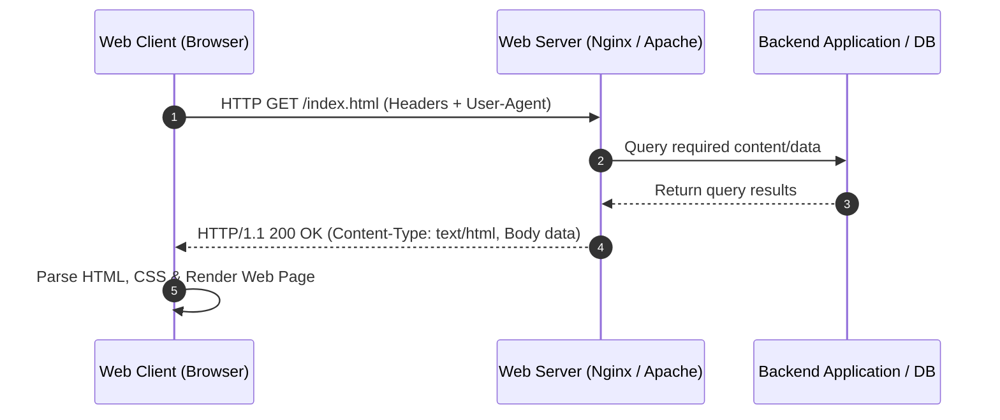
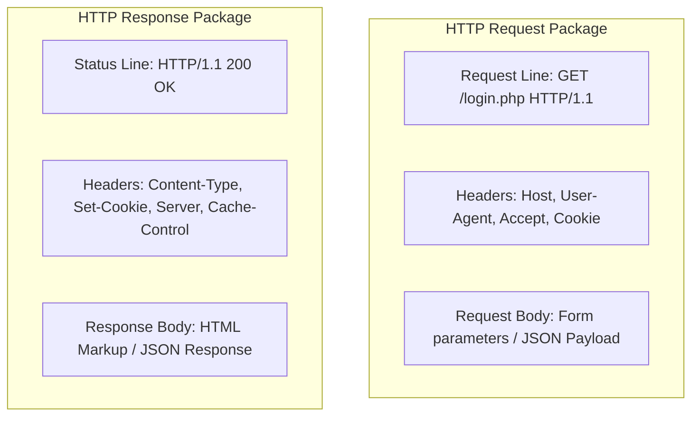
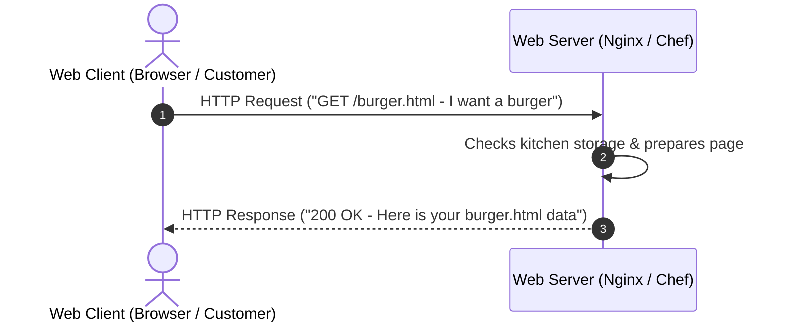
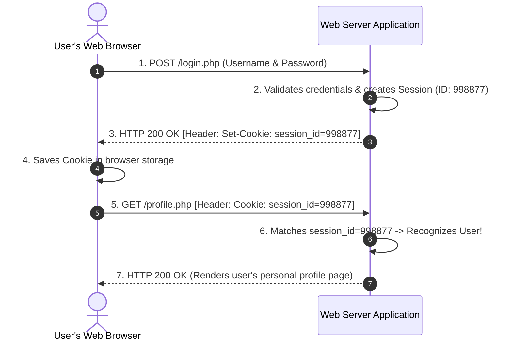

# Class 03: Web Clients, Web Servers & HTTP Request-Response Model

**Course:** Web Technology & Cloud Computing Applications – I  
**Unit:** Unit I - Exploring History, Internet Concepts, Architecture & Protocols  
**Target Duration:** 2 Hours (120 Minutes Continuous Session)  
**Self-Study Guide:** Designed for complete self-study. Every technical term is explained with simple real-world analogies without omitting any technical depth.

---

## 1. Class Session Objectives
By the end of this 2-hour continuous session, students will be able to:
1. Explain the roles and interactions between Web Clients (Browsers) and Web Servers (Apache, Nginx, IIS).
2. Deconstruct the structure of HTTP Request and Response messages.
3. Classify HTTP Status Codes (1xx, 2xx, 3xx, 4xx, 5xx) and HTTP Methods (GET, POST, PUT, DELETE).
4. Analyze HTTP protocol characteristics (Statelessness, Persistence, Headers, Cookies).

---

## 2. Recommended 2-Hour Time Allocation

| Time Range | Duration | Activity / Teaching Strategy |
|---|---|---|
| **00:00 - 00:20** | 20 Mins | **Recap & Hook:** Review DNS lookup. Open Browser DevTools Network Tab live in class. |
| **00:20 - 00:50** | 30 Mins | **Deep Dive Theory:** Client vs Server roles, HTTP Methods, Status Codes, Statelessness & Sessions. |
| **00:50 - 01:20** | 30 Mins | **Visual Diagram Breakdown:** Sequence diagram of HTTP Request-Response lifecycle. |
| **01:20 - 01:45** | 25 Mins | **Live Code Walkthrough:** Inspecting Raw HTTP Headers using `curl` and building a barebones Node.js HTTP Server. |
| **01:45 - 02:00** | 15 Mins | **Spot Quiz & Session Wrap-Up:** Student quiz questions, Next Class Teaser. |

---

## 3. Visual Flowcharts & Architectural Diagrams

### A. HTTP Request-Response Lifecycle


### B. HTTP Request & Response Header Structure


### C. Client-Server Restaurant Analogy Data Flow


---

## 4. Key Jargon & Beginner Vocabulary Dictionary

> [!NOTE]
> * **HTTP (Hypertext Transfer Protocol):** The fundamental protocol used by the World Wide Web to format, transmit, and deliver web pages and media between web browsers and web servers.
> * **Web Client:** Software (like Google Chrome, Firefox, or Safari) that allows a user to request and view web resources from a remote server.
> * **Web Server:** A combination of computer hardware and software (like Apache, Nginx, or IIS) that stores web page files and delivers them to clients upon request.
> * **HTTP Request:** A digital message sent by a web client to a web server asking for a file, web page, or data action.
> * **HTTP Response:** A digital message sent by a web server back to a web client delivering the requested data along with a status code.
> * **HTTP Method / Verbs:** Action words in an HTTP request indicating what operation the client wants the server to perform (e.g., `GET` to read, `POST` to send data).
> * **HTTP Status Code:** A 3-digit numerical code returned by a server indicating whether the HTTP request succeeded or failed (e.g., `200 OK`, `404 Not Found`).
> * **Stateless Protocol:** A protocol where the server treats every incoming request as a brand new, isolated transaction, remembering nothing about previous requests.
> * **Cookie:** A small piece of text data saved by a web browser on your computer so the website can remember your login status or shopping cart items across different pages.

---

## 5. In-Depth Topic Breakdown

### 5.1 Primary HTTP Request Methods

| HTTP Method | Purpose | Safe (Read-Only) | Idempotent |
|---|---|---|---|
| **GET** | Retrieve data from server | **Yes** | **Yes** |
| **POST** | Submit data to server to create a resource | **No** | **No** |
| **PUT** | Replace existing resource entirely | **No** | **Yes** |
| **PATCH** | Partially update existing resource | **No** | **No** |
| **DELETE** | Remove specified resource from server | **No** | **Yes** |

> [!TIP]
> **What does "Idempotent" mean?**  
> An HTTP method is **Idempotent** if executing it 1 time produces the exact same result on the server as executing it 100 times. For example, `GET` is idempotent because viewing a web page 100 times does not alter the server. `POST` is NOT idempotent because submitting a payment form 100 times would charge your credit card 100 times!

---

### 5.2 HTTP Status Code Categories

* **1xx (Informational):** Request received, continuing process (e.g., `100 Continue`).
* **2xx (Success):** Action successfully received and accepted (e.g., `200 OK`, `201 Created`).
* **3xx (Redirection):** Further action needed to complete request (e.g., `301 Moved Permanently`, `302 Found`).
* **4xx (Client Error):** Request contains bad syntax or cannot be fulfilled (e.g., `400 Bad Request`, `401 Unauthorized`, `403 Forbidden`, `404 Not Found`).
* **5xx (Server Error):** Server failed to fulfill an apparently valid request (e.g., `500 Internal Server Error`, `502 Bad Gateway`, `503 Service Unavailable`).

#### Detailed Status Code Descriptions:
* **200 OK:** The request succeeded! The requested web page or file is included in the response.
* **201 Created:** The request succeeded and a brand new resource was created on the server (e.g., new user registered).
* **301 Moved Permanently:** The web page has moved permanently to a new URL. The browser automatically redirects there.
* **400 Bad Request:** The server cannot process the request due to malformed syntax sent by the client.
* **401 Unauthorized:** Authentication is required. You must log in first before viewing this page.
* **403 Forbidden:** Access denied! Even if you are logged in, you do not have permission to view this file.
* **404 Not Found:** The requested web page or file does not exist on the server (wrong URL typed).
* **500 Internal Server Error:** The web server encountered a crash or programming bug in its backend code.
* **503 Service Unavailable:** The server is temporarily overloaded or undergoing maintenance.

---

### 5.3 HTTP Statelessness, Cookies, and Sessions

By default, **HTTP is a Stateless Protocol**. This means that when you click a button on a website, the server processes your request and immediately forgets who you are!

To overcome statelessness and keep you logged into websites (like Amazon, Facebook, or your University Portal), web applications use **Cookies** and **Sessions**:

1. **Session (Server-Side):** When you log in with your username and password, the server creates a temporary profile record called a **Session** and assigns it a unique random ID string (e.g., `SessionID = abc123xyz`).
2. **Set-Cookie Header:** The server sends back an HTTP header: `Set-Cookie: session_id=abc123xyz`.
3. **Cookie Storage (Client-Side):** Your browser saves this small cookie file on your computer.
4. **Automatic Cookie Transmission:** Every single time your browser makes a new request to that website, it automatically includes the header: `Cookie: session_id=abc123xyz`. The server inspects the ID, recognizes you, and keeps you logged in!



---

## 6. Practical Code Examples & Raw HTTP Inspection

### A. Raw HTTP Request & Response Text Format

```http
--- RAW HTTP REQUEST ---
GET /products?category=laptops HTTP/1.1
Host: www.store.com
User-Agent: Mozilla/5.0 (Windows NT 10.0; Win64; x64)
Accept: text/html,application/xhtml+xml
Connection: keep-alive

--- RAW HTTP RESPONSE ---
HTTP/1.1 200 OK
Date: Mon, 28 Jul 2026 10:00:00 GMT
Server: Apache/2.4.52 (Ubuntu)
Content-Type: text/html; charset=UTF-8
Content-Length: 142

<!DOCTYPE html>
<html>
<head><title>Laptops</title></head>
<body><h1>Available Laptops</h1></body>
</html>
```

---

### B. Creating a Basic HTTP Server in Node.js

_(let us understand the concept first, then the code)_

```javascript
// Native Node.js HTTP Server demonstrating request parsing & response header setup
const http = require('http');

const server = http.createServer((req, res) => {
    console.log(`Received ${req.method} request for ${req.url}`);

    if (req.url === '/') {
        res.writeHead(200, { 'Content-Type': 'text/html' });
        res.end('<h1>Welcome to Web Technology Class!</h1>');
    } else if (req.url === '/api/status') {
        res.writeHead(200, { 'Content-Type': 'application/json' });
        res.end(JSON.stringify({ status: 'Server Active', uptime: process.uptime() }));
    } else {
        res.writeHead(404, { 'Content-Type': 'text/html' });
        res.end('<h1>404 Page Not Found</h1>');
    }
});

server.listen(3000, () => {
    console.log('HTTP Web Server running at http://localhost:3000/');
});
```

#### Line-by-Line Code Breakdown:
1. `const http = require('http');`: Loads Node.js's native HTTP library used for parsing HTTP requests and serving HTTP responses.
2. `http.createServer((req, res) => { ... })`: Spawns a server. `req` contains incoming headers and URLs; `res` is the object used to write headers and send back HTML/JSON data.
3. `res.writeHead(200, { 'Content-Type': 'text/html' })`: Writes the HTTP Status Line (`200 OK`) and sets the `Content-Type` header so the browser knows to render the payload as HTML code.
4. `res.writeHead(404, ...)`: Sends a `404 Not Found` status code if the user requests an unrecognized URL path.
5. `server.listen(3000)`: Binds the web server to Port 3000.

---

## 7. Interactive Discussion & Spot Quiz

### Discussion Questions
1. Why is HTTP called a "Stateless Protocol", and how do Cookies and Sessions overcome this limitation?
2. What is the key difference between HTTP GET and HTTP POST when submitting form data?

### Spot Quiz
1. Which HTTP status code represents a "404 Not Found" error?
   - A) 200
   - B) 301
   - C) 404
   - D) 500
2. Which header is sent by the server to store a session cookie on the client's browser?
   - A) `Cookie`
   - B) `Set-Cookie`
   - C) `Authorization`
   - D) `Content-Type`

---

## 8. Class Summary & Next Session Teaser

* **Summary:** Today we analyzed Web Client and Server roles, HTTP request/response line formats, HTTP methods, status code families (1xx–5xx), and state management mechanisms.
* **Next Class Teaser (Class 04):** Next class we examine **HTTPS, SSL/TLS Encryption, Handshakes**, Digital Certificates, and Secure Web Communication!
