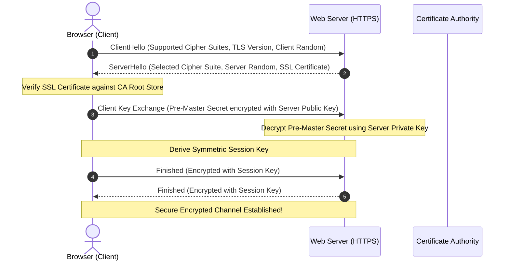

# Class 04: HyperText Transfer Protocol Secure (HTTPS), SSL/TLS Principles & Web Security

**Course:** Web Technology & Cloud Computing Applications – I  
**Unit:** Unit I - Exploring History, Internet Concepts, Architecture & Protocols  
**Target Duration:** 2 Hours (120 Minutes Continuous Session)  
**Self-Study Guide:** Designed for complete self-study. Every technical term is explained with simple real-world analogies without omitting any technical depth.

---

## 1. Class Session Objectives
By reading and studying this lecture guide line-by-line, you will be able to:
1. Identify security flaws in unencrypted HTTP communications (eavesdropping, tampering, spoofing).
2. Explain Symmetric vs Asymmetric Encryption algorithms used in web security.
3. Trace the step-by-step SSL/TLS 1.2/1.3 Handshake sequence.
4. Understand Digital Certificates, Certificate Authorities (CA), and Public Key Infrastructure (PKI).

---

## 2. Recommended 2-Hour Time Allocation

| Time Range | Duration | Activity / Teaching Strategy |
|---|---|---|
| **00:00 - 00:20** | 20 Mins | **Recap & Hook:** Wireshark packet capture demo showing plain-text HTTP password vs encrypted HTTPS ciphertext. |
| **00:20 - 00:50** | 30 Mins | **Deep Dive Theory:** Symmetric vs Asymmetric Cryptography, CA Chain of Trust, SSL vs TLS evolution. |
| **00:50 - 01:20** | 30 Mins | **Visual Diagram Breakdown:** Sequence diagram detailing the SSL/TLS Handshake protocol. |
| **01:20 - 01:45** | 25 Mins | **Hands-On Code Walkthrough:** Creating self-signed SSL certificates using `openssl` and running a Node.js HTTPS Server. |
| **01:45 - 02:00** | 15 Mins | **Spot Quiz & Session Wrap-Up:** Student quiz questions (answers in `.agents/`), Next Class Teaser. |

---

## 3. Visual Flowcharts & Architectural Diagrams

### A. SSL/TLS Handshake Sequence Diagram


### B. Hybrid Cryptography Model in HTTPS
```mermaid
graph TD
    subgraph Asymmetric Encryption (Handshake Phase)
        PUB[Server Public Key]
        PRIV[Server Private Key]
        K_EX[Exchange Pre-Master Secret securely]
    end

    subgraph Symmetric Encryption (Data Transfer Phase)
        SES_KEY[Shared Symmetric Session Key (AES-256)]
        DATA_IN[Plaintext Web Data]
        CIPHER[Encrypted Ciphertext over Wire]
    end

    PUB --> K_EX
    PRIV --> K_EX
    K_EX --> SES_KEY
    DATA_IN --> SES_KEY --> CIPHER
```

### C. Insecure HTTP vs Encrypted HTTPS Data Stream
```mermaid
graph TD
    subgraph Insecure HTTP (Port 80)
        C1[Client Browser] -->|Plaintext: 'password123'| Hacker[Hacker / Wi-Fi Eavesdropper Reads Data!] --> S1[Server]
    end

    subgraph Secure HTTPS (Port 443)
        C2[Client Browser] -->|Ciphertext: 'a7#x9%L!kQ2'| Shield[Encrypted TLS Tunnel - Hacker Sees Scrambled Garbage] --> S2[Server]
    end
```

---

## 4. Key Jargon & Beginner Vocabulary Dictionary

> [!NOTE]
> * **Plaintext:** Raw, unencrypted, readable text or data (e.g., typing `password123` on a form).
> * **Ciphertext:** Unreadable scrambled data produced by encrypting plaintext using a mathematical algorithm and key.
> * **Encryption:** The process of converting plaintext into unreadable ciphertext to prevent unauthorized access.
> * **Decryption:** The reverse process of converting scrambled ciphertext back into readable plaintext using a secret key.
> * **HTTP vs HTTPS:** Standard HTTP sends data across the Internet in plain unencrypted text. HTTPS (HTTP Secure) encrypts all data using SSL/TLS before transmission.
> * **SSL/TLS (Secure Sockets Layer / Transport Layer Security):** Cryptographic security protocols that encrypt internet connections between web browsers and servers. (TLS is the modern, updated successor to SSL).
> * **Symmetric Encryption:** An encryption method where the exact same secret key is used to both encrypt and decrypt data.
> * **Asymmetric Encryption:** An encryption method that uses a mathematically linked pair of keys: a **Public Key** (shared with everyone to encrypt data) and a **Private Key** (kept secret to decrypt data).
> * **Certificate Authority (CA):** A trusted global organization (e.g., Let's Encrypt, DigiCert) that verifies website identities and issues signed Digital Certificates.
> * **Man-in-the-Middle (MitM) Attack:** A cyber attack where a malicious hacker secretly intercepts and alters communication between two unsuspecting parties.

---

## 5. In-Depth Topic Breakdown

### 5.1 Symmetric vs Asymmetric Encryption

| Feature | Symmetric Encryption | Asymmetric Encryption |
|---|---|---|
| **Key Usage** | Single Shared Secret Key | Pair of Keys (Public Key + Private Key) |
| **Speed** | Extremely Fast (Low CPU overhead) | Slow (High computational complexity) |
| **Primary Use** | Bulk Data Encryption (Web Content Payload) | Key Exchange, Digital Signatures, Handshakes |
| **Algorithms** | AES-128, AES-256, ChaCha20 | RSA, ECC (Elliptic Curve), Diffie-Hellman |

#### Real-World Cryptography Analogies:

1. **Symmetric Encryption Analogy:**
   * A physical padlock on a door where both you and your roommate have identical duplicate metal keys. Sender locks data with Key A, and Receiver unlocks data with Key A.
   * *Problem:* How do you securely share Key A with a stranger's website across the Internet without a hacker stealing Key A along the way?

2. **Asymmetric Encryption Analogy:**
   * A public mailbox drop slot outside a post office: Anyone on the street can drop a letter through the slot (**Public Key**). However, once the letter drops inside, no one on the street can reach in to pull it out! Only the postal worker with the secret key to the back door (**Private Key**) can open the box and read the letters.

3. **HTTPS Hybrid Encryption Model:**
   * HTTPS uses **Asymmetric Encryption** during the initial handshake phase to securely negotiate a shared secret key without anyone eavesdropping.
   * Once the shared key is negotiated, HTTPS switches to **Symmetric Encryption** using that shared session key to transmit heavy web page payloads at maximum speed!

---

### 5.2 Public Key Infrastructure (PKI) & Digital Certificates

* **Digital Certificate (X.509):** Binds an IP/Domain name to an organization's public key, signed by a trusted CA.
* **Certificate Authority (CA):** Trusted third-party entity (e.g., Let's Encrypt, DigiCert) that validates domain ownership and issues signed certificates.
* **Chain of Trust:** End-Entity Certificate $\rightarrow$ Intermediate CA Certificate $\rightarrow$ Root CA Certificate (pre-installed in OS/Browsers).

> [!WARNING]
> **Why Browser Security Warnings Appear:** If you visit a website with an expired certificate, a mismatched domain name, or a self-signed certificate not trusted by a CA, your browser blocks access and displays a red warning screen: *"Your connection is not private / Security Risk Ahead"*.

---

## 6. Practical Code Examples & Certificate Setup

### A. Generating a Self-Signed Certificate via OpenSSL

```bash
# Terminal command to generate private key and self-signed X.509 certificate
openssl req -x509 -newkey rsa:4096 -keyout key.pem -out cert.pem -days 365 -nodes
```

#### Command Argument Breakdown:
* `req -x509`: Specifies that we want to output a self-signed X.509 digital certificate.
* `-newkey rsa:4096`: Generates a brand new 4096-bit RSA Asymmetric Key Pair.
* `-keyout key.pem`: Saves the secret **Private Key** into a file named `key.pem`.
* `-out cert.pem`: Saves the public **Digital Certificate** into a file named `cert.pem`.
* `-days 365`: Sets the certificate to remain valid for 1 year (365 days).
* `-nodes`: Prevents encrypting the private key file with a password so the web server can read it automatically on boot.

---

### B. Building a Secure HTTPS Server in Node.js

```javascript
// Native HTTPS Server in Node.js using SSL/TLS Keys
const https = require('https');
const fs = require('fs');

// Read SSL certificate and private key files
const options = {
    key: fs.readFileSync('key.pem'),
    cert: fs.readFileSync('cert.pem')
};

const app = https.createServer(options, (req, res) => {
    res.writeHead(200, { 'Content-Type': 'text/html' });
    res.end('<h1>Secure HTTPS Connection Established!</h1>');
});

app.listen(443, () => {
    console.log('Secure HTTPS Server listening on port 443');
});
```

#### Line-by-Line Code Breakdown:
1. `const https = require('https');`: Loads Node.js's secure HTTPS protocol library.
2. `fs.readFileSync('key.pem')`: Loads the private key required for the server to decrypt incoming TLS handshake messages.
3. `https.createServer(sslOptions, ...)`: Initializes an encrypted TLS engine using the provided certificate and key.
4. `app.listen(443)`: Binds the HTTPS server to Port 443 (the standard port reserved worldwide for HTTPS traffic).

---

## 7. Interactive Discussion & Spot Quiz

### Discussion Questions
1. Why does HTTPS use Asymmetric Encryption for the handshake but switch to Symmetric Encryption for payload transfer?
2. What happens when a browser encounters an expired or self-signed certificate, and why does a warning screen appear?

### Spot Quiz
1. Which default TCP port is used for HTTPS traffic?
   - A) Port 80
   - B) Port 8080
   - C) Port 443
   - D) Port 22
2. What is the role of the Certificate Authority (CA)?
   - A) Encrypt internet passwords
   - B) Digitally sign and verify public keys of domains
   - C) Route TCP/IP packets
   - D) Filter firewall rules

---

## 8. Class Summary & Next Session Teaser

* **Summary:** Today we learned why HTTPS is mandatory for modern web applications, the hybrid encryption model, PKI chain of trust, and the step-by-step TLS handshake.
* **Next Class Teaser (Class 05):** In Class 05, we explore **Proxy Servers**, Forward vs Reverse Proxies, Load Balancing, and Caching mechanisms!
