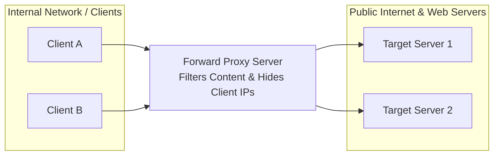
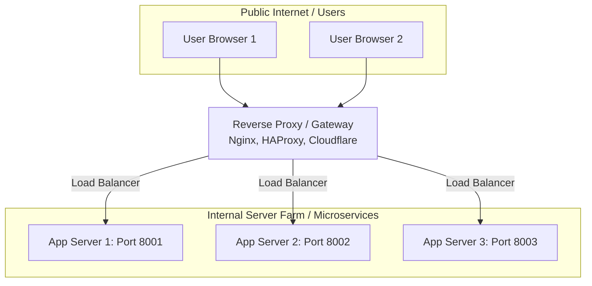

# Class 05: Proxy Servers: Types, Architecture & Working Mechanisms

**Course:** Web Technology & Cloud Computing Applications – I  
**Unit:** Unit I - Exploring History, Internet Concepts, Architecture & Protocols  
**Target Duration:** 2 Hours (120 Minutes Continuous Session)  
**Self-Study Guide:** Designed for complete self-study. Every technical term is explained with simple real-world analogies without omitting any technical depth.

---

## 1. Class Session Objectives
By reading and studying this lecture guide line-by-line, you will be able to:
1. Define a Proxy Server and distinguish between Forward Proxies and Reverse Proxies.
2. Explain key use cases of proxies (Anonymity, Content Filtering, Caching, Load Balancing, SSL Termination).
3. Analyze transparent vs non-transparent proxy setups.
4. Implement a reverse proxy load-balancer configuration conceptually and in code.

---

## 2. Recommended 2-Hour Time Allocation

| Time Range | Duration | Activity / Teaching Strategy |
|---|---|---|
| **00:00 - 00:20** | 20 Mins | **Recap & Hook:** Review HTTPS security. Discuss "How does a VPN or corporate web filter work?" |
| **00:20 - 00:50** | 30 Mins | **Deep Dive Theory:** Forward Proxy vs Reverse Proxy architecture, Caching headers, Load balancing algorithms. |
| **00:50 - 01:20** | 30 Mins | **Visual Diagram Breakdown:** Mermaid flowcharts comparing Forward and Reverse proxy positions. |
| **01:20 - 01:45** | 25 Mins | **Live Code Walkthrough:** Building a Reverse Proxy in Node.js / Nginx sample configuration. |
| **01:45 - 02:00** | 15 Mins | **Spot Quiz & Session Wrap-Up:** Student quiz questions (answers in `.agents/`), Next Class Teaser. |

---

## 3. Visual Flowcharts & Architectural Diagrams

### A. Forward Proxy Architecture (Client-Side Protection & Filtering)


### B. Reverse Proxy Architecture (Server-Side Load Balancing & Security)


---

## 4. Key Jargon & Beginner Vocabulary Dictionary

> [!NOTE]
> * **Proxy Server:** An intermediary computer or software program that sits between a client and a target server, forwarding requests and responses on behalf of users.
> * **Forward Proxy:** A proxy server positioned in front of client devices (users) in an internal network. It intercepts outgoing requests to mask user IP addresses or filter web content.
> * **Reverse Proxy:** A proxy server positioned in front of backend web servers. It intercepts incoming internet requests to distribute traffic, speed up performance, and shield origin servers from cyber attacks.
> * **Load Balancing:** The process of distributing incoming network traffic evenly across a group of backend servers to prevent any single server from becoming overwhelmed.
> * **Content Caching:** Storing copies of frequently requested web pages or images in proxy memory so future requests can be served instantly without contacting the main server.
> * **SSL Termination (SSL Offloading):** The practice of decrypting HTTPS traffic at the reverse proxy level before passing plaintext HTTP traffic to internal backend servers, reducing server CPU load.
> * **Origin Server:** The actual backend server where website files and databases reside.

---

## 5. In-Depth Topic Breakdown

### 5.1 What is a Proxy Server?

The word **Proxy** means "a person authorized to act on behalf of another".

In computer networking, a **Proxy Server** acts like a **middleman**. Instead of your computer connecting directly to a website, your computer sends the request to the Proxy Server. The Proxy Server then turns around, connects to the website, fetches the information, and hands it back to you!

---

### 5.2 Forward Proxy vs. Reverse Proxy

#### Comparison Matrix:

| Characteristic | Forward Proxy | Reverse Proxy |
|---|---|---|
| **Whom it protects** | Protects Clients (Users inside internal network) | Protects Servers (Web applications in data center) |
| **Location** | Positioned in front of Clients | Positioned in front of Web Servers |
| **Client Awareness** | Client browser is aware & configured to use proxy | Clients are unaware; think they are talking to origin server |
| **Key Functions** | Content filtering, anonymity, IP masking, bandwidth caching | Load balancing, SSL termination, DDoS protection, web caching |

#### Detailed Functions & Analogies:

1. **Forward Proxy (The Personal Secretary Analogy):**
   * Imagine an executive who never calls anyone directly. When she wants information from an outside company, she tells her secretary. The secretary makes the phone call, gets the answer, and tells the executive. The outside company only ever sees the secretary's phone number!
   * *Functions:* IP Anonymity/VPNs, Content Filtering (blocking social media at work), Bandwidth Caching.

2. **Reverse Proxy (The Hotel Receptionist Analogy):**
   * When you visit a luxury hotel, you do not walk straight into room #304 to talk to the maid. You talk to the front desk receptionist. The receptionist takes your request, calls room #304 on an internal intercom, and reports back to you.
   * *Functions:* Load Balancing (spreading requests across 10 app servers), Security/DDoS shielding, SSL Termination.

---

### 5.3 Load Balancing Algorithms in Reverse Proxies

When a Reverse Proxy receives thousands of incoming user requests, how does it decide which backend server should handle each request? It uses a **Load Balancing Algorithm**:

* **Round Robin:** Requests distributed sequentially across server farm (Request 1 to Server 1, Request 2 to Server 2, etc.).
* **Least Connections:** Directs traffic to the server currently handling the fewest active connections.
* **IP Hash:** Client IP is mathematically hashed to consistently route a specific user to the same backend server (Session Stickiness).

---

## 6. Practical Code Examples & Configuration

### A. Simple Reverse Proxy & Load Balancer in Node.js

```javascript
// Reverse Proxy Server using http-proxy module
const http = require('http');
const httpProxy = require('http-proxy');

// Create proxy instance
const proxy = httpProxy.createProxyServer({});

// Array of backend application servers
const servers = [
    'http://localhost:8001',
    'http://localhost:8002'
];
let current = 0;

// Reverse Proxy listener
const proxyServer = http.createServer((req, res) => {
    // Round Robin selection
    const target = servers[current];
    current = (current + 1) % servers.length;

    console.log(`Forwarding request ${req.url} to backend: ${target}`);
    proxy.web(req, res, { target: target }, (err) => {
        res.writeHead(502, { 'Content-Type': 'text/html' });
        res.end('<h1>502 Bad Gateway</h1>');
    });
});

proxyServer.listen(8000, () => {
    console.log('Reverse Proxy listening on port 8000');
});
```

#### Line-by-Line Code Breakdown:
1. `const httpProxy = require('http-proxy');`: Loads a Node.js reverse proxy library capable of forwarding HTTP headers and streams.
2. `const servers = [...]`: An array listing the URLs of backend worker servers running locally on ports 8001 and 8002.
3. `(current + 1) % servers.length`: Implements **Round-Robin** math! If index is 0, next is 1. If index is 1, next loops back to 0.
4. `proxy.web(req, res, { target: target })`: Hands over the incoming user request to the proxy module to stream data directly to the chosen backend server.

---

### B. Sample Nginx Reverse Proxy Configuration Block

```nginx
# Nginx configuration for Reverse Proxy & Load Balancing
http {
    upstream backend_cluster {
        server 192.168.1.10:8080;
        server 192.168.1.11:8080;
    }

    server {
        listen 80;
        server_name mywebsite.com;

        location / {
            proxy_pass http://backend_cluster;
            proxy_set_header Host $host;
            proxy_set_header X-Real-IP $remote_addr;
        }
    }
}
```

#### Nginx Directive Breakdown:
* `upstream backend_cluster { ... }`: Defines a pool of backend servers for load balancing.
* `listen 80;`: Nginx listens for incoming public HTTP requests on Port 80.
* `proxy_pass http://backend_cluster;`: Instructs Nginx to act as a reverse proxy, forwarding requests to the cluster defined above.
* `proxy_set_header X-Real-IP $remote_addr;`: Passes the real user's IP address to backend servers.

---

## 7. Interactive Discussion & Spot Quiz

### Discussion Questions
1. Why do large organizations use Forward Proxies to block certain websites, while e-commerce sites use Reverse Proxies like Cloudflare?
2. What is "SSL Termination" on a reverse proxy, and why does it reduce computational load on backend application servers?

### Spot Quiz
1. Which type of proxy sits in front of backend web servers and handles load balancing?
   - A) Forward Proxy
   - B) Reverse Proxy
   - C) Transparent Proxy
   - D) Open Proxy
2. In Round-Robin load balancing, how are incoming requests assigned?
   - A) Based on client IP hash
   - B) Sequentially one after another across servers
   - C) To the server with lowest CPU load
   - D) Randomly to any server

---

## 8. Class Summary & Next Session Teaser

* **Summary:** Today we covered Forward vs Reverse proxies, load balancing algorithms, content caching, and SSL offloading.
* **Next Class Teaser (Class 06):** Next class we complete Unit I by exploring **Firewalls, Packet Filtering, Statefully Inspection**, and **Web Application Firewalls (WAF)**!
