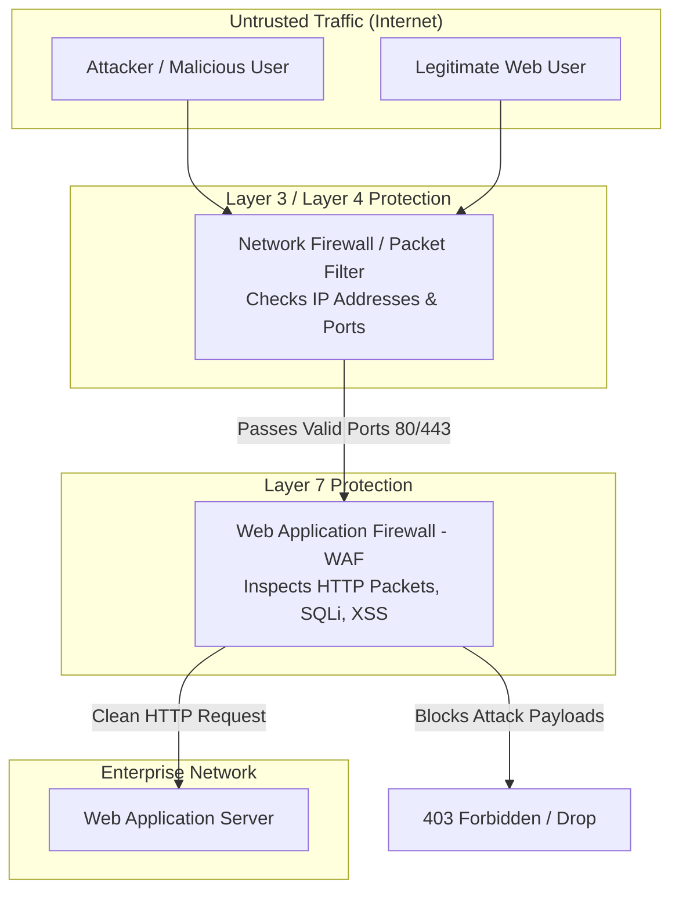

# Class 06: Firewalls: Types, Packet Filtering, Stateful Inspection & WAF

**Course:** Web Technology & Cloud Computing Applications – I  
**Unit:** Unit I - Exploring History, Internet Concepts, Architecture & Protocols  
**Target Duration:** 2 Hours (120 Minutes Continuous Session)  
**Self-Study Guide:** Designed for complete self-study. Every technical term is explained with simple real-world analogies without omitting any technical depth.

---

## 1. Class Session Objectives
By reading and studying this lecture guide line-by-line, you will be able to:
1. Define the role of Firewalls in network perimeter security.
2. Differentiate between Packet-Filtering, Stateful Inspection, and Proxy Firewalls.
3. Understand Web Application Firewalls (WAF) operating at Layer 7 to inspect HTTP traffic.
4. Analyze common web application attack vectors mitigated by WAF (SQL Injection, XSS, CSRF).

---

## 2. Recommended 2-Hour Time Allocation

| Time Range | Duration | Activity / Teaching Strategy |
|---|---|---|
| **00:00 - 00:20** | 20 Mins | **Recap & Hook:** Review Proxy Servers. Discuss "How does a company block unauthorized incoming traffic?" |
| **00:20 - 00:50** | 30 Mins | **Deep Dive Theory:** Packet Filtering Rules, Stateful vs Stateless, WAF vs Network Firewalls, OWASP Top 10 intro. |
| **00:50 - 01:20** | 30 Mins | **Visual Diagram Breakdown:** Mermaid flowcharts showing Packet Inspection vs WAF Layer 7 Payload Inspection. |
| **01:20 - 01:45** | 25 Mins | **Practical Code / Syntax Walkthrough:** Writing `iptables` rules and ModSecurity/WAF pattern matching rules. |
| **01:45 - 02:00** | 15 Mins | **Spot Quiz & Session Wrap-Up:** Student quiz questions, Unit I Review & Unit II Teaser. |

---

## 3. Visual Flowcharts & Architectural Diagrams

### A. Network Firewall vs Web Application Firewall (WAF)


---

## 4. Key Jargon & Beginner Vocabulary Dictionary

> [!NOTE]
> * **Firewall:** A network security system (hardware or software) that monitors and controls incoming and outgoing network traffic based on predetermined security rules.
> * **Packet Filtering:** A basic firewall mechanism that inspects packet headers (source/destination IP addresses and port numbers) to allow or drop traffic.
> * **Stateless Firewall:** A firewall that inspects each data packet in isolation without remembering any previous packets or active connection history.
> * **Stateful Inspection Firewall:** An advanced firewall that maintains a state table tracking active connections, automatically allowing incoming response packets if a client inside the network initiated the connection.
> * **Web Application Firewall (WAF):** A specialized Layer 7 (Application Layer) firewall that inspects raw HTTP/HTTPS request text bodies to block web attacks like SQL Injection and Cross-Site Scripting (XSS).
> * **SQL Injection (SQLi):** A cyber attack where malicious SQL statements are inserted into web form inputs to trick the database into revealing private user data.
> * **Cross-Site Scripting (XSS):** A cyber attack where malicious JavaScript code is injected into a trusted web page to steal user session cookies or hijack accounts.
> * **`iptables`:** A standard utility program in Linux operating systems used to configure network packet filtering rules.

---

## 5. In-Depth Topic Breakdown

### 5.1 Classification of Firewalls

| Firewall Type | Operating OSI Layer | Inspection Depth | Example Mechanism |
|---|---|---|---|
| **Packet-Filtering Firewall** | Network / Transport (Layer 3/4) | Inspects IP header, TCP/UDP ports, protocol flags | Drops packet if destination port = 23 (Telnet) |
| **Stateful Inspection Firewall** | Network / Transport (Layer 3/4) | Tracks active connection state table (SYN, ESTABLISHED) | Allows inbound reply only if client initiated outbound TCP request |
| **Circuit-Level Gateway** | Session (Layer 5) | Monitors TCP handshakes without payload inspection | Validates TCP session integrity |
| **Web Application Firewall (WAF)** | Application (Layer 7) | Deep Packet Inspection of HTTP headers, cookies, payloads | Detects `' OR 1=1 --` in form input (SQL Injection) |

#### Real-World Building Security Analogies:

1. **Packet-Filtering Firewall (The Front Gate Guard):** Checks ID badges and ticket numbers (IP address & Port number) at the building gate. If your ticket says "Port 80", he lets you enter. If your ticket says "Port 23", he turns you away.
2. **Stateful Inspection Firewall (The Gate Keeper with a Clipboard):** Maintains a connection state table. When an internal employee steps out for coffee, the guard writes down their name. When they return, the guard checks his clipboard and lets them back in without re-verifying their entire background.
3. **Web Application Firewall / WAF (The Airport X-Ray Customs Inspector):** Operates at Layer 7. It opens your luggage, runs an X-ray scan over your files, and inspects the exact words inside your HTTP payload! If it sees malicious code (like `' OR 1=1 --`), it confiscates the bag immediately.

---

### 5.2 Why Web Applications Need a WAF

Your Network Firewall MUST leave Port 80 (HTTP) and Port 443 (HTTPS) completely open so legitimate users worldwide can access your website. 

However, hackers send their attacks **inside valid HTTP requests over Port 80/443**! 
* **Example SQL Injection Attack:** A hacker types `' OR '1'='1` into a login form.
* **Network Firewall View:** The network firewall looks at the packet, sees `Destination Port: 443`, and says: *"Looks good! Port 443 is open!"* and allows the attack straight to your database.
* **WAF View:** The WAF opens the HTTP request text, detects the SQL syntax `' OR '1'='1`, recognizes an injection attack, and **blocks the request with a 403 Forbidden error** before it touches your database!

---

## 6. Practical Rule Examples & Code Syntax

### A. Linux `iptables` Network Firewall Rules Example

```bash
# Default Policy: Drop all incoming traffic
iptables -P INPUT DROP
iptables -P FORWARD DROP
iptables -P OUTPUT ACCEPT

# Allow loopback interface
iptables -A INPUT -i lo -j ACCEPT

# Allow established and related incoming connections
iptables -A INPUT -m state --state ESTABLISHED,RELATED -j ACCEPT

# Allow incoming HTTP (Port 80) and HTTPS (Port 443)
iptables -A INPUT -p tcp --dport 80 -j ACCEPT
iptables -A INPUT -p tcp --dport 443 -j ACCEPT
```

#### Line-by-Line Rule Explanation:
1. `iptables -P INPUT DROP`: Implements the **Principle of Least Privilege**. It blocks ALL incoming network traffic by default unless explicitly permitted by a rule below.
2. `iptables -A INPUT -i lo -j ACCEPT`: Permits local internal applications on the computer to talk to each other via the loopback interface (`127.0.0.1`).
3. `iptables -A INPUT -m state --state ESTABLISHED,RELATED -j ACCEPT`: Enables **Stateful Inspection**! It automatically permits incoming reply traffic for connections that an internal user started.
4. `iptables -A INPUT -p tcp --dport 80 -j ACCEPT`: Opens Destination Port 80 so external web traffic can reach the web server.

---

### B. Conceptual WAF Pattern Matching Rule (SQL Injection Detection)

```javascript
// Node.js Express Middleware simulating a mini WAF rule
function miniWafMiddleware(req, res, next) {
    const sqliRegex = /(\%27)|(\')|(\-\-)|(\%23)|(#)|(UNION)|(SELECT)/i;
    const queryString = JSON.stringify(req.query);
    const bodyString = JSON.stringify(req.body);

    if (sqliRegex.test(queryString) || sqliRegex.test(bodyString)) {
        console.warn(`[WAF ALERT] SQL Injection attack attempt blocked from IP: ${req.ip}`);
        return res.status(403).send('<h1>403 Forbidden: Malicious Payload Detected by WAF</h1>');
    }
    next();
}
```

#### Line-by-Line Code Breakdown:
1. `function miniWafMiddleware(req, res, next)`: Express middleware function that intercepts EVERY incoming HTTP request before it reaches page handlers.
2. `const sqliRegex = /(\%27)|(\')|(\-\-)|(#)|(SELECT)/i;`: A pattern rule searching for SQL comment marks (`--`), quotes (`'`), or database commands (`SELECT`, `UNION`).
3. `if (sqliRegex.test(...))`: If the regex finds an attack pattern in the form input, it halts execution and returns `403 Forbidden`.
4. `next()`: If no attack pattern is detected, the clean request is safely passed to the database application.

---

## 7. Interactive Discussion & Spot Quiz

### Discussion Questions
1. Why is a standard Network Firewall unable to prevent SQL Injection or Cross-Site Scripting (XSS) attacks over HTTPS port 443?
2. Explain the difference between Stateless Packet Filtering and Stateful Inspection.

### Spot Quiz
1. At which layer of the OSI model does a Web Application Firewall (WAF) operate?
   - A) Layer 3 (Network Layer)
   - B) Layer 4 (Transport Layer)
   - C) Layer 5 (Session Layer)
   - D) Layer 7 (Application Layer)
2. What does a stateful inspection firewall maintain to determine whether to allow incoming packets?
   - A) DNS Root table
   - B) Connection State Table
   - C) User password database
   - D) SSL Certificate chain

---

## 8. Class Summary & Next Session Teaser

* **Summary:** Today we completed Unit I by covering Network Firewalls (Packet Filtering, Stateful Inspection) and Layer 7 Web Application Firewalls (WAF).
* **Next Class Teaser (Class 07):** In Class 07, we begin **Unit II: Static Web Page Development with HTML & HTML5**, exploring document structures, `<head>`, `<body>`, and HTML syntax rules!
