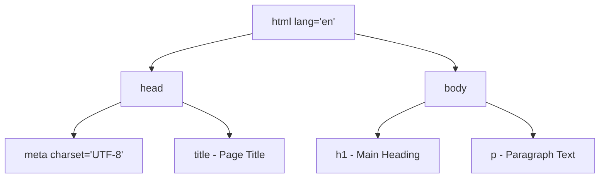
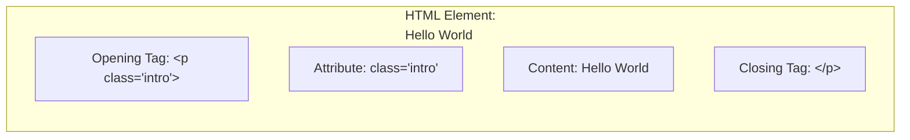
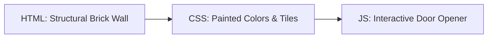

# Class 07: Introduction to HTML & HTML5 Document Structure

**Course:** Web Technology & Cloud Computing Applications – I  
**Unit:** Unit II - Static Web Page Development with HTML & HTML5  
**Target Duration:** 2 Hours (120 Minutes Continuous Session)  
**Self-Study Guide:** Designed for complete self-study. Every technical term is explained with simple real-world analogies without omitting any technical depth.

---

## 1. Class Session Objectives
By reading and studying this lecture guide line-by-line, you will be able to:
1. Explain the role of HTML and HTML5 as the core markup standard of the web.
2. Construct a standard HTML5 boilerplate document (`<!DOCTYPE html>`, `<html>`, `<head>`, `<body>`).
3. Differentiate between HTML Tags, Elements, and Attributes.
4. Utilize core metadata tags (`<title>`, `<meta charset="UTF-8">`, `<meta name="viewport">`) effectively.

---

## 2. Recommended 2-Hour Time Allocation

| Time Range | Duration | Activity / Teaching Strategy |
|---|---|---|
| **00:00 - 00:20** | 20 Mins | **Recap & Unit II Intro:** Transition from Networking/Protocols to Web Page Authoring. View page source on a live site. |
| **00:20 - 00:50** | 30 Mins | **Deep Dive Theory:** Anatomy of an HTML element, DOCTYPE evolution, `<head>` vs `<body>`, metadata. |
| **00:50 - 01:20** | 30 Mins | **Visual Diagram Breakdown:** Mermaid DOM tree diagram representing an HTML document hierarchy. |
| **01:20 - 01:45** | 25 Mins | **Live Code Walkthrough:** Writing first HTML5 document in VS Code and rendering in browser. |
| **01:45 - 02:00** | 15 Mins | **Spot Quiz & Session Wrap-Up:** Student quiz questions, Next Class Teaser. |

---

## 3. Visual Flowcharts & Architectural Diagrams

### A. HTML Document DOM Tree Hierarchy


### B. Anatomy of an HTML Element


---

## 4. Key Jargon & Beginner Vocabulary Dictionary

> [!NOTE]
> * **HTML (HyperText Markup Language):** The standard markup language used to structure web pages and their content (headings, paragraphs, images, links).
> * **Markup Language:** A computer language that uses formatting tags to annotate text, telling web browsers how to display content.
> * **Tag:** A code command enclosed in angle brackets (e.g., `<p>` or `<h1>`) that marks the beginning or end of an HTML element.
> * **Element:** A complete HTML component consisting of an opening tag, content, and a closing tag (e.g., `<p>Hello World</p>`).
> * **Attribute:** Additional property settings placed inside an opening tag that modify the element's behavior or appearance (e.g., `class="intro"` or `src="logo.png"`).
> * **Boilerplate:** Standard, reusable code templates that must be included at the start of every project file to ensure correct functionality.
> * **Metadata:** "Data about data". In HTML, metadata inside the `<head>` section gives browsers information about character encoding, viewport scaling, and page titles.
> * **Void Tag (Self-Closing Tag):** An HTML tag that does not enclose text content and therefore does not require a closing tag (e.g., `<hr>`, `<br>`, ``).
> * **DOM (Document Object Model):** The hierarchical tree structure that browsers construct from an HTML document to render web page elements.

---

## 5. In-Depth Topic Breakdown

### 5.1 What is HTML? The Building Construction Analogy

Imagine building a modern residential house:
1. **HTML (The Structure & Concrete Skeleton):** HTML represents the raw concrete pillars, brick walls, window frames, and doorways. It defines *what* is on the page.
2. **CSS (The Styling & Paint):** CSS represents the interior paint colors, wall tiles, wallpaper, and decorative curtains. It defines *how it looks*.
3. **JavaScript (The Functionality & Electricity):** JavaScript represents the electrical wiring, water taps, garage door openers, and alarm systems. It defines *how it behaves*.



---

### 5.2 HTML5 Document Skeleton & Boilerplate Breakdown

Study this standard HTML5 boilerplate document:

```html
<!DOCTYPE html>
<html lang="en">
<head>
    <meta charset="UTF-8">
    <meta name="viewport" content="width=device-width, initial-scale=1.0">
    <title>My First HTML5 Web Page</title>
</head>
<body>
    <h1>Welcome to Mandsaur University</h1>
    <p>This is a standard HTML5 document structure.</p>
</body>
</html>
```

#### Line-by-Line Statement Breakdown:

* **Line 1: `<!DOCTYPE html>`**  
  An mandatory instruction to the web browser declaring that this document is written in modern **HTML5**. It prevents browsers from rendering the page in legacy "Quirks Mode".
* **Line 2: `<html lang="en">`**  
  The root container tag wrapping all content on the entire page. The `lang="en"` attribute declares that the document content is in English, helping search engines (SEO) and screen reader software for visually impaired users.
* **Line 3: `<head>`**  
  The header metadata container. Content placed inside `<head>` is not rendered directly as visual web page content in the browser viewport; instead, it contains background information, page titles, character encodings, and external stylesheet links.
* **Line 4: `<meta charset="UTF-8">`**  
  Specifies the character encoding for the document. `UTF-8` includes almost all characters, symbols, and emojis from all written human languages worldwide.
* **Line 5: `<meta name="viewport" content="width=device-width, initial-scale=1.0">`**  
  Ensures responsive web design on mobile devices! It instructs mobile phone browsers to set the page width equal to the device screen width rather than zooming out to a tiny desktop layout.
* **Line 6: `<title>My First HTML5 Web Page</title>`**  
  Sets the text displayed on the browser tab at the very top of your browser window and in Google search results.
* **Line 8: `<body>`**  
  The main visual content container. Everything written inside `<body>` (headings, paragraphs, images, tables, forms, videos) will be displayed visually on the browser screen.

---

## 6. Practical Code Examples & Attribute Usage

### A. Elements, Void Tags, and Nesting Rules

In HTML, elements can be nested inside one another like Russian nesting dolls. However, tags must be closed in the exact reverse order in which they were opened!

```html
<!-- Example of Container Elements vs Void (Self-Closing) Elements -->
<article>
    <!-- Heading Container Element -->
    <h1>Web Development Fundamentals</h1>
    
    <!-- Paragraph Element with nested inline emphasis (<em>) -->
    <p>HTML elements can be <em>nested</em> inside one another.</p>
    
    <!-- Void Elements (No closing tag needed) -->
    <hr> <!-- Horizontal Line Rule -->
    <br> <!-- Line Break -->
    
    <!-- Image Void Element with key attributes -->
    
</article>
```

#### Detailed Attribute Breakdown on ``:
* `src="logo.png"`: Specifies the file path location of the image file.
* `alt="University Logo"`: Alternative text description displayed if the image fails to load or read by screen readers.
* `width="200"` and `height="100"`: Sets explicit pixel dimensions for the image.

---

## 7. Interactive Discussion & Spot Quiz

### Discussion Questions
1. Why is `<!DOCTYPE html>` essential at the very first line of an HTML file, and what happens if it is omitted?
2. What is the difference between Container Tags and Void (Self-Closing) Tags?

### Spot Quiz
1. Which tag contains metadata and document titles not rendered directly inside the visual browser body?
   - A) `<body>`
   - B) `<head>`
   - C) `<section>`
   - D) `<footer>`
2. Which attribute sets universal character encoding in HTML5?
   - A) `<meta charset="UTF-8">`
   - B) `<meta name="encoding">`
   - C) `<html lang="utf-8">`
   - D) `<head utf8>`

---

## 8. Class Summary & Next Session Teaser

* **Summary:** Today we mastered basic HTML5 document architecture, DOCTYPE declarations, `<head>` metadata, element nesting, attributes, and void tags.
* **Next Class Teaser (Class 08):** Next class we dive into **Text Formatting (`<h1>`-`<h6>`, `<p>`, `<b>`, `<i>`), Alignment, Fonts**, and embedding images using ``!
