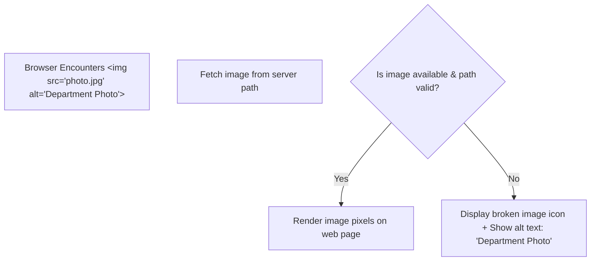

# Class 08: Text Formatting, Alignment, Fonts & Embedding Images (``)

**Course:** Web Technology & Cloud Computing Applications – I  
**Unit:** Unit II - Static Web Page Development with HTML & HTML5  
**Target Duration:** 2 Hours (120 Minutes Continuous Session)  
**Self-Study Guide:** Designed for complete self-study. Every technical term is explained with simple real-world analogies without omitting any technical depth.

---

## 1. Class Session Objectives
By reading and studying this lecture guide line-by-line, you will be able to:
1. Apply heading tags (`<h1>` to `<h6>`) and paragraph tags (`<p>`) with proper semantic hierarchy.
2. Utilize inline text formatting tags (`<b>`, `<strong>`, `<i>`, `<em>`, `<u>`, `<mark>`, `<small>`, `<sub>`, `<sup>`).
3. Embed images using the `` tag with proper `src`, `alt`, `width`, and `height` attributes.
4. Understand text alignment and deprecation of legacy presentation attributes vs modern CSS alignment.

---

## 2. Recommended 2-Hour Time Allocation

| Time Range | Duration | Activity / Teaching Strategy |
|---|---|---|
| **00:00 - 00:20** | 20 Mins | **Recap & Hook:** Review HTML5 structure. Display a plain text page vs formatted page with images. |
| **00:20 - 00:50** | 30 Mins | **Deep Dive Theory:** Semantic heading hierarchy, physical vs semantic formatting, image formats (PNG, JPG, WebP, SVG). |
| **00:50 - 01:20** | 30 Mins | **Visual Diagram Breakdown:** Image rendering pipeline & fallback mechanism diagram. |
| **01:20 - 01:45** | 25 Mins | **Live Code Walkthrough:** Building a formatted news article web page with headings, styled text, and images. |
| **01:45 - 02:00** | 15 Mins | **Spot Quiz & Session Wrap-Up:** Student quiz questions, Next Class Teaser. |

---

## 3. Visual Flowcharts & Architectural Diagrams

### A. Image Rendering Pipeline & `alt` Attribute Fallback


---

## 4. Key Jargon & Beginner Vocabulary Dictionary

> [!NOTE]
> * **Heading Hierarchy:** Organizing web page titles sequentially from `<h1>` (most important main title) down to `<h6>` (least important sub-heading), creating an accessible document outline.
> * **Physical Formatting Tags:** Legacy HTML tags (`<b>`, `<i>`, `<u>`) that purely alter visual appearance (bold, italic, underline) without conveying any structural meaning.
> * **Semantic Formatting Tags:** Modern HTML5 tags (`<strong>`, `<em>`) that give structural importance and emphasis to text, helping search engines and screen readers understand priority.
> * **Subscript (`<sub>`):** Text formatted slightly lower than the normal line of text (e.g., in chemical formulas like $\text{H}_2\text{O}$).
> * **Superscript (`<sup>`):** Text formatted slightly higher than the normal line of text (e.g., in mathematical exponents like $E=mc^2$).
> * **Lossy Compression (JPEG):** Image compression that shrinks file sizes by removing tiny invisible pixel data, ideal for photographs.
> * **Lossless Compression (PNG):** Image compression that retains 100% of original pixel quality and supports transparent backgrounds.
> * **Vector Graphics (SVG):** Mathematical images defined by points and lines rather than pixels, allowing them to scale to any size without getting blurry.

---

## 5. In-Depth Topic Breakdown

### 5.1 Physical vs Semantic Text Formatting Tags

Imagine reading a newspaper:
* **`<h1>` to `<h6>` Heading Levels:** `<h1>` is the massive front-page headline. `<h2>` is a section header (e.g., "Sports News"). `<h3>` is a article sub-title. You should only use one `<h1>` per page.
* **Physical Tags vs Semantic Tags:** Physical tags (`<b>`, `<i>`) just add visual paint. Semantic tags (`<strong>`, `<em>`) tell the browser: *"This text is urgent/critical!"*. A screen reader for visually impaired users will speak `<strong>` text in a louder, firmer voice!

#### Formatting Tag Comparison Table:

| Semantic Tag | Physical Tag | Visual Effect | Semantic Meaning for Screen Readers |
|---|---|---|---|
| `<strong>` | `<b>` | Bold text | High importance / urgent warning |
| `<em>` | `<i>` | Italicized text | Stress emphasis |
| `<mark>` | - | Yellow highlighted background | Marked/highlighted for relevance |
| `<sub>` | - | Subscript text (e.g., $\text{H}_2\text{O}$) | Chemical formulas, mathematical indices |
| `<sup>` | - | Superscript text (e.g., $E=mc^2$) | Exponents, ordinal numbers |
| `<del>` | `<strike>` | Strikethrough text | Deleted content |
| `<ins>` | `<u>` | Underlined text | Inserted content |

---

### 5.2 Web Image File Formats

Different image formats serve different purposes on web pages:

* **JPEG / JPG (Joint Photographic Experts Group):** Uses lossy compression. Best for complex photographs and real-world campus photos with millions of colors. Small file size.
* **PNG (Portable Network Graphics):** Uses lossless compression. Supports transparent backgrounds (`alpha` channel). Best for logos, icons, and diagrams with sharp lines.
* **GIF (Graphics Interchange Format):** Supports 256 colors and simple looped animations.
* **SVG (Scalable Vector Graphics):** XML-based vector graphics. Because SVG images are drawn using math equations rather than pixels, they never lose quality or get blurry when zoomed in!
* **WebP:** Modern web image format developed by Google. Provides 30% smaller file sizes than JPEG/PNG without losing quality.

---

## 6. Practical Code Examples

### A. Formatted Article with Headings, Subscripts, Superscripts, and Images

```html
<!DOCTYPE html>
<html lang="en">
<head>
    <meta charset="UTF-8">
    <title>Department News - Mandsaur University</title>
</head>
<body>
    <!-- Main Page Heading (H1) -->
    <h1>Department of Computer Science & Applications</h1>
    
    <!-- Sub-heading (H2) -->
    <h2>Research in Artificial Intelligence & Cloud Computing</h2>
    
    <p>
        The department announced groundbreaking research on <strong>Big Data Analytics</strong> 
        and <em>Cloud Infrastructure</em>. Water formula is H<sub>2</sub>O and Einstein's equation is E=mc<sup>2</sup>.
    </p>

    <!-- Image Tag with complete attributes -->
    <p>
        
    </p>

    <!-- Quote Block -->
    <blockquote cite="https://www.meu.edu.in">
        "Education is the most powerful weapon which you can use to change the world."
    </blockquote>
</body>
</html>
```

#### Line-by-Line Code Breakdown:
1. `<h1>Department of Computer Science...</h1>`: Primary main heading for the page.
2. `<h2>Research in...</h2>`: Secondary structural sub-heading.
3. `<strong>Big Data Analytics</strong>`: Renders text in bold font AND marks it as high semantic importance.
4. `H<sub>2</sub>O`: Formats `2` as subscript below the text baseline for the chemical formula for water.
5. `E=mc<sup>2</sup>`: Formats `2` as superscript above the text baseline for the mathematical exponent.
6. ``: Embeds an image file. `alt="..."` provides descriptive text if the image fails to load. `loading="lazy"` delays downloading the image until the user scrolls down to it, saving bandwidth!

---

## 7. Interactive Discussion & Spot Quiz

### Discussion Questions
1. Why is it recommended to use `<strong>` and `<em>` instead of legacy `<b>` and `<i>` tags in modern HTML5?
2. What is the primary purpose of the `alt` attribute in an `` tag, and why is it crucial for SEO and accessibility?

### Spot Quiz
1. Which tag is used to create subscript text (e.g., $\text{H}_2\text{O}$)?
   - A) `<sup>`
   - B) `<sub>`
   - C) `<small>`
   - D) `<mark>`
2. Which image format supports lossless compression and transparent backgrounds?
   - A) JPG
   - B) PNG
   - C) BMP
   - D) MP4

---

## 8. Class Summary & Next Session Teaser

* **Summary:** Today we covered HTML heading levels (`<h1>`–`<h6>`), semantic text formatting tags, image embedding via ``, image attributes (`src`, `alt`, `width`, `height`), and web image formats.
* **Next Class Teaser (Class 09):** In Class 09, we explore **Hyperlinks (`<a>`), Relative vs Absolute Paths, Anchor Navigation**, and visual banners using the **`<marquee>` tag**!
