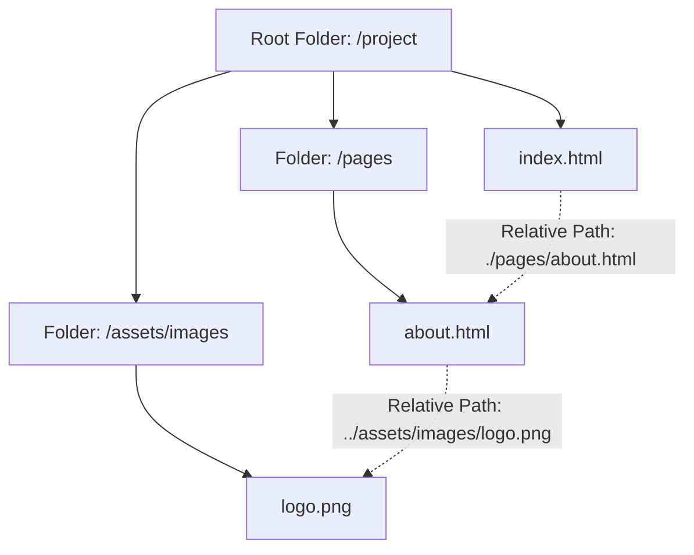

# Class 09: Hyperlinks (`<a>`), Relative vs Absolute Paths, Anchor Navigation & Marquee Tag

**Course:** Web Technology & Cloud Computing Applications – I  
**Unit:** Unit II - Static Web Page Development with HTML & HTML5  
**Target Duration:** 2 Hours (120 Minutes Continuous Session)  
**Self-Study Guide:** Designed for complete self-study. Every technical term is explained with simple real-world analogies without omitting any technical depth.

---

## 1. Class Session Objectives
By reading and studying this lecture guide line-by-line, you will be able to:
1. Create external and internal hyperlinks using the anchor tag (`<a>`).
2. Distinguish between Absolute URLs and Relative File Paths (`./`, `../`).
3. Construct In-Page Bookmark/Anchor Navigation (Back-to-Top links using `id` attributes).
4. Utilize link target attributes (`_blank`, `_self`) and understand the marquee tag (`<marquee>`).

---

## 2. Recommended 2-Hour Time Allocation

| Time Range | Duration | Activity / Teaching Strategy |
|---|---|---|
| **00:00 - 00:20** | 20 Mins | **Recap & Hook:** Review text formatting and images. Demonstrate clicking links to connect the global web. |
| **00:20 - 00:50** | 30 Mins | **Deep Dive Theory:** Anchor tag attributes, Absolute vs Relative paths, In-page jump targets, Marquee attributes. |
| **00:50 - 01:20** | 30 Mins | **Visual Diagram Breakdown:** Directory path navigation diagram (`../images/pic.jpg`). |
| **01:20 - 01:45** | 25 Mins | **Live Code Walkthrough:** Building a multi-page site with navigation bar and top/bottom jump anchors. |
| **01:45 - 02:00** | 15 Mins | **Spot Quiz & Session Wrap-Up:** Student quiz questions, Next Class Teaser. |

---

## 3. Visual Flowcharts & Architectural Diagrams

### A. Relative File Path Resolution Hierarchy


---

## 4. Key Jargon & Beginner Vocabulary Dictionary

> [!NOTE]
> * **Hyperlink:** A clickable text word, icon, or image on a web page that directs the user to another web page, document, or section.
> * **Anchor Tag (`<a>`):** The HTML element used to define hyperlinks. It requires an `href` (hypertext reference) attribute.
> * **Absolute URL:** A complete web address specifying protocol, domain name, and path (e.g., `https://www.wikipedia.org`).
> * **Relative Path:** A file path relative to the location of the current file (e.g., `./contact.html` or `../images/logo.png`).
> * **Target Attribute (`target="..."`):** Specifies where to open the linked document (e.g., `_blank` opens a new browser tab).
> * **In-Page Bookmark / Jump Anchor:** A link referencing an `id` on the same page (e.g., `href="#top"`), automatically scrolling the browser to that section.
> * **Marquee Tag (`<marquee>`):** A legacy HTML element used to create automatically scrolling horizontal text or image banners.

---

## 5. In-Depth Topic Breakdown

### 5.1 Absolute vs Relative URLs: The Address Analogy

* **Absolute URL (Full Global Address):** Imagine writing your complete postal address including Country, State, City, Street Name, and House Number (`https://www.wikipedia.org/wiki/LAN`). Anyone in the world can find this location regardless of where they are.
* **Relative Path (Directions from Current Room):** Imagine telling a family member in your house: *"Go two doors down the hall to the kitchen"* (`../kitchen/snack.html`). 
  * `./` = "Look inside the current folder".
  * `../` = "Step back up one folder to the parent directory".

---

### 5.2 Anchor Target Attributes

* `target="_self"`: Default; opens the linked document in the same frame/tab.
* `target="_blank"`: Opens the linked document in a new window or browser tab.
* `target="_parent"`: Opens the linked document in the parent frame.
* `target="_top"`: Opens the linked document in the full body of the window.

---

### 5.3 In-Page Jump Anchors (Bookmarks)

By setting an `id` attribute on an element, an anchor link can jump directly to that specific section on the page:
`<a href="#section3">Go to Section 3</a>` $\rightarrow$ `<h2 id="section3">Section 3 Content</h2>`.

---

## 6. Practical Code Examples

### A. Multi-Page Navigation with In-Page Jump Anchors & Marquee Banner

```html
<!DOCTYPE html>
<html lang="en">
<head>
    <meta charset="UTF-8">
    <title>Navigation & Anchor Demo - Mandsaur University</title>
</head>
<body id="top">

    <!-- Scrolling Announcement Banner using Marquee -->
    <marquee behavior="scroll" direction="left" scrollamount="5" bgcolor="#f2f2f2">
        <strong>Admissions Open 2026-27!</strong> Apply online at www.meu.edu.in for BCA Programs.
    </marquee>

    <!-- Top Navigation Links -->
    <nav>
        <a href="index.html">Home</a> | 
        <a href="https://en.wikipedia.org/wiki/LAN" target="_blank">LAN Info (External)</a> | 
        <a href="https://en.wikipedia.org/wiki/Wi-Fi" target="_blank">Wi-Fi Info (External)</a> | 
        <a href="#contact-section">Jump to Contact</a>
    </nav>

    <hr>

    <h1>Department Infrastructure</h1>
    <p>Scroll down to view detailed contact information...</p>

    <!-- Spacer to simulate long page content -->
    <div style="height: 600px; background-color: #f9f9f9; padding: 20px;">
        <p>Detailed campus infrastructure information goes here...</p>
    </div>

    <!-- Target Anchor Location -->
    <h2 id="contact-section">Department Contact Info</h2>
    <p>Email: info@meu.edu.in | Phone: +91-7422-220000</p>

    <!-- Back to Top Jump Link -->
    <p>
        <a href="#top">Back to Top of Page ↑</a>
    </p>

</body>
</html>
```

#### Line-by-Line Code Breakdown:
1. `<marquee behavior="scroll" direction="left"...>`: Creates a scrolling ticker text moving from right to left across the screen.
2. `<a href="https://en.wikipedia.org/wiki/LAN" target="_blank">`: Creates an external link opening Wikipedia in a new browser tab.
3. `<a href="#contact-section">`: Links to an element on the same page with `id="contact-section"`.
4. `<h2 id="contact-section">`: Target section heading assigned the unique identifier `contact-section`.
5. `<a href="#top">Back to Top of Page ↑</a>`: Jumps directly back up to `<body id="top">`.

---

## 7. Interactive Discussion & Spot Quiz

### Discussion Questions
1. When linking to an external website, why is it security best practice to use `target="_blank"` combined with `rel="noopener noreferrer"`?
2. What is the difference between `<a href="index.html">` and `<a href="/index.html">`?

### Spot Quiz
1. Which target attribute value forces a hyperlink to open in a new browser tab?
   - A) `target="_self"`
   - B) `target="_new"`
   - C) `target="_blank"`
   - D) `target="_top"`
2. What syntax is used in `href` to jump to an element with `id="footer"` on the current page?
   - A) `<a href="id:footer">`
   - B) `<a href="#footer">`
   - C) `<a href=".footer">`
   - D) `<a href="goto(footer)">`

---

## 8. Class Summary & Next Session Teaser

* **Summary:** Today we mastered `<a>` tags, Absolute vs Relative URL paths, target attributes (`_blank`), in-page anchor bookmarking (`href="#id"`), and `<marquee>` banners.
* **Next Class Teaser (Class 10):** Next class we cover **HTML Lists: Ordered Lists (`<ol>`), Unordered Lists (`<ul>`), Definition Lists (`<dl>`), and Nested Lists**!
