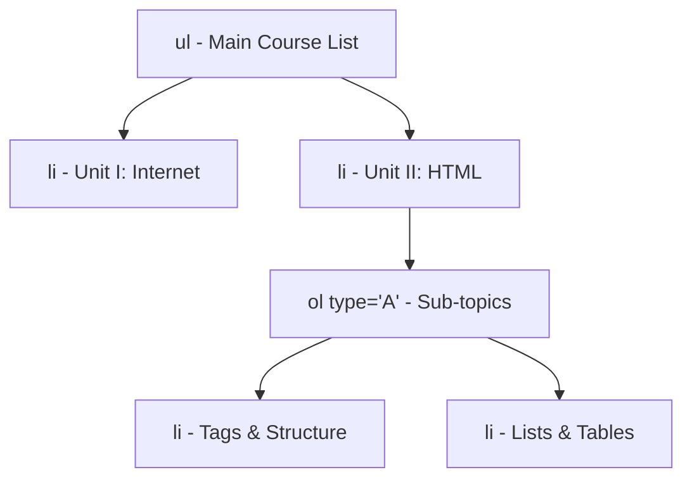

# Class 10: HTML Lists: Ordered Lists (`<ol>`), Unordered Lists (`<ul>`) & Nested Lists

**Course:** Web Technology & Cloud Computing Applications – I  
**Unit:** Unit II - Static Web Page Development with HTML & HTML5  
**Target Duration:** 2 Hours (120 Minutes Continuous Session)  
**Self-Study Guide:** Designed for complete self-study. Every technical term is explained with simple real-world analogies without omitting any technical depth.

---

## 1. Class Session Objectives
By reading and studying this lecture guide line-by-line, you will be able to:
1. Construct Unordered Lists (`<ul>`) with bullet style options (`disc`, `circle`, `square`).
2. Construct Ordered Lists (`<ol>`) with number/letter attributes (`type`, `start`, `reversed`).
3. Build Description Lists (`<dl>`, `<dt>`, `<dd>`) for terms and glossaries.
4. Design complex multi-level Nested Lists for web menus and course structures.

---

## 2. Recommended 2-Hour Time Allocation

| Time Range | Duration | Activity / Teaching Strategy |
|---|---|---|
| **00:00 - 00:20** | 20 Mins | **Recap & Hook:** Review links. Compare unstructured raw text vs structured lists for syllabus rendering. |
| **00:20 - 00:50** | 30 Mins | **Deep Dive Theory:** List tags, List types (`1`, `A`, `a`, `I`, `i`), nesting hierarchy rules, Description lists. |
| **00:50 - 01:20** | 30 Mins | **Visual Diagram Breakdown:** Nested list DOM hierarchy tree diagram. |
| **01:20 - 01:45** | 25 Mins | **Live Code Walkthrough:** Authoring a multi-level course curriculum menu using nested lists. |
| **01:45 - 02:00** | 15 Mins | **Spot Quiz & Session Wrap-Up:** Student quiz questions, Next Class Teaser. |

---

## 3. Visual Flowcharts & Architectural Diagrams

### A. Nested List DOM Hierarchy Tree


---

## 4. Key Jargon & Beginner Vocabulary Dictionary

> [!NOTE]
> * **Unordered List (`<ul>`):** A bulleted list of items where sequence order does not matter (e.g., a grocery list).
> * **Ordered List (`<ol>`):** A numbered or alphabetical list of items where sequence order is critical (e.g., step-by-step recipe instructions).
> * **List Item (`<li>`):** The individual container element placed inside a list to hold a single item's content.
> * **Description List (`<dl>`):** A specialized list format used to pair terms (`<dt>`) with their corresponding descriptions or definitions (`<dd>`).
> * **Nested List:** A list placed completely inside a list item (`<li>`) of another list, creating multi-level hierarchical menus.
> * **Nesting Rule:** The strict requirement that child lists must be placed inside parent `<li>...</li>` tags before the parent tag is closed.

---

## 5. In-Depth Topic Breakdown

### 5.1 Real-World List Analogies

1. **Unordered List (`<ul>`):** Like a grocery shopping list (Apples, Milk, Bread). Buying milk before apples makes no difference to the outcome.
2. **Ordered List (`<ol>`):** Like a recipe for baking a cake (Step 1: Mix flour; Step 2: Bake in oven; Step 3: Serve). You cannot bake the cake before mixing the flour!
3. **Description List (`<dl>`):** Like a physical dictionary or textbook glossary pairing a bold term with its definition text.
4. **Nested Lists:** Like the file directory on your laptop (Documents $\rightarrow$ University $\rightarrow$ Web Technology $\rightarrow$ Lab1.html).

---

### 5.2 Ordered List (`<ol>`) Attributes

* **`type` attribute:**
  * `type="1"`: Numbers (1, 2, 3...) [Default]
  * `type="A"`: Uppercase Letters (A, B, C...)
  * `type="a"`: Lowercase Letters (a, b, c...)
  * `type="I"`: Uppercase Roman Numerals (I, II, III...)
  * `type="i"`: Lowercase Roman Numerals (i, ii, iii...)
* **`start` attribute:** Specifies starting numerical value (e.g., `<ol start="5">` starts numbering at 5 or E).
* **`reversed` attribute:** Reverses list numbering order (e.g., 3, 2, 1).

---

### 5.3 Unordered List (`<ul>`) Bullet Types

* `disc`: Filled solid circle [Default]
* `circle`: Outline circle
* `square`: Filled solid square

---

### 5.4 Description List (`<dl>`) Structure

Used to pair terms with their definition descriptions:
* `<dl>`: Description List container
* `<dt>`: Description Term (The word being defined)
* `<dd>`: Description Data (The definition text)

---

## 6. Practical Code Examples

### A. Multi-Level Nested List & Description List Example

```html
<!DOCTYPE html>
<html lang="en">
<head>
    <meta charset="UTF-8">
    <title>Course Syllabus - BCA Semester III</title>
</head>
<body>
    <h1>BCA Semester III - Course Modules</h1>

    <!-- Multi-Level Nested List -->
    <ul type="disc">
        <li>
            <strong>Module 1: Web Technologies</strong>
            <ol type="I" start="1">
                <li>
                    Unit I: Networking Essentials
                    <ul type="circle">
                        <li>TCP/IP Protocol Suite</li>
                        <li>DNS Resolution</li>
                    </ul>
                </li>
                <li>
                    Unit II: Static Web Design
                    <ul type="circle">
                        <li>HTML5 Elements</li>
                        <li>Lists & Tables</li>
                    </ul>
                </li>
            </ol>
        </li>
        <li>
            <strong>Module 2: Cloud Computing</strong>
            <ol type="A">
                <li>IaaS & PaaS Models</li>
                <li>Virtualization Technology</li>
            </ol>
        </li>
    </ul>

    <hr>

    <!-- Description Glossary List -->
    <h2>Web Terminology Glossary</h2>
    <dl>
        <dt><strong>HTTP</strong></dt>
        <dd>HyperText Transfer Protocol - An application-layer protocol for transmitting web pages.</dd>
        
        <dt><strong>DNS</strong></dt>
        <dd>Domain Name System - Converts human-readable domain names into IP addresses.</dd>
    </dl>
</body>
</html>
```

#### Line-by-Line Code Breakdown:
1. `<ul type="disc">`: Creates a main outer unordered list using solid bullet points.
2. `<li><strong>Module 1...</strong>`: Opens the first parent list item.
3. `<ol type="I" start="1">`: Nests an ordered sub-list inside Module 1 using Roman Numerals (I, II, III).
4. `<ul type="circle">`: Nests a 3rd-level sub-list under Unit I using open circle bullet points.
5. `<dl>`: Creates a Description List container for glossary definitions.
6. `<dt><strong>HTTP</strong></dt>`: Specifies the term being defined.
7. `<dd>HyperText Transfer Protocol...</dd>`: Specifies the definition text for HTTP.

---

## 7. Interactive Discussion & Spot Quiz

### Discussion Questions
1. Why must list items (`<li>`) always be direct children of `<ol>` or `<ul>` tags, and what happens if a `<div>` is placed directly inside `<ul>`?
2. How do Description Lists (`<dl>`) differ from standard Unordered Lists (`<ul>`) in visual layout and semantic meaning?

### Spot Quiz
1. Which attribute is used to start an ordered list from the letter "E"?
   - A) `<ol start="E">`
   - B) `<ol type="A" start="5">`
   - C) `<ol begin="5">`
   - D) `<ol index="5">`
2. In a Description List, which tag defines the term being described?
   - A) `<dd>`
   - B) `<dt>`
   - C) `<dl>`
   - D) `<li>`

---

## 8. Class Summary & Next Session Teaser

* **Summary:** Today we covered Ordered lists (`<ol>`), Unordered lists (`<ul>`), list styling attributes (`type`, `start`), Description lists (`<dl>`), and building multi-level nested navigation lists.
* **Next Class Teaser (Class 11):** Next class we dive into **HTML Tables (`<table>`, `<tr>`, `<td>`, `<th>`), Table Layouts, `colspan` & `rowspan`**!
