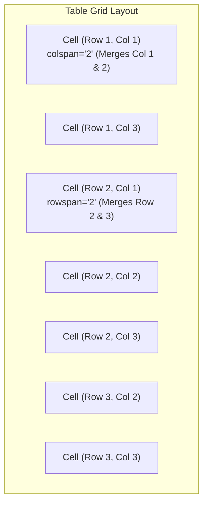

# Class 11: HTML Tables: Structure, Formatting, Spans (`colspan`/`rowspan`) & Layouts

**Course:** Web Technology & Cloud Computing Applications – I  
**Unit:** Unit II - Static Web Page Development with HTML & HTML5  
**Target Duration:** 2 Hours (120 Minutes Continuous Session)  
**Self-Study Guide:** Designed for complete self-study. Every technical term is explained with simple real-world analogies without omitting any technical depth.

---

## 1. Class Session Objectives
By reading and studying this lecture guide line-by-line, you will be able to:
1. Construct structured HTML tables using `<table>`, `<tr>`, `<th>`, and `<td>` tags.
2. Utilize Semantic Table Sections (`<thead>`, `<tbody>`, `<tfoot>`) and captions (`<caption>`).
3. Master cell spanning across columns (`colspan`) and rows (`rowspan`).
4. Format table borders, cell padding, cell spacing, and build table-based web page layouts.

---

## 2. Recommended 2-Hour Time Allocation

| Time Range | Duration | Activity / Teaching Strategy |
|---|---|---|
| **00:00 - 00:20** | 20 Mins | **Recap & Hook:** Review lists. Display a timetable spreadsheet and discuss translating grid data into HTML markup. |
| **00:20 - 00:50** | 30 Mins | **Deep Dive Theory:** Table structure, `colspan` vs `rowspan` grid math, table layout history & legacy presentation. |
| **00:50 - 01:20** | 30 Mins | **Visual Diagram Breakdown:** Grid spanning diagram mapping `colspan="2"` and `rowspan="2"`. |
| **01:20 - 01:45** | 25 Mins | **Live Code Walkthrough:** Building a complex Class Timetable and a multi-column University Infrastructure layout table. |
| **01:45 - 02:00** | 15 Mins | **Spot Quiz & Session Wrap-Up:** Student quiz questions, Next Class Teaser. |

---

## 3. Visual Flowcharts & Architectural Diagrams

### A. Table Cell Spanning Grid Matrix (`colspan` vs `rowspan`)


---

## 4. Key Jargon & Beginner Vocabulary Dictionary

> [!NOTE]
> * **HTML Table (`<table>`):** A two-dimensional grid arrangement of rows and columns used to display structured tabular data (like class timetables, financial reports, or rosters).
> * **Table Row (`<tr>`):** A horizontal container tag representing a single row of cells in a table.
> * **Table Header Cell (`<th>`):** A special cell tag used for column or row headings, rendered in bold font and centered by default.
> * **Table Data Cell (`<td>`):** A standard cell container used to hold actual data values, left-aligned by default.
> * **Colspan (`colspan="N"`):** An attribute that merges a single cell horizontally across $N$ columns.
> * **Rowspan (`rowspan="N"`):** An attribute that merges a single cell vertically across $N$ rows.
> * **Cellpadding:** The internal padding space (in pixels) between a cell's border and the text content inside it.
> * **Cellspacing:** The external distance space (in pixels) between adjacent individual table cells.

---

## 5. In-Depth Topic Breakdown

### 5.1 The Spreadsheet Grid Analogy

Think of an HTML table as a Microsoft Excel spreadsheet:
* `<table>` is the entire Excel sheet window.
* `<tr>` is an entire horizontal row (Row 1, Row 2, Row 3).
* `<th>` is a shaded column header cell at the top (e.g., "Student Name", "Marks").
* `<td>` is an individual grid cell where you type data.
* `colspan` is highlighting two adjacent cells side-by-side and clicking **"Merge & Center"** across columns.
* `rowspan` is highlighting two stacked cells vertically and clicking **"Merge & Center"** across rows.

---

### 5.2 HTML Table Core Tags

* `<table>`: Main container element for grid table.
* `<caption>`: Specifies a descriptive title for the table (positioned above table by default).
* `<thead>`: Encloses header rows (`<tr>`) containing header cells (`<th>`).
* `<tbody>`: Encloses body content rows containing data cells (`<td>`).
* `<tfoot>`: Encloses summary/footer rows (e.g., total sums).
* `<tr>`: Table Row container.
* `<th>`: Table Header cell (bold and centered by default).
* `<td>`: Table Data cell (regular font, left-aligned by default).

---

### 5.3 Cell Spanning Attributes (`colspan` vs `rowspan`)

* `colspan="N"`: Expands a cell horizontally to occupy $N$ consecutive columns.
* `rowspan="N"`: Expands a cell vertically to occupy $N$ consecutive rows.

> [!WARNING]
> **The Grid Math Rule:** If a row has 4 total columns, and you use `colspan="2"` on one cell, you must only add 2 more `<td>` cells to that row! Adding 3 extra cells will break table alignment.

---

## 6. Practical Code Examples

### A. Class Timetable with `colspan` and `rowspan`

```html
<!DOCTYPE html>
<html lang="en">
<head>
    <meta charset="UTF-8">
    <title>Class Timetable - BCA III Semester</title>
</head>
<body>

    <h2>Department Class Timetable (BCA III)</h2>

    <table border="1" cellpadding="8" cellspacing="0" width="100%">
        <caption><strong>Weekly Lecture Schedule (2-Hour Blocks)</strong></caption>
        
        <thead>
            <tr bgcolor="#4CAF50" style="color: white;">
                <th>Day</th>
                <th>09:00 AM - 11:00 AM</th>
                <th>11:00 AM - 01:00 PM</th>
                <th>01:00 PM - 02:00 PM</th>
                <th>02:00 PM - 04:00 PM</th>
            </tr>
        </thead>
        
        <tbody>
            <tr>
                <td><strong>Monday</strong></td>
                <td>Web Technology (Theory)</td>
                <td>Cloud Computing Applications</td>
                <td rowspan="5" align="center" bgcolor="#ffeb3b"><strong>LUNCH<br>BREAK</strong></td>
                <td>Web Technology Lab (P1)</td>
            </tr>
            <tr>
                <td><strong>Tuesday</strong></td>
                <td colspan="2" align="center" bgcolor="#e0f7fa">
                    <strong>Combined Hands-On Project Lab (Merged Streams)</strong>
                </td>
                <td>Cloud Computing Lab (P2)</td>
            </tr>
            <tr>
                <td><strong>Wednesday</strong></td>
                <td>System Administration</td>
                <td>Web Technology (Theory)</td>
                <td>Library & Seminar</td>
            </tr>
        </tbody>

        <tfoot>
            <tr bgcolor="#f2f2f2">
                <td colspan="5"><em>Note: All classes take place in Lab 302, CSA Department.</em></td>
            </tr>
        </tfoot>
    </table>

</body>
</html>
```

#### Line-by-Line Code Breakdown:
1. `<table border="1" cellpadding="8" cellspacing="0" width="100%">`: Creates a bordered table spanning full width with 8px inner cell padding.
2. `<caption>Weekly Lecture Schedule...</caption>`: Renders a table title centered above the grid.
3. `<tr bgcolor="#4CAF50" style="color: white;">`: Sets the header row background color to green with white bold text.
4. `<td rowspan="5" align="center" bgcolor="#ffeb3b">LUNCH BREAK</td>`: Merges the Lunch Break cell vertically across all 5 weekday rows.
5. `<td colspan="2" align="center" bgcolor="#e0f7fa">...</td>`: Merges Tuesday morning lecture time horizontally across 2 full column slots for the combined project lab.

---

## 7. Interactive Discussion & Spot Quiz

### Discussion Questions
1. How does `colspan="2"` alter the row cell count calculation in HTML tables, and why does an extra `<td>` break the alignment?
2. Why are modern websites constructed using `<div>` containers instead of `<table>` tags for overall web page layout?

### Spot Quiz
1. Which attribute is used to merge a single table cell across 3 horizontal columns?
   - A) `rowspan="3"`
   - B) `colspan="3"`
   - C) `colmerge="3"`
   - D) `span="3"`
2. Which HTML table tag is used for defining header cells that are automatically bolded and centered?
   - A) `<td>`
   - B) `<tr>`
   - C) `<th>`
   - D) `<thead>`

---

## 8. Class Summary & Next Session Teaser

* **Summary:** Today we mastered building tables using `<table>`, `<tr>`, `<th>`, `<td>`, `<thead>`, `<tbody>`, `<tfoot>`, and merging grid cells using `colspan` and `rowspan`.
* **Next Class Teaser (Class 12):** Next class we complete Unit II by mastering **HTML Forms (`<form>`), Input Types, Buttons, Backgrounds & Color Controls**!
