# Class 12: HTML Forms: Input Elements, Form Controls, Backgrounds & Color Controls

**Course:** Web Technology & Cloud Computing Applications – I  
**Unit:** Unit II - Static Web Page Development with HTML & HTML5  
**Target Duration:** 2 Hours (120 Minutes Continuous Session)  
**Self-Study Guide:** Designed for complete self-study. Every technical term is explained with simple real-world analogies without omitting any technical depth.

---

## 1. Class Session Objectives
By reading and studying this lecture guide line-by-line, you will be able to:
1. Construct user input forms using the `<form>` tag with `action` and `method` attributes.
2. Utilize diverse `<input>` types (`text`, `password`, `radio`, `checkbox`, `number`, `date`, `color`, `file`, `submit`, `reset`).
3. Master form control tags (`<textarea>`, `<select>`, `<option>`, `<label>`, `<fieldset>`, `<legend>`).
4. Apply page background colors (`bgcolor`), text colors, and HTML5 form validation attributes (`required`, `placeholder`, `pattern`).

---

## 2. Recommended 2-Hour Time Allocation

| Time Range | Duration | Activity / Teaching Strategy |
|---|---|---|
| **00:00 - 00:20** | 20 Mins | **Recap & Hook:** Review tables. Demonstrate user login and registration forms on popular web applications. |
| **00:20 - 00:50** | 30 Mins | **Deep Dive Theory:** Form attributes (`action`, `method`), input controls, radio groups, checkboxes, dropdowns, HTML5 validation. |
| **00:50 - 01:20** | 30 Mins | **Visual Diagram Breakdown:** Form Data Submission Pipeline diagram (Browser $\rightarrow$ Payload $\rightarrow$ Action URL). |
| **01:20 - 01:45** | 25 Mins | **Live Code Walkthrough:** Authoring a complete Student Registration Form with labels, fieldsets, and color pickers. |
| **01:45 - 02:00** | 15 Mins | **Spot Quiz & Session Wrap-Up:** Student quiz questions, Unit II Review & Unit III Teaser. |

---

## 3. Visual Flowcharts & Architectural Diagrams

### A. HTML Form Submission Data Pipeline

```mermaid
sequenceDiagram
    autonumber
    actor User as Student User
    participant Form as HTML Form (Client Browser)
    participant Server as Backend Script (action='process.php')

    User->>Form: Fills Text, Selects Radio Buttons & Checkboxes
    User->>Form: Clicks <input type='submit'>
    Form->>Form: Executes HTML5 Constraints Validation (required, pattern)
    alt Validation Passes
        Form->>Server: HTTP POST /process.php (Form Data Payload in Request Body)
        Server-->>User: 200 OK Response (Registration Successful Page)
    else Validation Fails
        Form-->>User: Display Browser Tooltip Warning (e.g. 'Please fill out this field')
    end
```


---

## 4. Key Jargon & Beginner Vocabulary Dictionary

> [!NOTE]
> * **HTML Form (`<form>`):** An interactive section of a web page containing input controls designed to collect user data and transmit it to a server.
> * **Form Control:** Individual interactive UI elements inside a form (like text boxes, buttons, checkboxes, radio buttons, and dropdown menus).
> * **Action Attribute (`action="..."`):** The URL of the server-side script or page where the form data payload is sent upon submission.
> * **Method Attribute (`method="..."`):** The HTTP request method used to send data (`GET` appends input data in the browser URL; `POST` hides data securely inside the HTTP request body).
> * **Radio Button (`<input type="radio">`):** A form input allowing a user to pick exactly ONE option from a mutually exclusive group of options.
> * **Checkbox (`<input type="checkbox">`):** A form input allowing a user to select zero, one, or multiple independent choices.
> * **Fieldset (`<fieldset>`):** A visual grouping border drawn around related form controls.
> * **Legend (`<legend>`):** A caption heading positioned on a `<fieldset>` border describing the grouped form section.
> * **HTML5 Constraint Validation:** Built-in browser checks (like `required`, `type="email"`, `min="1"`, `max="100"`) that prevent form submission if fields contain invalid data.

---

## 5. In-Depth Topic Breakdown

### 5.1 Real-World Paper Form Analogy

Think of an HTML `<form>` as a physical paper job application or bank account opening form:
1. **The Form Container (`<form>`):** The printed paper sheet itself.
2. **Action & Method (`action` / `method`):** The mailing address written on the pre-addressed return envelope (`action="process.php"`), and whether you mail it via standard open postcard (`method="GET"`) or a sealed registered envelope (`method="POST"`).
3. **Radio Buttons vs Checkboxes:** 
   - Radio buttons are like a multiple-choice question on an exam where you can pick only ONE answer (e.g., Gender: Male or Female). Selecting one automatically unselects the other.
   - Checkboxes are like ordering pizza toppings where you can check multiple items (e.g., Extra Cheese, Mushrooms, Olives).
4. **Fieldset & Legend:** Like boxing off a section of the application paper titled `"Section 1: Applicant Emergency Contacts"`.

---

### 5.2 HTML Form Core Attributes

* `action`: URL of the server-side script that handles and processes submitted form data.
* `method`: HTTP method used to send data (`GET` appends parameters in URL; `POST` sends payload in request body).
* `enctype`: Encoding type for data; `multipart/form-data` is required when uploading files via `<input type="file">`.

---

### 5.3 Form Control Elements Table

| Input Element | Tag & Syntax | Primary Function |
|---|---|---|
| **Text Field** | `<input type="text" name="username">` | Single-line text input |
| **Password Field** | `<input type="password" name="pwd">` | Masked characters input |
| **Radio Button** | `<input type="radio" name="gender" value="M">` | Exclusive single choice among a group |
| **Checkbox** | `<input type="checkbox" name="subject" value="Web">` | Multiple independent selections |
| **Dropdown List** | `<select name="city"><option value="1">Mandsaur</option></select>` | Dropdown selection menu |
| **Multi-line Text** | `<textarea name="address" rows="4" cols="50"></textarea>` | Multi-line comment/address field |
| **Fieldset & Legend** | `<fieldset><legend>Personal Info</legend>...</fieldset>` | Grouping visual box with caption |

---

## 6. Practical Code Examples

### A. Student Registration Form with Background Colors & Fieldsets

```html
<!DOCTYPE html>
<html lang="en">
<head>
    <meta charset="UTF-8">
    <title>Student Registration - Mandsaur University</title>
</head>
<body bgcolor="#f4f6f9" text="#333333">

    <h2 align="center">Student Course Registration Form</h2>

    <form action="process_register.php" method="POST" enctype="multipart/form-data">
        
        <!-- Section 1: Personal Details -->
        <fieldset>
            <legend><strong>1. Personal Information</strong></legend>
            <p>
                <label for="fullname">Full Name:</label><br>
                <input type="text" id="fullname" name="fullname" placeholder="Enter your full name" required size="40">
            </p>
            <p>
                <label for="userpass">Password:</label><br>
                <input type="password" id="userpass" name="userpass" required size="40">
            </p>
            <p>
                <label>Gender:</label>
                <input type="radio" id="male" name="gender" value="Male" required>
                <label for="male">Male</label>
                <input type="radio" id="female" name="gender" value="Female">
                <label for="female">Female</label>
            </p>
        </fieldset>

        <br>

        <!-- Section 2: Preferences & Upload -->
        <fieldset>
            <legend><strong>2. Course Preferences & Profile</strong></legend>
            <p>
                <label for="stream">Select Branch/Stream:</label>
                <select id="stream" name="stream" required>
                    <option value="">-- Select Stream --</option>
                    <option value="SACS">System Administration & Cyber Security</option>
                    <option value="BCC">Cloud Computing</option>
                </select>
            </p>
            <p>
                <label>Favorite Hobbies / Subjects:</label><br>
                <input type="checkbox" name="hobbies[]" value="WebDev"> Web Development
                <input type="checkbox" name="hobbies[]" value="Cloud"> Cloud Architecture
                <input type="checkbox" name="hobbies[]" value="CyberSec"> Network Security
            </p>
            <p>
                <label for="favcolor">Theme Color Choice:</label>
                <input type="color" id="favcolor" name="favcolor" value="#008CBA">
            </p>
            <p>
                <label for="photo">Upload Profile Photo:</label>
                <input type="file" id="photo" name="photo" accept="image/*">
            </p>
        </fieldset>

        <br>

        <!-- Form Submission Controls -->
        <p align="center">
            <input type="submit" value="Register Student" style="padding: 10px 20px;">
            <input type="reset" value="Clear Form" style="padding: 10px 20px;">
        </p>

    </form>

</body>
</html>
```

#### Line-by-Line Code Breakdown:
1. `<form action="process_register.php" method="POST" enctype="multipart/form-data">`: Defines form submitting payload via `POST` to backend script `process_register.php`. `enctype` allows file uploads.
2. `<fieldset>` & `<legend>1. Personal Information</legend>`: Draws a border box around personal fields with a bold title.
3. `<input type="text" id="fullname" name="fullname" placeholder="..." required>`: Creates a single-line input field that forces user completion before submitting (`required`).
4. `<input type="radio" name="gender" value="Male">`: Creates a radio button. Both Male/Female share `name="gender"`, ensuring only one can be selected.
5. `<select id="stream" name="stream">`: Creates a dropdown menu containing `<option>` items.
6. `<input type="submit" value="Register Student">`: Triggers form constraint validation and submits form data to the server.

---

## 7. Interactive Discussion & Spot Quiz

### Discussion Questions
1. Why must Radio Buttons sharing the same logical group have the exact same `name` attribute value?
2. What is the difference between `method="GET"` and `method="POST"` when submitting sensitive form data like passwords?

### Spot Quiz
1. Which attribute on `<form>` specifies the target server URL where form data is sent?
   - A) `method`
   - B) `action`
   - C) `target`
   - D) `href`
2. Which `<input>` attribute ensures a field must be filled out before submitting the form?
   - A) `validate="true"`
   - B) `placeholder`
   - C) `required`
   - D) `mandatory`

---

## 8. Class Summary & Next Session Teaser

* **Summary:** Today we completed Unit II by mastering HTML Forms, input controls (`text`, `password`, `radio`, `checkbox`, `select`, `file`), fieldset grouping, and HTML5 validation attributes.
* **Next Class Teaser (Class 13):** In Class 13, we begin **Unit III: Dynamic Web Page Styling with CSS**, exploring CSS Syntax, Selectors, Properties, and Units (`px`, `%`, `em`, `rem`)!
