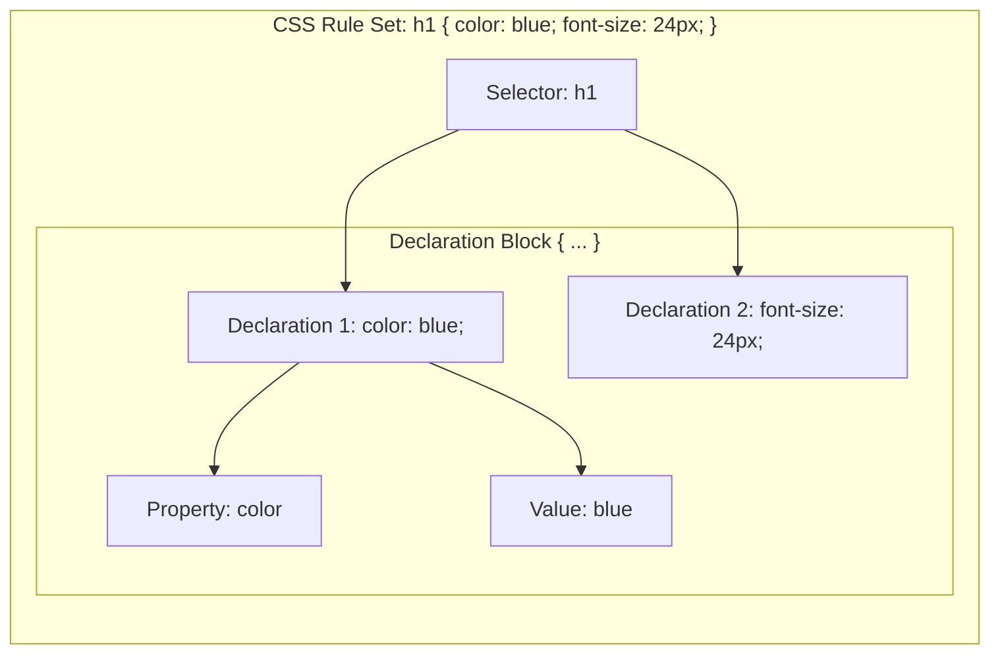
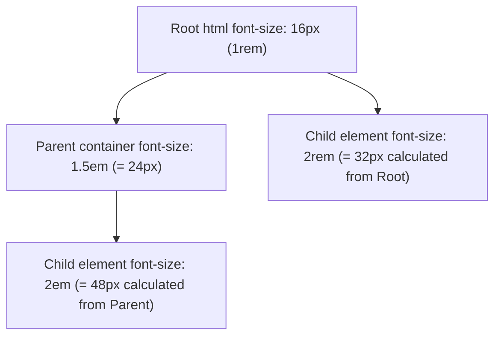

# Class 13: Introduction to CSS: Syntax, Properties, Declarations & CSS Units

**Course:** Web Technology & Cloud Computing Applications – I  
**Unit:** Unit III - Dynamic Web Page Styling with CSS & Layout Design  
**Target Duration:** 2 Hours (120 Minutes Continuous Session)  
**Self-Study Guide:** Designed for complete self-study. Every technical term is explained with simple real-world analogies without omitting any technical depth.

---

## 1. Class Session Objectives
By reading and studying this lecture guide line-by-line, you will be able to:
1. Explain the purpose of Cascading Style Sheets (CSS) in separating presentation from content.
2. Deconstruct the CSS Rule Set syntax (Selector, Property, Value, Declaration).
3. Differentiate between Absolute Units (`px`, `pt`, `in`) and Relative Units (`%`, `em`, `rem`, `vw`, `vh`).
4. Understand CSS Inheritance and the Cascading Order of styles.

---

## 2. Recommended 2-Hour Time Allocation

| Time Range | Duration | Activity / Teaching Strategy |
|---|---|---|
| **00:00 - 00:20** | 20 Mins | **Recap & Unit III Intro:** Transition from raw HTML markup to visual CSS styling. Show unstyled HTML vs styled site. |
| **00:20 - 00:50** | 30 Mins | **Deep Dive Theory:** CSS Rule Anatomy, CSS Units (`px` vs `em`/`rem`), Inheritance & Specificity basics. |
| **00:50 - 01:20** | 30 Mins | **Visual Diagram Breakdown:** CSS Rule Anatomy Diagram & CSS Unit Scaling Tree. |
| **01:20 - 01:45** | 25 Mins | **Live Code Walkthrough:** Writing CSS rules in browser DevTools Styles tab and comparing unit behaviors. |
| **01:45 - 02:00** | 15 Mins | **Spot Quiz & Session Wrap-Up:** Student quiz questions, Next Class Teaser. |

---

## 3. Visual Flowcharts & Architectural Diagrams

### A. Anatomy of a CSS Rule Set


### B. Relative vs Absolute CSS Units Scaling Hierarchy


---

## 4. Key Jargon & Beginner Vocabulary Dictionary

> [!NOTE]
> * **CSS (Cascading Style Sheets):** A stylesheet language used to describe the visual presentation (colors, fonts, layouts, spacing) of a document written in HTML.
> * **Cascading:** The algorithm that resolves conflicts when multiple CSS rules apply to the same HTML element, relying on specificity and rule order.
> * **Rule Set:** A complete CSS instruction block comprising a **Selector** and a **Declaration Block** enclosed in curly braces `{...}`.
> * **Selector:** The target pattern at the beginning of a CSS rule set specifying which HTML elements to style (e.g., `h1`, `.card`, `#logo`).
> * **Property:** The specific visual attribute being modified (e.g., `color`, `font-size`, `background-color`, `margin`).
> * **Value:** The setting assigned to a property (e.g., `blue`, `24px`, `center`).
> * **Declaration:** A single pair consisting of a Property and Value separated by a colon and ending with a semicolon (e.g., `color: red;`).
> * **Absolute Unit (`px`):** Fixed measurement units that do not scale relative to other elements (1px = 1/96th of an inch).
> * **Relative Unit (`rem` / `em` / `%`):** Dynamic units that scale relative to root font sizes, parent font sizes, or viewport dimensions.

---

## 5. In-Depth Topic Breakdown

### 5.1 Real-World Analogy for CSS

Imagine a store mannequin:
* **HTML:** The bare plastic mannequin frame specifying human limbs and torso.
* **CSS:** The designer clothes, shoes, hat, and jacket put onto the mannequin.
* **CSS Selector & Declaration:** Pointing at the mannequin in a crowd ("Target: The mannequin in the front window!") and giving an instruction ("Property: Jacket color; Value: Red!").

---

### 5.2 CSS Unit Types Comparison

| Unit Category | Unit Name | Reference Base | Best Use Case |
|---|---|---|---|
| **Absolute** | `px` (Pixels) | Fixed screen pixels (1px = 1/96 inch) | Borders, fixed shadows, small details |
| **Relative (Element)** | `em` | Font size of the *parent element* | Padding/margins scaling relative to text |
| **Relative (Root)** | `rem` | Font size of the *root `<html>` element* | Typography, accessible layout sizing |
| **Relative (Percentage)** | `%` | Size relative to parent container width/height | Responsive column widths |
| **Relative (Viewport)** | `vw` / `vh` | $1\%$ of Viewport Width / Viewport Height | Full-screen hero sections |

---

## 6. Practical Code Examples

### A. Demonstrating CSS Units (`rem`, `em`, `px`) & Syntax

```html
<!DOCTYPE html>
<html lang="en">
<head>
    <meta charset="UTF-8">
    <title>CSS Units & Syntax Demo</title>
    <style>
        /* Base Root Font Size */
        html {
            font-size: 16px;
        }

        /* Selector Declaration Block */
        body {
            font-family: 'Segoe UI', Arial, sans-serif;
            color: #333333;
        }

        /* Fixed Pixel Heading */
        h1 {
            font-size: 32px; /* Absolute Unit */
            border-bottom: 2px solid #008CBA;
        }

        /* REM Relative Container */
        .card {
            font-size: 1.25rem; /* 1.25 * 16px = 20px */
            padding: 1.5rem;   /* 1.5 * 16px = 24px */
            background-color: #f8f9fa;
        }

        /* EM Relative Sub-element */
        .card-button {
            font-size: 0.8em; /* 0.8 * 20px (card size) = 16px */
            padding: 0.5em 1em;
            background-color: #4CAF50;
            color: white;
        }
    </style>
</head>
<body>

    <h1>CSS Syntax & Units Demonstration</h1>

    <div class="card">
        <p>This card container has a font size of 1.25rem (20px).</p>
        <button class="card-button">EM-Scaled Button</button>
    </div>

</body>
</html>
```

#### Line-by-Line Code Breakdown:
1. `html { font-size: 16px; }`: Sets the root font size baseline. All `rem` units across the page will multiply against `16px`.
2. `h1 { font-size: 32px; }`: Sets an absolute heading size of 32 pixels.
3. `.card { font-size: 1.25rem; }`: Sets font size to $1.25 \times 16\text{px} = 20\text{px}$.
4. `.card-button { font-size: 0.8em; }`: Sets button font size to $0.8 \times \text{parent font size (20px)} = 16\text{px}$.

---

## 7. Interactive Discussion & Spot Quiz

### Discussion Questions
1. What is the key advantage of using `rem` units over fixed `px` units for responsive typography and web accessibility?
2. Explain the cascading mechanism in CSS: What happens when two identical CSS rules target the same element with different values?

### Spot Quiz
1. In the CSS declaration `font-size: 2rem;`, what is `font-size` called?
   - A) Selector
   - B) Property
   - C) Value
   - D) Class
2. If root `<html>` font-size is 16px, what is the calculated pixel value of `1.5rem`?
   - A) 16px
   - B) 20px
   - C) 24px
   - D) 32px

---

## 8. Class Summary & Next Session Teaser

* **Summary:** Today we introduced CSS rule sets, selector anatomy, properties, declarations, and absolute (`px`) vs relative (`em`, `rem`, `%`, `vw`) units.
* **Next Class Teaser (Class 14):** Next class we cover **Style Placement Methods: Inline styles, Internal `<style>` tags, and Linking External `.css` stylesheets**!
