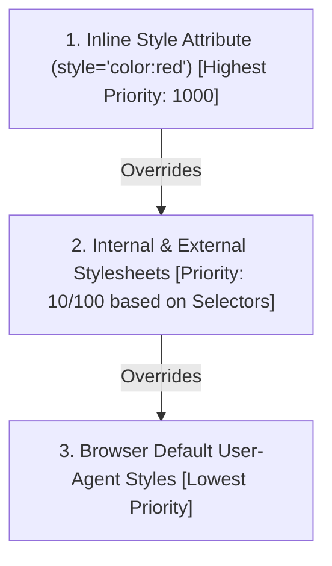

# Class 14: CSS Style Placement Methods: Inline, Internal & External Stylesheets

**Course:** Web Technology & Cloud Computing Applications – I  
**Unit:** Unit III - Dynamic Web Page Styling with CSS & Layout Design  
**Target Duration:** 2 Hours (120 Minutes Continuous Session)  
**Self-Study Guide:** Designed for complete self-study. Every technical term is explained with simple real-world analogies without omitting any technical depth.

---

## 1. Class Session Objectives
By reading and studying this lecture guide line-by-line, you will be able to:
1. Implement Inline Styles using the HTML `style` attribute.
2. Construct Internal Stylesheets within the `<style>` tag in `<head>`.
3. Create and link External CSS files (`.css`) using the `<link>` tag.
4. Compare precedence, specificity, and maintainability across the three placement methods.

---

## 2. Recommended 2-Hour Time Allocation

| Time Range | Duration | Activity / Teaching Strategy |
|---|---|---|
| **00:00 - 00:20** | 20 Mins | **Recap & Hook:** Review CSS syntax. Demonstrate updating a single `.css` file to re-style a 100-page website. |
| **00:20 - 00:50** | 30 Mins | **Deep Dive Theory:** Inline vs Internal vs External placement, `@import`, Specificity hierarchy, Cascade rule. |
| **00:50 - 01:20** | 30 Mins | **Visual Diagram Breakdown:** CSS Specificity Weight Calculation & Placement Precedence Flow. |
| **01:20 - 01:45** | 25 Mins | **Live Code Walkthrough:** Refactoring inline styled code into modular external CSS stylesheets. |
| **01:45 - 02:00** | 15 Mins | **Spot Quiz & Session Wrap-Up:** Student quiz questions, Next Class Teaser. |

---

## 3. Visual Flowcharts & Architectural Diagrams

### A. CSS Placement Precedence & Override Cascade


---

## 4. Key Jargon & Beginner Vocabulary Dictionary

> [!NOTE]
> * **Inline Style:** CSS rules written directly inside an HTML element tag using the `style="..."` attribute (e.g., `<p style="color: red;">`).
> * **Internal Style:** CSS rules written inside a `<style>` tag embedded within the `<head>` section of a single HTML document.
> * **External Stylesheet:** A separate file ending in `.css` that contains all CSS rules, linked to HTML documents using the `<link>` tag.
> * **Link Tag (`<link>`):** An HTML void tag used in `<head>` to establish a connection between an HTML file and an external CSS file.
> * **Cascading Precedence:** The hierarchy rules determining which style wins when multiple styles target the same element (Inline > Internal/External > Browser Default).
> * **Browser Caching:** The process where web browsers save external `.css` files in local memory so subsequent pages load instantly without re-downloading the file.

---

## 5. In-Depth Topic Breakdown

### 5.1 Real-World Analogy for Style Placement

Think of web styling like university uniform regulations:
1. **Inline Style (Writing on a T-Shirt with a Sharpie):** Writing a rule directly on one specific t-shirt (`style="color: red;"`). It overrides all general rules, but if you want to change 100 shirts, you have to write on every single one manually!
2. **Internal Style (Writing Rules on a Classroom Whiteboard):** Writing uniform rules on a specific classroom board (`<style>` in `<head>`). All students in that room follow the rule, but students in other classrooms cannot see it.
3. **External Stylesheet (The University Student Handbook):** Printing a single official uniform rule handbook (`style.css`) given to every student across campus. Modifying one line in the handbook updates the rule for all 5,000 students across all pages instantly!

---

### 5.2 CSS Style Placement Comparison Matrix

| Method | Syntax Location | Pros | Cons | Best Use Case |
|---|---|---|---|---|
| **Inline Style** | Inside HTML element attribute `style="..."` | Highest specificity, overrides other styles instantly | Poor maintainability, violates separation of concerns | Quick testing, dynamic JS overrides |
| **Internal Style** | Inside `<style>` tag in `<head>` | Single-file convenience, no extra HTTP requests | Applies to single page only, duplicates code across pages | One-off single landing pages |
| **External Style** | Linked via `<link rel="stylesheet" href="style.css">` | Reusable across entire site, cached by browser, clean code | Requires extra HTTP request (mitigated by HTTP/2) | Professional multi-page web applications |

---

## 6. Practical Code Examples

### A. Multi-Page External CSS Architecture Setup

#### 1. External CSS File (`style.css`)
```css
/* style.css - Global Stylesheet */
body {
    font-family: Arial, sans-serif;
    background-color: #f4f6f9;
    color: #333333;
    margin: 0;
    padding: 20px;
}

.header-banner {
    background-color: #003366;
    color: #ffffff;
    padding: 15px;
    text-align: center;
}

.highlight-box {
    background-color: #e3f2fd;
    border-left: 5px solid #2196f3;
    padding: 15px;
    margin: 15px 0;
}
```

#### 2. HTML Document Linking External CSS (`index.html`)
```html
<!DOCTYPE html>
<html lang="en">
<head>
    <meta charset="UTF-8">
    <title>External CSS Demo - Mandsaur University</title>
    
    <!-- External CSS Link Tag -->
    <link rel="stylesheet" href="style.css">
    
    <!-- Internal CSS (Overrides External for specific element) -->
    <style>
        h1 {
            text-transform: uppercase;
        }
    </style>
</head>
<body>

    <div class="header-banner">
        <h1>Department of CSA</h1>
    </div>

    <!-- Inline Style Override Example -->
    <p style="color: red; font-weight: bold;">
        This paragraph uses inline CSS to force red text.
    </p>

    <div class="highlight-box">
        This box receives styling directly from the external style.css file.
    </div>

</body>
</html>
```

#### Line-by-Line Code Breakdown:
1. `<link rel="stylesheet" href="style.css">`: Fetches the external `style.css` stylesheet and applies its global rules.
2. `<style> h1 { text-transform: uppercase; } </style>`: Internal CSS rule that targets `<h1>` elements on this specific page.
3. `<p style="color: red; ...">`: Demonstrates Inline CSS. Because inline styles have higher precedence than internal/external rules, `color: red;` overrides any external `p` color settings!

---

## 7. Interactive Discussion & Spot Quiz

### Discussion Questions
1. Why is relying heavily on inline styles (`style="..."`) considered an anti-pattern in professional web development?
2. How does browser caching benefit performance when using external CSS stylesheets?

### Spot Quiz
1. Which HTML tag is used to link an external CSS stylesheet into an HTML document?
   - A) `<script src="style.css">`
   - B) `<link rel="stylesheet" href="style.css">`
   - C) `<style href="style.css">`
   - D) `<css path="style.css">`
2. Which CSS placement method has the highest default specificity precedence over external rules?
   - A) External CSS
   - B) Internal `<style>` tag
   - C) Inline `style=""` attribute
   - D) Browser Defaults

---

## 8. Class Summary & Next Session Teaser

* **Summary:** Today we covered Inline styles, Internal `<style>` tags, linking External `.css` files via `<link>`, and analyzed precedence and specificity rules.
* **Next Class Teaser (Class 15):** Next class we explore **CSS Styling Properties: Backgrounds, Text Formatting, Controlling Fonts & Typographic Hierarchy**!
