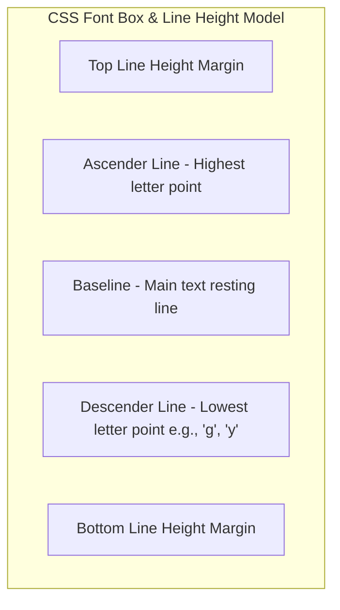

# Class 15: CSS Styling: Backgrounds, Text Formatting & Controlling Fonts

**Course:** Web Technology & Cloud Computing Applications – I  
**Unit:** Unit III - Dynamic Web Page Styling with CSS & Layout Design  
**Target Duration:** 2 Hours (120 Minutes Continuous Session)  
**Self-Study Guide:** Designed for complete self-study. Every technical term is explained with simple real-world analogies without omitting any technical depth.

---

## 1. Class Session Objectives
By reading and studying this lecture guide line-by-line, you will be able to:
1. Apply CSS Background properties (`background-color`, `background-image`, `background-repeat`, `background-position`, `background-size`).
2. Format text typography using `text-align`, `text-decoration`, `text-transform`, `line-height`, `letter-spacing`, and `word-spacing`.
3. Control web fonts using `font-family`, `font-size`, `font-weight`, `font-style`, and `@font-face` / Google Fonts integration.
4. Construct visual hero sections with background images and overlay typography.

---

## 2. Recommended 2-Hour Time Allocation

| Time Range | Duration | Activity / Teaching Strategy |
|---|---|---|
| **00:00 - 00:20** | 20 Mins | **Recap & Hook:** Review style placement. Compare default browser typography vs custom Google Fonts styled page. |
| **00:20 - 00:50** | 30 Mins | **Deep Dive Theory:** Background properties (cover vs contain), Font fallback stacks, Web-safe fonts, Text formatting. |
| **00:50 - 01:20** | 30 Mins | **Visual Diagram Breakdown:** Typography metrics diagram (Baseline, Line-Height, Font Box, Line Spacing). |
| **01:20 - 01:45** | 25 Mins | **Live Code Walkthrough:** Importing Google Fonts and creating a hero header with background cover image. |
| **01:45 - 02:00** | 15 Mins | **Spot Quiz & Session Wrap-Up:** Student quiz questions, Next Class Teaser. |

---

## 3. Visual Flowcharts & Architectural Diagrams

### A. Typography Line-Height & Font Box Metrics


---

## 4. Key Jargon & Beginner Vocabulary Dictionary

> [!NOTE]
> * **Typography:** The art and technique of arranging text on a web page to make written language legible, readable, and visually appealing.
> * **Line-Height (`line-height`):** The vertical distance between adjacent lines of text, controlling line spacing to prevent cramped reading.
> * **Letter-Spacing (`letter-spacing`):** The horizontal spacing gap between individual characters in a word.
> * **Font Family Stack:** A fallback prioritized list of font names in CSS (e.g., `'Poppins', Arial, sans-serif`). If the user's computer does not have the first font installed, the browser moves to the next font in the stack.
> * **Web-Safe Font:** Fonts universally pre-installed on virtually all computers worldwide (like Arial, Times New Roman, Georgia, Verdana).
> * **Google Fonts:** A free cloud repository of custom web fonts imported into web pages via `<link>` or `@import`.
> * **`background-size: cover`:** Scales a background image so it completely covers the container element, cropping edges if necessary.
> * **`background-size: contain`:** Scales a background image so the entire image is visible inside the container without cropping.

---

## 5. In-Depth Topic Breakdown

### 5.1 Real-World Styling Analogies

1. **`background-size: cover` vs `contain` (Picture Frame Analogy):**
   * Imagine fitting a photograph into a picture frame. 
   * `cover` zooms and crops the photograph so the entire frame is covered without any empty white gaps on the sides.
   * `contain` scales the photo so the entire photograph is visible inside the frame without cropping any edges, even if empty white bars appear on the sides.
2. **Font Family Fallback Stack (Restaurant Analogy):**
   * Ordering a drink: *"I'd like a glass of fresh orange juice (`'Poppins'`). If you're out of that, give me canned juice (`Arial`). If you don't have that, bring me any cold fruit drink (`sans-serif`)!"*

---

### 5.2 CSS Background Properties

* `background-color`: Sets solid background color (HEX, RGB, HSL).
* `background-image`: Specifies image URL (`url('bg.jpg')`).
* `background-repeat`: `repeat` | `no-repeat` | `repeat-x` | `repeat-y`.
* `background-size`: `cover` (scales to fill container completely) | `contain` (scales to fit inside container without cropping).
* `background-position`: Position of image (`center center`, `top right`).

---

### 5.3 Font Family Stack & Google Fonts

Always specify fallback web-safe fonts:
`font-family: 'Roboto', 'Helvetica Neue', Arial, sans-serif;`

---

## 6. Practical Code Examples

### A. Styled Hero Banner with Google Fonts & Background Image

```html
<!DOCTYPE html>
<html lang="en">
<head>
    <meta charset="UTF-8">
    <title>Typography & Background Demo</title>

    <!-- Google Fonts Integration -->
    <link rel="preconnect" href="https://fonts.googleapis.com">
    <link href="https://fonts.googleapis.com/css2?family=Poppins:wght@400;600;700&display=swap" rel="stylesheet">

    <style>
        body {
            margin: 0;
            font-family: 'Poppins', Arial, sans-serif;
            color: #333333;
        }

        /* Hero Banner with Background Image */
        .hero-banner {
            background-color: #1a252f;
            background-image: linear-gradient(rgba(0,0,0,0.6), rgba(0,0,0,0.6)), url('hero-bg.jpg');
            background-size: cover;
            background-position: center;
            background-repeat: no-repeat;
            color: #ffffff;
            text-align: center;
            padding: 100px 20px;
        }

        .hero-banner h1 {
            font-size: 2.5rem;
            font-weight: 700;
            text-transform: uppercase;
            letter-spacing: 2px;
            margin-bottom: 15px;
        }

        .hero-banner p {
            font-size: 1.2rem;
            line-height: 1.8;
            max-width: 700px;
            margin: 0 auto;
            text-decoration: underline dotted #4CAF50;
        }
    </style>
</head>
<body>

    <div class="hero-banner">
        <h1>Welcome to Mandsaur University</h1>
        <p>
            Department of Computer Science & Applications - Empowering future IT professionals through state-of-the-art education.
        </p>
    </div>

</body>
</html>
```

#### Line-by-Line Code Breakdown:
1. `<link href="https://fonts.googleapis.com/css2?family=Poppins..." rel="stylesheet">`: Fetches the custom Google Font **Poppins** over the cloud.
2. `background-image: linear-gradient(...), url('hero-bg.jpg')`: Applies a dark translucent overlay gradient over the background photo so white text remains easy to read.
3. `background-size: cover`: Stretches the hero background photo to cover the full width and height of the container banner.
4. `text-transform: uppercase; letter-spacing: 2px;`: Capitalizes all letters in the heading and spreads them out with a 2px horizontal letter gap.

---

## 7. Interactive Discussion & Spot Quiz

### Discussion Questions
1. What is the difference between `background-size: cover` and `background-size: contain`?
2. Why is specifying a generic fallback font like `sans-serif` or `serif` at the end of a `font-family` declaration essential?

### Spot Quiz
1. Which CSS property transforms all text characters to uppercase?
   - A) `font-transform: uppercase`
   - B) `text-transform: uppercase`
   - C) `text-style: capital`
   - D) `font-variant: caps`
2. Which `background-repeat` value ensures a background image is displayed only once without tiling?
   - A) `background-repeat: single;`
   - B) `background-repeat: no-repeat;`
   - C) `background-repeat: none;`
   - D) `background-repeat: stop;`

---

## 8. Class Summary & Next Session Teaser

* **Summary:** Today we covered CSS backgrounds (`cover`, `contain`), typography formatting (`text-transform`, `line-height`), and web font stacks with Google Fonts integration.
* **Next Class Teaser (Class 16):** Next class we master **CSS Selectors, ID (`#id`) & Class (`.class`) Selectors, Grouping Selectors & Color Models (HEX, RGB, HSL)**!
