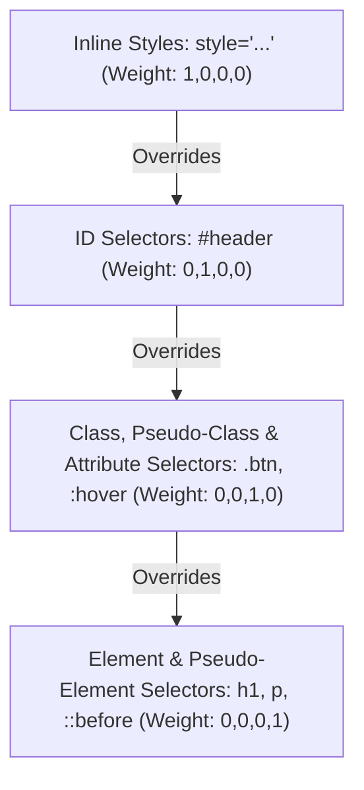

# Class 16: CSS Selectors: ID vs Class, Grouping Selectors & Color Models (HEX, RGB, HSL)

**Course:** Web Technology & Cloud Computing Applications – I  
**Unit:** Unit III - Dynamic Web Page Styling with CSS & Layout Design  
**Target Duration:** 2 Hours (120 Minutes Continuous Session)  
**Self-Study Guide:** Designed for complete self-study. Every technical term is explained with simple real-world analogies without omitting any technical depth.

---

## 1. Class Session Objectives
By reading and studying this lecture guide line-by-line, you will be able to:
1. Differentiate between Element, Class (`.class`), and ID (`#id`) Selectors.
2. Utilize Grouping Selectors (comma `,`), Descendant Selectors (space), and Child Selectors (`>`).
3. Master CSS Color Models: Keyword names, Hexadecimal (`#RRGGBB`), RGB (`rgb(r,g,b)`), RGBA with transparency, and HSL (`hsl(h,s,l)`).
4. Calculate selector specificity weights to resolve CSS rule conflicts.

---

## 2. Recommended 2-Hour Time Allocation

| Time Range | Duration | Activity / Teaching Strategy |
|---|---|---|
| **00:00 - 00:20** | 20 Mins | **Recap & Hook:** Review font properties. Demonstrate selecting individual elements vs multiple elements simultaneously. |
| **00:20 - 00:50** | 30 Mins | **Deep Dive Theory:** ID vs Class rules, Combinators, Specificity formula (Inline, ID, Class, Element), RGBA alpha channel. |
| **00:50 - 01:20** | 30 Mins | **Visual Diagram Breakdown:** Specificity Weight Calculation Pyramid & Color Wheel (HSL/RGB). |
| **01:20 - 01:45** | 25 Mins | **Live Code Walkthrough:** Writing complex combinator selectors and transparent overlays using RGBA. |
| **01:45 - 02:00** | 15 Mins | **Spot Quiz & Session Wrap-Up:** Student quiz questions, Next Class Teaser. |

---

## 3. Visual Flowcharts & Architectural Diagrams

### A. CSS Selector Specificity Weight Hierarchy


---

## 4. Key Jargon & Beginner Vocabulary Dictionary

> [!NOTE]
> * **Element Selector:** A CSS selector targeting all elements of a specific HTML tag name (e.g., `h1` or `p`).
> * **Class Selector (`.name`):** A reusable CSS selector preceded by a dot (`.`) targeting any elements containing `class="name"`.
> * **ID Selector (`#name`):** A high-priority CSS selector preceded by a hash symbol (`#`) targeting a single unique element containing `id="name"`.
> * **Combinator:** A CSS character specifying a structural relationship between selectors (e.g., descendant space, direct child `>`, grouping comma `,`).
> * **Specificity Weight:** A numerical scoring system calculated by the browser to determine which CSS rule wins when multiple rules target the same element.
> * **Hexadecimal Color (`#RRGGBB`):** A 6-digit base-16 color code representing Red, Green, and Blue color intensities (00 to FF).
> * **RGB (`rgb(r,g,b)`):** A color model specifying Red, Green, and Blue light intensities as numbers from 0 to 255.
> * **RGBA (`rgba(r,g,b,alpha)`):** An extended RGB color model including an **Alpha Channel** value (0.0 to 1.0) for background transparency/opacity.
> * **HSL (`hsl(hue, sat%, light%)`):** A human-intuitive color model based on **Hue** (color angle $0^\circ-360^\circ$), **Saturation** %, and **Lightness** %.

---

## 5. In-Depth Topic Breakdown

### 5.1 Class vs ID Selectors (The University ID Analogy)

* **Class Selector (`.bca-student`):** Like a university course batch badge. Hundreds of different students can wear the `.bca-student` badge simultaneously. You can apply a class selector to 50 different elements on the same web page.
* **ID Selector (`#student-1001`):** Like a student's unique national ID or University Roll Number. Only ONE individual student on campus has that exact ID. You must only use an ID selector once per HTML page.
* **Specificity Boxing Analogy:**
  - Inline style (`style="..."`) = Heavyweight Champion (Score: 1000)
  - ID selector (`#header`) = Middleweight (Score: 100)
  - Class selector (`.btn`) = Lightweight (Score: 10)
  - Element selector (`p`) = Featherweight (Score: 1)

---

### 5.2 CSS Selectors & Combinators

* **Element Selector:** Targets all HTML elements of a type (e.g., `p { color: black; }`).
* **Class Selector (`.name`):** Reusable style targeting elements with `class="name"` attribute. Can be applied to multiple elements.
* **ID Selector (`#name`):** Unique style targeting a single element with `id="name"`. Highest specificity among standard selectors.
* **Grouping Selector (`,`):** Share styling rules across multiple selectors (e.g., `h1, h2, h3 { font-family: Arial; }`).
* **Descendant Selector (`space`):** Targets elements nested inside specified parent (e.g., `nav a { color: white; }`).
* **Direct Child Selector (`>`):** Targets immediate direct children only (e.g., `ul > li`).

---

### 5.3 CSS Color Models Table

| Color Model | Syntax Format | Example | Features |
|---|---|---|---|
| **Color Name** | Named keyword | `red`, `navy`, `coral` | Limited to ~147 standard web names |
| **Hexadecimal** | `#RRGGBB` or `#RGB` | `#FF0000`, `#333` | 24-bit color depth (00 to FF per channel) |
| **RGB** | `rgb(red, green, blue)` | `rgb(255, 0, 0)` | Integer channel values (0 to 255) |
| **RGBA** | `rgba(r, g, b, alpha)` | `rgba(0, 0, 0, 0.5)` | Adds Alpha transparency (0.0 to 1.0) |
| **HSL** | `hsl(hue, sat%, light%)` | `hsl(0, 100%, 50%)` | Intuitive Hue ($0^\circ-360^\circ$), Saturation %, Lightness % |

---

## 6. Practical Code Examples

### A. Combinators, Specificity & Color Models Demo

```html
<!DOCTYPE html>
<html lang="en">
<head>
    <meta charset="UTF-8">
    <title>CSS Selectors & Colors Demo</title>
    <style>
        /* Grouping Selector */
        h1, h2, h3 {
            font-family: sans-serif;
            margin-bottom: 10px;
        }

        /* Class Selector (Reusable) */
        .btn-primary {
            background-color: #008CBA; /* HEX Color */
            color: white;
            padding: 10px 20px;
            border: none;
            border-radius: 4px;
        }

        /* ID Selector (Unique & High Specificity) */
        #main-header {
            background-color: rgb(26, 37, 47); /* RGB Color */
            color: hsl(120, 100%, 75%); /* HSL Color */
            padding: 20px;
        }

        /* Descendant Selector: Targets links inside nav only */
        nav a {
            color: white;
            text-decoration: none;
            margin-right: 15px;
        }

        /* Semi-transparent Overlay using RGBA */
        .modal-overlay {
            background-color: rgba(0, 0, 0, 0.7); /* 70% opacity black */
            color: white;
            padding: 30px;
        }
    </style>
</head>
<body>

    <header id="main-header">
        <h1>Mandsaur University Portal</h1>
        <nav>
            <a href="#">Home</a>
            <a href="#">Courses</a>
            <a href="#">Contact</a>
        </nav>
    </header>

    <div class="modal-overlay">
        <h2>Translucent RGBA Container</h2>
        <button class="btn-primary">Action Button</button>
    </div>

</body>
</html>
```

#### Line-by-Line Code Breakdown:
1. `h1, h2, h3 { ... }`: Grouping selector applying shared sans-serif font family across all heading levels simultaneously.
2. `.btn-primary`: Class selector targeting any button with `class="btn-primary"`, applying a blue HEX color `#008CBA`.
3. `#main-header`: High-specificity ID selector targeting the unique `<header id="main-header">`.
4. `nav a`: Descendant selector targeting only `<a>` tags nested inside `<nav>`.
5. `background-color: rgba(0, 0, 0, 0.7)`: Sets a black background with 70% opacity ($0.7$ alpha), allowing underlying page content to show through softly.

---

## 7. Interactive Discussion & Spot Quiz

### Discussion Questions
1. Why can a Class Selector (`.class`) be used multiple times on a page, whereas an ID Selector (`#id`) must be unique per document?
2. How does RGBA color differ from standard RGB color, and what value range is valid for the Alpha channel?

### Spot Quiz
1. Which CSS symbol is used to define a Class Selector?
   - A) `#` (Hash)
   - B) `.` (Dot)
   - C) `*` (Asterisk)
   - D) `@` (At sign)
2. Which selector combination targets only `<a>` elements that are direct children of `<nav>`?
   - A) `nav a`
   - B) `nav > a`
   - C) `nav + a`
   - D) `nav, a`

---

## 8. Class Summary & Next Session Teaser

* **Summary:** Today we mastered Class vs ID selectors, combinators (descendant, child, grouping), and color models (HEX, RGB, RGBA, HSL).
* **Next Class Teaser (Class 17):** Next class we cover **Block vs Inline Elements, Structural Grouping using `<div>` and `<span>` tags, and Header Styles**!
