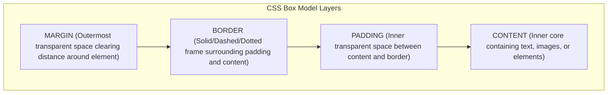

# Class 18: The CSS Box Model, Styling Lists & HTML Table Layouts

**Course:** Web Technology & Cloud Computing Applications – I  
**Unit:** Unit III - Dynamic Web Page Styling with CSS & Layout Design  
**Target Duration:** 2 Hours (120 Minutes Continuous Session)  
**Self-Study Guide:** Designed for complete self-study. Every technical term is explained with simple real-world analogies without omitting any technical depth.

---

## 1. Class Session Objectives
By reading and studying this lecture guide line-by-line, you will be able to:
1. Deconstruct the 4 layers of the CSS Box Model (Content, Padding, Border, Margin).
2. Differentiate between `content-box` and `border-box` box-sizing calculations.
3. Style HTML Lists (`list-style-type`, `list-style-image`, navigation bar transformation).
4. Style HTML Tables (`border-collapse`, `nth-child` zebra striping, hover effects).

---

## 2. Recommended 2-Hour Time Allocation

| Time Range | Duration | Activity / Teaching Strategy |
|---|---|---|
| **00:00 - 00:20** | 20 Mins | **Recap & Hook:** Review `<div>` layouts. Show unexpected container overflow box math (`width + padding + border`). |
| **00:20 - 00:50** | 30 Mins | **Deep Dive Theory:** 4 Box Model layers, `box-sizing: border-box`, `border-collapse`, zebra striping. |
| **00:50 - 01:20** | 30 Mins | **Visual Diagram Breakdown:** 4-Layer CSS Box Model Diagram & Box Sizing Math Comparison. |
| **01:20 - 01:45** | 25 Mins | **Live Code Walkthrough:** Building a zebra-striped table and converting an unordered list into a horizontal navigation bar. |
| **01:45 - 02:00** | 15 Mins | **Spot Quiz & Unit III Wrap-Up:** Student quiz questions, Unit IV Teaser. |

---

## 3. Visual Flowcharts & Architectural Diagrams

### A. The 4 Layers of the CSS Box Model


---

## 4. Key Jargon & Beginner Vocabulary Dictionary

> [!NOTE]
> * **CSS Box Model:** The core visual engine of web layouts, treating every single HTML element as a rectangular box composed of Content, Padding, Border, and Margin.
> * **Content:** The innermost core area of an element where actual text, images, or child elements reside.
> * **Padding:** The transparent inner spacing layer between the content and the element's border.
> * **Border:** The decorative edge line surrounding the padding and content.
> * **Margin:** The transparent outer spacing layer clearing distance outside the border, pushing adjacent elements away.
> * **`box-sizing: border-box`:** A vital CSS rule instructing the browser to include padding and border within the element's total declared width and height, preventing layout breakage.
> * **`border-collapse: collapse`:** A CSS property for HTML tables that merges double adjacent cell borders into a single clean border line.
> * **Zebra Striping (`:nth-child(even)`):** A CSS pseudo-class styling technique that alternates row background colors on tables for easier reading.

---

## 5. In-Depth Topic Breakdown

### 5.1 The Fragile Gift Box Analogy (CSS Box Model)

Imagine mailing a fragile glass picture frame inside a wooden shipping box:
1. **Content:** The glass picture frame itself inside the box.
2. **Padding:** The soft bubble-wrap wrapped tightly around the picture frame inside the box to protect it.
3. **Border:** The wooden cardboard box container wall surrounding the bubble wrap.
4. **Margin:** The empty safety space required between your cardboard box and neighboring boxes in the delivery truck so they don't bang into each other!

---

### 5.2 Box Sizing Math Comparison (`content-box` vs `border-box`)

Suppose an element has `width: 300px; padding: 20px; border: 5px solid black;`:
* **`box-sizing: content-box` (Default Legacy Math):**
  $$\text{Total Width} = 300 + (2 \times 20) + (2 \times 5) = 350\text{px}!$$
  *(The box expands bigger than $300\text{px}$, breaking horizontal multi-column grids!)*
* **`box-sizing: border-box` (Modern Professional Math):**
  $$\text{Total Width} = \text{Exactly } 300\text{px}!$$
  *(The browser automatically shrinks the inner content area to $250\text{px}$ so the total width remains exactly $300\text{px}$.)*

---

## 6. Practical Code Examples

### A. CSS Box Model & Styled Zebra Table

```html
<!DOCTYPE html>
<html lang="en">
<head>
    <meta charset="UTF-8">
    <title>CSS Box Model & Table Styling</title>
    <style>
        /* Universal Box-Sizing Reset */
        *, *::before, *::after {
            box-sizing: border-box;
        }

        body {
            font-family: Arial, sans-serif;
            padding: 20px;
            background-color: #f4f6f9;
        }

        /* Card Container (Box Model Demo) */
        .card-container {
            width: 100%;
            max-width: 600px;
            margin: 30px auto; /* Margin clears outer space & centers */
            padding: 20px;     /* Padding pushes content away from border */
            border: 2px solid #003366;
            background-color: white;
            border-radius: 8px;
        }

        /* Styled Zebra Table */
        .styled-table {
            width: 100%;
            border-collapse: collapse; /* Merges double borders */
            margin-top: 15px;
        }

        .styled-table th, .styled-table td {
            padding: 12px 15px;
            text-align: left;
            border-bottom: 1px solid #dddddd;
        }

        .styled-table th {
            background-color: #003366;
            color: white;
        }

        /* Zebra Striping Alternate Rows */
        .styled-table tbody tr:nth-child(even) {
            background-color: #f8f9fa;
        }

        /* Hover Effect */
        .styled-table tbody tr:hover {
            background-color: #e3f2fd;
            cursor: pointer;
        }
    </style>
</head>
<body>

    <div class="card-container">
        <h2>Student Grade Roster</h2>
        
        <table class="styled-table">
            <thead>
                <tr>
                    <th>Roll No</th>
                    <th>Student Name</th>
                    <th>Grade</th>
                </tr>
            </thead>
            <tbody>
                <tr>
                    <td>101</td>
                    <td>Rahul Sharma</td>
                    <td>A+</td>
                </tr>
                <tr>
                    <td>102</td>
                    <td>Priya Patel</td>
                    <td>A</td>
                </tr>
                <tr>
                    <td>103</td>
                    <td>Amit Kumar</td>
                    <td>B+</td>
                </tr>
            </tbody>
        </table>
    </div>

</body>
</html>
```

#### Line-by-Line Code Breakdown:
1. `*, *::before, *::after { box-sizing: border-box; }`: The universal CSS reset enforcing predictable box sizing math across all elements.
2. `margin: 30px auto`: Adds 30px vertical margin outside the card container and centers it horizontally.
3. `padding: 20px`: Adds 20px transparent padding buffer between the table content and the card border.
4. `border-collapse: collapse`: Merges ugly double borders between HTML table cells into single 1px clean lines.
5. `tbody tr:nth-child(even)`: Targets even-numbered rows (Row 2, 4, 6) to apply a light gray background for zebra striping.

---

## 7. Interactive Discussion & Spot Quiz

### Discussion Questions
1. Why is applying `* { box-sizing: border-box; }` considered a universal best practice at the beginning of modern CSS stylesheets?
2. What is the difference between `margin` and `padding` in the CSS Box Model?

### Spot Quiz
1. Which CSS Box Model layer creates space *outside* an element's border, pushing adjacent elements away?
   - A) Content
   - B) Padding
   - C) Border
   - D) Margin
2. Which CSS property collapses double adjacent cell borders into a single border line on HTML tables?
   - A) `table-layout: collapse;`
   - B) `border-collapse: collapse;`
   - C) `border-spacing: 0;`
   - D) `cell-collapse: true;`

---

## 8. Class Summary & Unit III Conclusion

* **Class Summary:** Today we completed Unit III by mastering the 4 layers of the CSS Box Model, `border-box` math, styling lists, and styling HTML tables with zebra striping and `border-collapse`.
* **Unit III Conclusion:** Congratulations! You have completed Unit III (Dynamic Web Page Styling with CSS). Next session begins **Unit IV: Client-Side Scripting with JavaScript: Functions, Variables & Logic**!
