# Class 19: Introduction to JavaScript: Role in Web Development & Script Execution

**Course:** Web Technology & Cloud Computing Applications – I  
**Unit:** Unit IV - Client-Side Scripting with JavaScript: Functions, Variables & Logic  
**Target Duration:** 2 Hours (120 Minutes Continuous Session)  
**Self-Study Guide:** Designed for complete self-study. Every technical term is explained with simple real-world analogies without omitting any technical depth.

---

## 1. Class Session Objectives
By reading and studying this lecture guide line-by-line, you will be able to:
1. Explain the role of JavaScript as the client-side interactivity engine of the World Wide Web.
2. Differentiate between Client-Side execution (Browser V8 engine) and Server-Side execution.
3. Utilize the `<script>` tag for Inline scripts and External `.js` file linking.
4. Compare script loading attributes: Standard blocking, `async`, and `defer`.

---

## 2. Recommended 2-Hour Time Allocation

| Time Range | Duration | Activity / Teaching Strategy |
|---|---|---|
| **00:00 - 00:20** | 20 Mins | **Recap & Unit IV Intro:** Transition from static CSS layout to dynamic JS programming. Demonstrate static page vs JS interactive page. |
| **00:20 - 00:50** | 30 Mins | **Deep Dive Theory:** Client-side execution (V8 engine), `<script>` tag placement in `<head>` vs `</body>`, `async` vs `defer` script loading. |
| **00:50 - 01:20** | 30 Mins | **Visual Diagram Breakdown:** Browser Parsing Pipeline Diagram (HTML Parsing $\rightarrow$ Script Execution $\rightarrow$ DOM Tree). |
| **01:20 - 01:45** | 25 Mins | **Live Code Walkthrough:** Opening Browser Developer Console (`F12`), writing first JS commands, and linking external `script.js`. |
| **01:45 - 02:00** | 15 Mins | **Spot Quiz & Session Wrap-Up:** Student quiz questions, Next Class Teaser. |

---

## 3. Visual Flowcharts & Architectural Diagrams

### A. Script Loading Behaviors: Standard vs `async` vs `defer`

```mermaid
gantt
    title Browser HTML Parsing & Script Loading Pipeline
    dateFormat  SS
    axisFormat %S
    
    section Standard Script
    HTML Parsing        :a1, 00, 03
    Fetch & Execute JS  :crit, a2, 03, 07
    Resume HTML Parsing :a3, 07, 10
    
    section Async Script
    HTML Parsing        :b1, 00, 06
    Fetch JS (Parallel) :active, b2, 01, 04
    Pause & Execute JS  :crit, b3, 04, 06
    Resume HTML Parsing :b4, 06, 10
    
    section Defer Script (Recommended)
    HTML Parsing        :c1, 00, 08
    Fetch JS (Parallel) :active, c2, 01, 05
    Execute JS (At End) :crit, c3, 08, 10
```


---

## 4. Key Jargon & Beginner Vocabulary Dictionary

> [!NOTE]
> * **JavaScript (JS):** A lightweight, interpreted, object-oriented programming language that adds dynamic interactivity, event handling, and data processing to web browsers.
> * **Client-Side Scripting:** Code executed directly inside the user's web browser (using engines like Chrome V8 or Firefox SpiderMonkey) without making requests back to the server.
> * **Script Tag (`<script>`):** The HTML element used to embed or link executable JavaScript code into an HTML document.
> * **External Script (`.js`):** A standalone text file containing JavaScript code linked to HTML pages using `<script src="file.js">`.
> * **`async` Attribute:** Instructs the browser to download the script in the background asynchronously and execute it immediately when downloaded, pausing HTML parsing.
> * **`defer` Attribute:** Instructs the browser to download the script in the background while continuing HTML parsing, executing the script only after HTML parsing is complete.

---

## 5. In-Depth Topic Breakdown

### 5.1 Real-World Web Stack Analogy

Think of building a high-performance sports car:
1. **HTML (The Structural Chassis & Body Frame):** The steel frame, doors, hood, and seating structure.
2. **CSS (The Exterior Paint & Upholstery):** The metallic red paint job, leather seats, and polished chrome trim.
3. **JavaScript (The Engine & Electrical System):** The V8 engine, accelerator pedal, steering controls, headlights, and speedometer that make the car functional and interactive!

---

### 5.2 `<script>` Loading Attributes Matrix

| Script Attribute | HTML Parsing Behavior | Execution Time | Use Case |
|---|---|---|---|
| **Standard `<script src="...">`** | Pauses HTML parsing immediately while downloading and executing script | Immediately upon download | Legacy scripts placed at bottom before `</body>` |
| **`<script async src="...">`** | Downloads script in background without pausing parsing | Immediately when downloaded (pauses parsing during execution) | Independent 3rd-party scripts (Google Analytics, Ads) |
| **`<script defer src="...">`** | Downloads script in background without pausing parsing | After HTML document is completely parsed | Primary application code interacting with DOM elements |

---

## 6. Practical Code Examples

### A. External JavaScript Setup (`script.js` & `index.html`)

#### 1. External JavaScript File (`script.js`)
```javascript
// script.js - Client-Side Interactive Engine

// Log message to Browser Developer Console (F12)
console.log("JavaScript engine initialized successfully!");

// Simple Function to modify DOM element content
function changeGreeting() {
    const heading = document.getElementById("welcome-heading");
    heading.textContent = "Welcome to Dynamic JavaScript Programming!";
    heading.style.color = "#008CBA";
}
```

#### 2. HTML Document Linking JS (`index.html`)
```html
<!DOCTYPE html>
<html lang="en">
<head>
    <meta charset="UTF-8">
    <title>JavaScript Intro & Script Tag - Lab 19</title>
    
    <!-- Recommended: Deferred External Script Link -->
    <script src="script.js" defer></script>
</head>
<body>

    <h1 id="welcome-heading">Static HTML Heading</h1>
    <p>Click the button below to trigger JavaScript execution:</p>
    
    <button onclick="changeGreeting()" style="padding: 10px 20px; font-size: 1rem; cursor: pointer;">
        Trigger JavaScript Function
    </button>

</body>
</html>
```

#### Line-by-Line Code Breakdown:
1. `<script src="script.js" defer></script>`: Links the external script file and uses `defer` to ensure the HTML heading loads into memory before the script runs.
2. `console.log(...)`: Output command printing diagnostic messages to the browser's Developer Tools Console (`F12`).
3. `document.getElementById("welcome-heading")`: DOM selection method targeting the `<h1>` element by its ID attribute.
4. `heading.textContent = "..."`: Dynamically updates the text content of the HTML heading without refreshing the browser page!

---

## 7. Interactive Discussion & Spot Quiz

### Discussion Questions
1. Why is placing standard `<script>` tags in the `<head>` section without `defer` or `async` attributes considered a performance bottleneck?
2. Explain the difference between Client-Side JavaScript execution in the browser and Server-Side execution in Node.js.

### Spot Quiz
1. Which script attribute ensures a script is downloaded in the background and executed only after the HTML document is fully parsed?
   - A) `async`
   - B) `defer`
   - C) `preload`
   - D) `wait`
2. Which browser Developer Tool panel is used to inspect `console.log()` output and run interactive JS commands?
   - A) Elements Panel
   - B) Network Panel
   - C) Console Panel
   - D) Security Panel

---

## 8. Class Summary & Next Session Teaser

* **Summary:** Today we introduced JavaScript's role in web development, client-side browser execution, the `<script>` tag, and script loading attributes (`async` vs `defer`).
* **Next Class Teaser (Class 20):** Next class we explore **JavaScript Interactivity: Dialog Boxes (`alert()`, `prompt()`, `confirm()`) & User Input Handling**!
