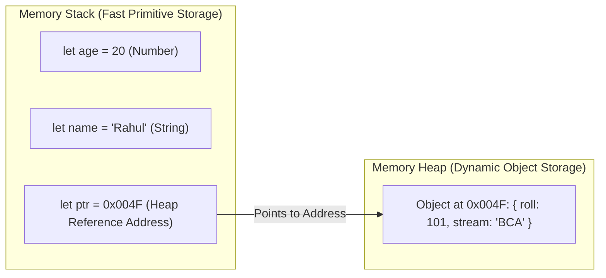

# Class 21: JavaScript Variables (`var`, `let`, `const`), Data Types, Dynamic Typing & Type Casting

**Course:** Web Technology & Cloud Computing Applications – I  
**Unit:** Unit IV - Client-Side Scripting with JavaScript: Functions, Variables & Logic  
**Target Duration:** 2 Hours (120 Minutes Continuous Session)  
**Self-Study Guide:** Designed for complete self-study. Every technical term is explained with simple real-world analogies without omitting any technical depth.

---

## 1. Class Session Objectives
By reading and studying this lecture guide line-by-line, you will be able to:
1. Differentiate between variable declaration keywords: `var` (function scope), `let` (block scope), and `const` (immutable reference).
2. Identify Primitive Data Types (`String`, `Number`, `Boolean`, `Undefined`, `Null`, `Symbol`, `BigInt`) and Reference Data Types (`Object`, `Array`, `Function`).
3. Master JavaScript Dynamic Typing and operator `typeof`.
4. Perform Explicit Type Casting (`Number()`, `String()`, `Boolean()`, `parseInt()`, `parseFloat()`) and Implicit Coercion.

---

## 2. Recommended 2-Hour Time Allocation

| Time Range | Duration | Activity / Teaching Strategy |
|---|---|---|
| **00:00 - 00:20** | 20 Mins | **Recap & Hook:** Review dialog boxes. Demonstrate why `"10" + 20` results in string concatenation `"1020"` instead of arithmetic `30`. |
| **00:20 - 00:50** | 30 Mins | **Deep Dive Theory:** `var` vs `let` vs `const`, Hoisting, Primitive vs Reference memory, Type Coercion vs Casting. |
| **00:50 - 01:20** | 30 Mins | **Visual Diagram Breakdown:** Memory Stack (Primitives) vs Memory Heap (Objects) Allocation Diagram. |
| **01:20 - 01:45** | 25 Mins | **Live Code Walkthrough:** Writing type conversion scripts and inspecting variable data types using `typeof`. |
| **01:45 - 02:00** | 15 Mins | **Spot Quiz & Session Wrap-Up:** Student quiz questions, Next Class Teaser. |

---

## 3. Visual Flowcharts & Architectural Diagrams

### A. Memory Allocation: Stack (Primitives) vs Heap (Objects)


---

## 4. Key Jargon & Beginner Vocabulary Dictionary

> [!NOTE]
> * **Variable:** A named storage container in memory used to store data values that can be read or modified during program execution.
> * **Scope:** The context or region of code within which a declared variable is accessible (`Global`, `Function`, `Block`).
> * **Hoisting:** JavaScript's default behavior of moving variable and function declarations to the top of their containing scope during compilation.
> * **Primitive Data Type:** Immutable data stored directly in the Memory Stack (e.g., `String`, `Number`, `Boolean`, `Null`, `Undefined`).
> * **Reference Data Type:** Complex data structures stored in the Memory Heap (e.g., `Object`, `Array`, `Function`), accessed via memory pointers.
> * **Dynamic Typing:** A programming language feature where variable data types are determined automatically at runtime based on assigned values.
> * **Implicit Type Coercion:** Automatic data type conversion performed by the JavaScript engine behind the scenes during operations (e.g., `'5' * 2` becomes `10`).
> * **Explicit Type Casting:** Manual conversion of a value from one data type to another using built-in functions (e.g., `Number('5')`).

---

## 5. In-Depth Topic Breakdown

### 5.1 Real-World Variable & Scope Analogies

1. **`var` vs `let` vs `const` Storage Containers:**
   * **`const` (Permanent Engraving):** Engraving a student Roll Number onto a metal ID badge (`const rollNo = 101`). Once engraved, you cannot overwrite or re-assign a new value to it!
   * **`let` (Pencil in a Notebook):** Writing a score in a notebook (`let score = 50`). You can erase it and write `score = 75` later. It only exists inside that specific notebook page (**Block Scope**).
   * **`var` (Loudspeaker Announcement):** An old-style loudspeaker declaration (`var legacyName`). It bleeds out of rooms (**Function Scope**) and can cause accidental variable collisions!
2. **Primitive vs Reference Types (Coins vs Coat Check Ticket):**
   * **Primitive (Coins in your pocket):** You hold the actual physical value directly in your hand (Stack memory).
   * **Reference Type (Coat Check Ticket):** You hold a small paper ticket containing a number (`0x004F`). The actual heavy winter coat (Object) resides in the large storage room (Heap memory)!

---

### 5.2 `var` vs `let` vs `const` Matrix

| Keyword | Scope Level | Hoisted? | Can Be Re-assigned? | Can Be Re-declared? | Recommendation |
|---|---|---|---|---|---|
| **`var`** | Function Scope | Yes (initialized as `undefined`) | Yes | Yes | Avoid in modern JS |
| **`let`** | Block Scope `{}` | Yes (in Temporal Dead Zone) | Yes | No | Use for variables that change |
| **`const`** | Block Scope `{}` | Yes (in Temporal Dead Zone) | No | No | Default choice for all variables |

---

## 6. Practical Code Examples

### A. Variable Declaration, `typeof`, and Type Casting

```javascript
// Class 21 - Variables & Type Casting Demo

// 1. Variable Declarations
const collegeName = "Mandsaur University"; // String (Immutable)
let studentAge = 20;                      // Number
let isEnrolled = true;                    // Boolean
let middleName;                           // Undefined
let graduationYear = null;                // Null

console.log("--- Initial Types ---");
console.log("collegeName:", typeof collegeName); // string
console.log("studentAge:", typeof studentAge);   // number
console.log("isEnrolled:", typeof isEnrolled);   // boolean
console.log("middleName:", typeof middleName);   // undefined
console.log("graduationYear:", typeof graduationYear); // object (historical JS quirk!)

// 2. Implicit Type Coercion Demo
console.log("\n--- Implicit Coercion ---");
let result1 = "10" + 5; // "105" (Number 5 converted to String)
let result2 = "10" - 5; // 5 (String "10" converted to Number)
console.log('"10" + 5 =', result1, "| Type:", typeof result1);
console.log('"10" - 5 =', result2, "| Type:", typeof result2);

// 3. Explicit Type Casting (Parsing Prompt Input)
console.log("\n--- Explicit Type Casting ---");
let inputStr = "42.75";

let parsedInt = parseInt(inputStr);     // 42 (Truncates decimals)
let parsedFloat = parseFloat(inputStr); // 42.75
let numCast = Number(inputStr);         // 42.75

console.log("parseInt('42.75'):", parsedInt);
console.log("parseFloat('42.75'):", parsedFloat);
console.log("Number('42.75'):", numCast);
```

#### Line-by-Line Code Breakdown:
1. `const collegeName = "Mandsaur University"`: Declares a block-scoped immutable constant string.
2. `let studentAge = 20`: Declares a block-scoped mutable number variable initialized to 20.
3. `typeof studentAge`: Evaluates the runtime primitive data type of the variable.
4. `"10" + 5`: JavaScript sees the `+` operator with a string, triggers implicit coercion, and concatenates values to `"105"`.
5. `parseInt("42.75")`: Explicitly parses string `"42.75"` into an integer number `42`.

---

## 7. Interactive Discussion & Spot Quiz

### Discussion Questions
1. Why is `const` preferred over `let` as the default choice when declaring variables in modern JavaScript?
2. What is the difference between `null` and `undefined` in JavaScript memory management?

### Spot Quiz
1. What will `console.log(typeof "100")` output to the developer console?
   - A) `number`
   - B) `string`
   - C) `undefined`
   - D) `object`
2. What is the result of `Number("abc")` when attempting to cast an invalid numeric string?
   - A) `0`
   - B) `null`
   - C) `NaN` (Not a Number)
   - D) `undefined`

---

## 8. Class Summary & Next Session Teaser

* **Summary:** Today we covered `var`, `let`, `const`, primitive vs reference memory types, `typeof`, implicit coercion, and explicit type casting (`parseInt`, `Number`).
* **Next Class Teaser (Class 22):** Next class we explore **Expressions, Arithmetic & Logical Operators, Strict Equality (`===`) & Operator Precedence**!
