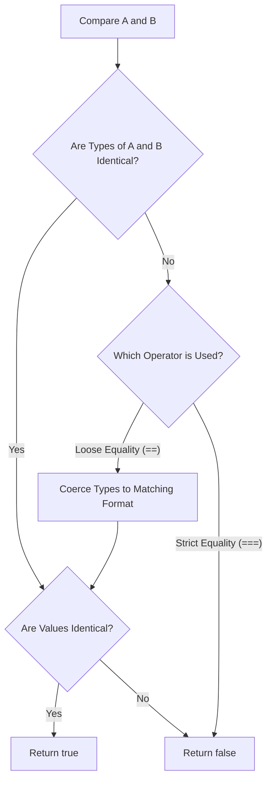

# Class 22: JavaScript Expressions, Operators & Operator Precedence

**Course:** Web Technology & Cloud Computing Applications – I  
**Unit:** Unit IV - Client-Side Scripting with JavaScript: Functions, Variables & Logic  
**Target Duration:** 2 Hours (120 Minutes Continuous Session)  
**Self-Study Guide:** Designed for complete self-study. Every technical term is explained with simple real-world analogies without omitting any technical depth.

---

## 1. Class Session Objectives
By reading and studying this lecture guide line-by-line, you will be able to:
1. Construct valid JavaScript Expressions and Statements.
2. Utilize Arithmetic Operators (`+`, `-`, `*`, `/`, `%`, `**`), Increment/Decrement (`++`, `--`), and Assignment Operators (`+=`, `-=`).
3. Differentiate between Abstract Equality (`==`) and Strict Equality (`===`).
4. Master Logical Operators (`&&`, `||`, `!`), Short-Circuit evaluation, and Ternary Conditional Operators (`condition ? val1 : val2`).

---

## 2. Recommended 2-Hour Time Allocation

| Time Range | Duration | Activity / Teaching Strategy |
|---|---|---|
| **00:00 - 00:20** | 20 Mins | **Recap & Hook:** Review data types. Show why `5 == "5"` evaluates to `true`, but `5 === "5"` evaluates to `false`. |
| **00:20 - 00:50** | 30 Mins | **Deep Dive Theory:** Arithmetic & Modulus math, Abstract vs Strict equality, Logical short-circuiting, Operator precedence table. |
| **00:50 - 01:20** | 30 Mins | **Visual Diagram Breakdown:** Operator Precedence Hierarchy Pyramid & Logical Short-Circuit Flowchart. |
| **01:20 - 01:45** | 25 Mins | **Live Code Walkthrough:** Building a discount calculator script using ternary operators and modulus math. |
| **01:45 - 02:00** | 15 Mins | **Spot Quiz & Session Wrap-Up:** Student quiz questions, Next Class Teaser. |

---

## 3. Visual Flowcharts & Architectural Diagrams

### A. Strict Equality (`===`) vs Loose Equality (`==`) Decision Matrix


---

## 4. Key Jargon & Beginner Vocabulary Dictionary

> [!NOTE]
> * **Expression:** Any valid unit of code that resolves to a single value (e.g., `5 + 10` or `x > 2`).
> * **Operand:** The data value or variable acted upon by an operator (in `A + B`, `A` and `B` are operands).
> * **Modulus Operator (`%`):** An arithmetic operator that returns the integer remainder after division (e.g., `10 % 3` returns `1`).
> * **Abstract Equality (`==`):** An equality operator that compares values after performing implicit type coercion.
> * **Strict Equality (`===`):** An equality operator that compares both value AND data type without coercion (recommended best practice).
> * **Short-Circuit Evaluation:** A logical operation feature where `&&` stops evaluating immediately if the first operand is `false`, and `||` stops if the first operand is `true`.
> * **Ternary Operator (`? :`):** A concise 3-part conditional operator equivalent to an `if-else` statement (`condition ? exprIfTrue : exprIfFalse`).

---

## 5. In-Depth Topic Breakdown

### 5.1 Real-World Operator Analogies

1. **Loose Equality (`==`) vs Strict Equality (`===`) (The Nightclub Bouncers):**
   * **Loose Equality (`==`) (The Casual Bouncer):** Checks your age ID card (`"20"` string) and says *"You look 20, close enough!"* and lets you in without checking if it's a paper copy or plastic card (**Coerces types**).
   * **Strict Equality (`===`) (The Strict Security Agent):** Verifies both that your age is `20` AND that your ID is an official plastic government card (**Checks Value AND Type**). If you hand him string `"20"`, he rejects it!
2. **Modulus Operator (`%`) (Dividing Slices of Pizza):**
   * Dividing 7 pizza slices among 3 friends. Each friend gets 2 full slices ($3 \times 2 = 6$). The 1 remaining leftover slice in the box is the Modulus result (`7 % 3 = 1`)!

---

### 5.2 JavaScript Operators Reference Table

| Operator Type | Operators | Syntax Example | Meaning / Result |
|---|---|---|---|
| **Arithmetic** | `+`, `-`, `*`, `/`, `%`, `**` | `10 % 3` | Returns remainder `1`; `2 ** 3` returns $2^3 = 8$ |
| **Assignment** | `=`, `+=`, `-=`, `*=`, `/=` | `x += 5` | Equivalent to `x = x + 5` |
| **Comparison** | `==`, `===`, `!=`, `!==`, `>`, `<` | `5 === "5"` | Evaluates to `false` (Type mismatch) |
| **Logical** | `&&` (AND), `||` (OR), `!` (NOT) | `isAdult && hasTicket` | Returns `true` only if both operands are `true` |
| **Ternary** | `condition ? val1 : val2` | `age >= 18 ? "Adult" : "Minor"` | Concise conditional expression |

---

## 6. Practical Code Examples

### A. Comprehensive Operators & Ternary Logic Script

```javascript
// Class 22 - JS Operators & Precedence Demo

// 1. Modulus & Increment Math
let totalItems = 17;
let itemsPerBox = 5;
let fullBoxes = Math.floor(totalItems / itemsPerBox); // 3
let leftoverItems = totalItems % itemsPerBox;         // 2

console.log(`Full Boxes: ${fullBoxes} | Leftover Items: ${leftoverItems}`);

// 2. Strict Equality vs Loose Equality
console.log("\n--- Equality Comparison ---");
console.log('5 == "5":', 5 == "5");   // true (coerced)
console.log('5 === "5":', 5 === "5"); // false (strict type check)
console.log('5 !== "5":', 5 !== "5"); // true (strictly not equal)

// 3. Logical Short-Circuit Evaluation
console.log("\n--- Logical Operators ---");
let userRole = "admin";
let isLoggedIn = true;

// Short-circuit AND: Proceeds to check role only if isLoggedIn is true
let canAccessDashboard = isLoggedIn && userRole === "admin";
console.log("Can Access Dashboard:", canAccessDashboard); // true

// 4. Ternary Conditional Operator
console.log("\n--- Ternary Operator ---");
let marks = 75;
let statusMessage = (marks >= 40) ? "PASSED EXAM" : "FAILED EXAM";
console.log("Exam Result:", statusMessage);
```

#### Line-by-Line Code Breakdown:
1. `totalItems % itemsPerBox`: Uses modulus arithmetic to calculate remaining items left over after filling boxes.
2. `5 === "5"`: Compares number 5 to string `"5"`. Since types differ (`number` vs `string`), returns `false`.
3. `isLoggedIn && userRole === "admin"`: Uses logical AND (`&&`) short-circuiting to grant access only when both conditions are truthy.
4. `(marks >= 40) ? "PASSED" : "FAILED"`: Evaluates the ternary expression, returning `"PASSED EXAM"` if marks are $\ge 40$.

---

## 7. Interactive Discussion & Spot Quiz

### Discussion Questions
1. Why is using strict equality (`===`) strongly recommended over loose equality (`==`) in modern JavaScript codebases?
2. Explain logical short-circuit evaluation: What happens in `false && expensiveFunction()` and why is `expensiveFunction()` never executed?

### Spot Quiz
1. What is the value of expression `14 % 4` in JavaScript?
   - A) `3`
   - B) `2`
   - C) `3.5`
   - D) `0`
2. What does `(10 > 5) ? "Yes" : "No"` evaluate to?
   - A) `"Yes"`
   - B) `"No"`
   - C) `true`
   - D) `undefined`

---

## 8. Class Summary & Next Session Teaser

* **Summary:** Today we covered expressions, modulus math (`%`), strict equality (`===`), logical short-circuiting (`&&`, `||`), and the ternary conditional operator (`? :`).
* **Next Class Teaser (Class 23):** Next class we explore **JavaScript Functions: Declarations, Expressions, Arrow Functions (`=>`), Parameters & Lexical Scope**!
