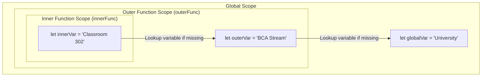

# Class 23: JavaScript Functions: Declarations, Expressions, Arrow Functions (`=>`) & Scope

**Course:** Web Technology & Cloud Computing Applications – I  
**Unit:** Unit IV - Client-Side Scripting with JavaScript: Functions, Variables & Logic  
**Target Duration:** 2 Hours (120 Minutes Continuous Session)  
**Self-Study Guide:** Designed for complete self-study. Every technical term is explained with simple real-world analogies without omitting any technical depth.

---

## 1. Class Session Objectives
By reading and studying this lecture guide line-by-line, you will be able to:
1. Construct Function Declarations, Function Expressions, and ES6 Arrow Functions (`() => {}`).
2. Manage function parameters, default argument values, and return statements.
3. Understand Global Scope, Local/Function Scope, and Block Scope (`let`/`const`).
4. Master Lexical Scoping and Closures in JavaScript execution context.

---

## 2. Recommended 2-Hour Time Allocation

| Time Range | Duration | Activity / Teaching Strategy |
|---|---|---|
| **00:00 - 00:20** | 20 Mins | **Recap & Hook:** Review operators. Demonstrate DRY principle (Don't Repeat Yourself) by refactoring repeated math code into a function. |
| **00:20 - 00:50** | 30 Mins | **Deep Dive Theory:** Function types (Declarations vs Expressions vs Arrow), Return values, Scope chain, Closures. |
| **00:50 - 01:20** | 30 Mins | **Visual Diagram Breakdown:** Lexical Scope Scope Chain Hierarchy & Closure Memory Bubble. |
| **01:20 - 01:45** | 25 Mins | **Live Code Walkthrough:** Building reusable utility functions (tax calculator, student grade evaluator) using ES6 arrow syntax. |
| **01:45 - 02:00** | 15 Mins | **Spot Quiz & Session Wrap-Up:** Student quiz questions, Next Class Teaser. |

---

## 3. Visual Flowcharts & Architectural Diagrams

### A. Lexical Scope Chain Lookup Hierarchy


---

## 4. Key Jargon & Beginner Vocabulary Dictionary

> [!NOTE]
> * **Function:** A reusable subprogram block of code designed to perform a specific task when called (invoked).
> * **Function Declaration:** Defining a function using the `function name() {}` syntax, which is hoisted to the top of its scope.
> * **Function Expression:** Assigning an anonymous function to a variable (e.g., `const add = function() {}`), which is not hoisted.
> * **Arrow Function (`=>`):** A concise ES6 syntax for writing functions (e.g., `const add = (a, b) => a + b`).
> * **Parameter:** The placeholder variable names listed in the function definition (e.g., `a` and `b`).
> * **Argument:** The actual concrete data values passed to the function during invocation (e.g., `add(5, 10)`).
> * **Lexical Scope:** The rule that inner functions have access to variables declared in their outer parent scopes based on physical code position.
> * **Closure:** A function bundled together with references to its surrounding state (lexical environment), allowing it to remember outer variables even after the outer function has finished executing.

---

## 5. In-Depth Topic Breakdown

### 5.1 Real-World Function & Closure Analogies

1. **JavaScript Function (The Kitchen Smoothie Blender Appliance):**
   * A smoothie blender is a pre-built machine waiting on your counter (**Function Definition**).
   * You drop bananas and milk into the blender (**Parameters / Arguments**).
   * You press the START button (**Function Invocation / Call**).
   * The machine blends the ingredients and pours out a fresh smoothie (**Return Value**)!
2. **Lexical Scope (One-Way Tinted VIP Glass):**
   * People standing inside a VIP private box (**Inner Scope**) can easily see out into the public stadium (**Global Scope**). But people standing in the public stadium outside cannot look into the VIP private box!
3. **Closure (The Backpack Container):**
   * When a student leaves the classroom (**Outer function completes**), they carry a backpack containing their textbook notes (**Enclosed variables**), allowing them to read those notes wherever they go!

---

### 5.2 Function Syntax Comparison Matrix

| Function Type | Syntax Example | Hoisted? | `this` Binding | Best Use Case |
|---|---|---|---|---|
| **Function Declaration** | `function calc(a, b) { return a + b; }` | Yes | Dynamic | General top-level utility functions |
| **Function Expression** | `const calc = function(a, b) { return a + b; };` | No | Dynamic | Callback functions, event handlers |
| **ES6 Arrow Function** | `const calc = (a, b) => a + b;` | No | Lexical (inherits from outer scope) | Short array methods, inline callbacks |

---

## 6. Practical Code Examples

### A. Declarations, Arrow Functions & Closure Counter

```javascript
// Class 23 - Functions & Closures Demo

// 1. Standard Function Declaration (Hoisted)
function calculateTotal(price, taxRate = 0.18) {
    return price + (price * taxRate);
}

console.log("Total Price ($100 + 18% Tax):", calculateTotal(100));

// 2. Concise ES6 Arrow Function
const calculateDiscount = (price, discountPercent) => price - (price * (discountPercent / 100));

console.log("Discounted Price ($100 with 20% off):", calculateDiscount(100, 20));

// 3. Closure Demonstrating Retained State
function createStudentCounter() {
    let studentCount = 0; // Private state retained by closure
    
    return function() {
        studentCount++;
        return `Current Enrolled Students: ${studentCount}`;
    };
}

const enrollBCAStudent = createStudentCounter();
console.log(enrollBCAStudent()); // Current Enrolled Students: 1
console.log(enrollBCAStudent()); // Current Enrolled Students: 2
console.log(enrollBCAStudent()); // Current Enrolled Students: 3
```

#### Line-by-Line Code Breakdown:
1. `function calculateTotal(price, taxRate = 0.18)`: Defines a standard function declaration with a default parameter `taxRate = 0.18`.
2. `const calculateDiscount = (price, discountPercent) => ...`: ES6 Arrow Function using implicit return syntax.
3. `function createStudentCounter()`: Returns an inner anonymous function that captures and remembers the private variable `studentCount`.
4. `enrollBCAStudent()`: Invokes the inner closure function. Each call increments `studentCount` without exposing it to global scope modification!

---

## 7. Interactive Discussion & Spot Quiz

### Discussion Questions
1. What is the difference between Function Declarations and Function Expressions in terms of hoisting execution?
2. Explain how Closures allow inner functions to retain access to variables declared inside an outer parent function after the parent function has finished executing.

### Spot Quiz
1. Which ES6 feature provides a concise arrow syntax `(a, b) => a + b` for writing functions?
   - A) Lambda Methods
   - B) Arrow Functions
   - C) Inline Expressions
   - D) Closure Block
2. What does a function return if it does not contain an explicit `return` statement?
   - A) `0`
   - B) `null`
   - C) `undefined`
   - D) `false`

---

## 8. Class Summary & Next Session Teaser

* **Summary:** Today we covered Function Declarations, Expressions, Arrow Functions (`=>`), parameters, return values, Global vs Local scope, and Closures.
* **Next Class Teaser (Class 24):** Next class we complete Unit IV by mastering **Control Structures: Conditionals (`if-else`, `switch`) & Iteration Loops (`for`, `while`, `do-while`, `break`/`continue`)**!
