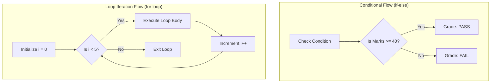

# Class 24: JavaScript Control Structures: Conditionals (`if-else`, `switch`) & Iteration Loops

**Course:** Web Technology & Cloud Computing Applications – I  
**Unit:** Unit IV - Client-Side Scripting with JavaScript: Functions, Variables & Logic  
**Target Duration:** 2 Hours (120 Minutes Continuous Session)  
**Self-Study Guide:** Designed for complete self-study. Every technical term is explained with simple real-world analogies without omitting any technical depth.

---

## 1. Class Session Objectives
By reading and studying this lecture guide line-by-line, you will be able to:
1. Construct decision-making branches using `if`, `else if`, `else`, and `switch` statements.
2. Master iteration loops: `for` loops, `while` loops, and `do-while` guaranteed execution loops.
3. Utilize loop control statements: `break` (exit loop) and `continue` (skip iteration).
4. Build interactive JavaScript web applications combining control logic with DOM updates.

---

## 2. Recommended 2-Hour Time Allocation

| Time Range | Duration | Activity / Teaching Strategy |
|---|---|---|
| **00:00 - 00:20** | 20 Mins | **Recap & Hook:** Review functions. Show a grading system taking marks and returning grade letters (A, B, C, F) using decision branches. |
| **00:20 - 00:50** | 30 Mins | **Deep Dive Theory:** `if-else` vs `switch`, Fallthrough in switch (`break`), `for` loop syntax, `while` vs `do-while`. |
| **00:50 - 01:20** | 30 Mins | **Visual Diagram Breakdown:** Flowcharts for `if-else` branching, `switch` case lookup, and `for`/`while` loop execution cycles. |
| **01:20 - 01:45** | 25 Mins | **Live Code Walkthrough:** Building an interactive Grade Evaluator and dynamic HTML list renderer using loops. |
| **01:45 - 02:00** | 15 Mins | **Spot Quiz & Unit IV Conclusion:** Student quiz questions, Unit V Teaser. |

---

## 3. Visual Flowcharts & Architectural Diagrams

### A. Decision Branching & Loop Iteration Flowcharts


---

## 4. Key Jargon & Beginner Vocabulary Dictionary

> [!NOTE]
> * **Control Structure:** Programming constructs that alter the sequential top-to-bottom flow of execution based on conditional checks or repetitive loops.
> * **Conditional Branching (`if-else`):** Executing specific blocks of code only if specified boolean conditions evaluate to `true`.
> * **Switch Statement (`switch`):** A multi-way branch statement that compares an expression against multiple potential value `case` clauses.
> * **Iteration Loop:** A control structure that repeatedly executes a block of code until a specified stopping condition is met.
> * **For Loop (`for`):** A counter-controlled loop used when the exact number of iterations is known beforehand (`for(initialization; condition; increment)`).
> * **While Loop (`while`):** A condition-controlled pre-test loop that continues executing as long as its condition remains `true`.
> * **Do-While Loop (`do-while`):** A post-test loop that guarantees its code body runs AT LEAST ONCE before evaluating the condition.
> * **`break`:** Instantly terminates the execution of a loop or `switch` block.
> * **`continue`:** Skips the rest of the current loop iteration and jumps immediately to the next iteration check.

---

## 5. In-Depth Topic Breakdown

### 5.1 Real-World Control Flow Analogies

1. **`if-else` Branching (The Hiking Trail Fork):**
   * You reach a signpost while hiking: *"IF the weather is sunny, take the mountain trail; ELSE IF it's raining, take the covered path; ELSE return to base camp!"*
2. **`switch` Statement (The Elevator Floor Buttons):**
   * Pressing a floor button in a high-rise elevator. Pressing `Case 3` takes you straight to Floor 3; pressing `Case 5` takes you to Floor 5. If no button matches, the `default` case opens the main lobby doors!
3. **`while` vs `do-while` Loops (Roller Coaster Ticket Verification):**
   * **`while` loop (Ticket booth before line):** Checks your ticket BEFORE letting you into line. If you have no ticket (`false`), you never ride!
   * **`do-while` loop (Riding first, paying at end):** You get on the ride immediately, and the attendant checks your ticket AFTER the first lap (`at least 1 run guaranteed`).

---

### 5.2 Loops & Conditionals Summary Matrix

| Structure | Syntax Format | Execution Condition | Best Use Case |
|---|---|---|---|
| **`if...else if...else`** | `if (cond) { ... } else { ... }` | Evaluates boolean expression | Complex logical condition checks |
| **`switch`** | `switch (val) { case X: ... break; }` | Exact value match | Choosing between 4+ discrete known options |
| **`for` Loop** | `for (let i=0; i<N; i++)` | Pre-test count | Iterating arrays or known number of steps |
| **`while` Loop** | `while (condition) { ... }` | Pre-test condition | Repeating tasks when loop count is dynamic/unknown |
| **`do-while` Loop** | `do { ... } while (condition);` | Post-test condition | Menus or tasks requiring at least 1 execution |

---

## 6. Practical Code Examples

### A. Grade Calculator & Dynamic Array Renderer Script

```javascript
// Class 24 - Conditionals & Loops Demo

// 1. Grade Evaluation using Switch Statement
function evaluateGrade(score) {
    // Determine score bracket
    let bracket = Math.floor(score / 10);
    let gradeLetter;

    switch (bracket) {
        case 10:
        case 9:
            gradeLetter = "A+ (Outstanding)";
            break;
        case 8:
            gradeLetter = "A (Excellent)";
            break;
        case 7:
            gradeLetter = "B (Very Good)";
            break;
        case 6:
            gradeLetter = "C (Good)";
            break;
        case 5:
            gradeLetter = "D (Pass)";
            break;
        default:
            gradeLetter = "F (Fail)";
            break;
    }
    return gradeLetter;
}

console.log("Score 85 Grade:", evaluateGrade(85));
console.log("Score 42 Grade:", evaluateGrade(42));

// 2. For Loop with Break and Continue
console.log("\n--- For Loop with Break & Continue ---");
const studentRoster = ["Rahul", "Priya", "ABSENT", "Amit", "Neha"];

for (let i = 0; i < studentRoster.length; i++) {
    // Skip absent students using continue
    if (studentRoster[i] === "ABSENT") {
        console.log(`Index ${i}: Skipping ABSENT record...`);
        continue;
    }
    
    console.log(`Processing Student #${i + 1}: ${studentRoster[i]}`);
}
```

#### Line-by-Line Code Breakdown:
1. `switch (bracket)`: Evaluates the score bracket integer and jumps to the matching `case` block.
2. `break;`: Exits the switch block immediately, preventing accidental fallthrough into subsequent cases.
3. `for (let i = 0; i < studentRoster.length; i++)`: Iterates through the student array using index counter `i`.
4. `continue;`: Skips processing for `"ABSENT"` and jumps to the next loop iteration `i++`.

---

## 7. Interactive Discussion & Spot Quiz

### Discussion Questions
1. What happens in a JavaScript `switch` statement if a programmer omits the `break;` command at the end of a `case` block?
2. How does a `do-while` loop differ from a standard `while` loop when its condition evaluates to `false` on the initial execution?

### Spot Quiz
1. Which loop construct guarantees that its code block will execute AT LEAST ONCE?
   - A) `for` loop
   - B) `while` loop
   - C) `do-while` loop
   - D) `foreach` loop
2. Which keyword is used inside a loop to immediately stop execution and exit the loop?
   - A) `stop`
   - B) `exit`
   - C) `break`
   - D) `skip`

---

## 8. Class Summary & Unit IV Conclusion

* **Class Summary:** Today we completed Unit IV by mastering `if-else` conditionals, `switch` statements, `for`/`while`/`do-while` loops, and `break`/`continue` loop control flow.
* **Unit IV Conclusion:** Congratulations! You have completed Unit IV (Client-Side Scripting with JavaScript). Next session begins **Unit V: Server-Side Scripting & PHP Essentials: Basics, Forms & Databases**!
