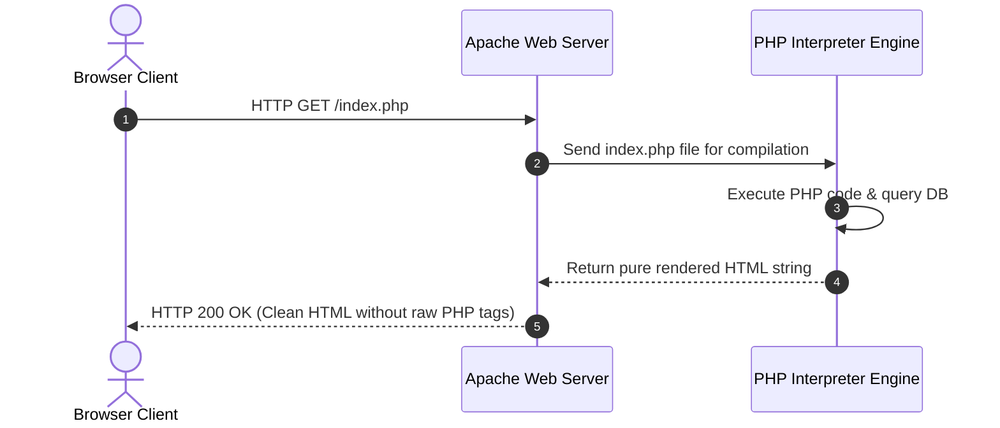

# Class 25: Introduction to PHP: Environment, Syntax, Data Types & Variables

**Course:** Web Technology & Cloud Computing Applications – I  
**Unit:** Unit V - Server-Side Scripting & PHP Essentials: Basics, Forms & Databases  
**Target Duration:** 2 Hours (120 Minutes Continuous Session)  
**Self-Study Guide:** Designed for complete self-study. Every technical term is explained with simple real-world analogies without omitting any technical depth.

---

## 1. Class Session Objectives
By reading and studying this lecture guide line-by-line, you will be able to:
1. Explain the role of PHP as a server-side scripting language in web architecture.
2. Setup local PHP execution environments (XAMPP/WAMP/Built-in CLI server).
3. Deconstruct PHP tags (`<?php ... ?>`), variable declaration rules (`$var`), and case sensitivity.
4. Master PHP Data Types, String Interpolation (double vs single quotes), and output methods (`echo`, `print`, `var_dump()`).

---

## 2. Recommended 2-Hour Time Allocation

| Time Range | Duration | Activity / Teaching Strategy |
|---|---|---|
| **00:00 - 00:20** | 20 Mins | **Recap & Unit V Intro:** Transition from client-side JS to server-side PHP. Demonstrate raw PHP code invisible in View Source. |
| **00:20 - 00:50** | 30 Mins | **Deep Dive Theory:** Client vs Server execution flow, XAMPP architecture, PHP syntax (`$`), String interpolation (`"..."` vs `'...'`), `var_dump()`. |
| **00:50 - 01:20** | 30 Mins | **Visual Diagram Breakdown:** Client-Server Request Processing Sequence Diagram (Apache + PHP Engine). |
| **01:20 - 01:45** | 25 Mins | **Live Code Walkthrough:** Writing first PHP script in `htdocs` directory and inspecting `var_dump()` output in browser. |
| **01:45 - 02:00** | 15 Mins | **Spot Quiz & Session Wrap-Up:** Student quiz questions, Next Class Teaser. |

---

## 3. Visual Flowcharts & Architectural Diagrams

### A. Client-Side Browser vs Server-Side PHP Execution Flow


---

## 4. Key Jargon & Beginner Vocabulary Dictionary

> [!NOTE]
> * **PHP (PHP: Hypertext Preprocessor):** A widely-used open-source server-side scripting language designed specifically for web development to generate dynamic web page content.
> * **Server-Side Scripting:** Code executed on the web server before the resulting HTML is sent to the user's browser, hiding backend code logic from the public.
> * **XAMPP / WAMP:** Local web server stack packages containing Apache, MySQL, PHP, and Perl used to run PHP projects locally on developer laptops.
> * **PHP Tags (`<?php ... ?>`):** The opening and closing delimiters used to enclose PHP code blocks within HTML files.
> * **Variable Prefix (`$`):** In PHP, all variable names must begin with a dollar sign symbol (e.g., `$studentName`).
> * **String Interpolation:** The automatic evaluation of variable values inside double-quoted strings (`"$var"`), which does not happen in single-quoted strings (`'$var'`).
> * **`echo`:** A PHP language construct used to output one or more strings to the browser screen.
> * **`var_dump()`:** A built-in PHP debugging function that displays structured information about a variable, including its data type and exact length value.

---

## 5. In-Depth Topic Breakdown

### 5.1 Real-World Server-Side PHP Analogies

1. **Client-Side vs Server-Side (The Restaurant Kitchen Analogy):**
   * **Client-Side JS (The Dining Table):** Condiments and napkins on your dining table that you can reach out and adjust yourself.
   * **Server-Side PHP (The Locked Kitchen in the Back):** The secret recipe preparation in the kitchen. You order a dish (HTTP Request); the chef prepares it behind locked doors (PHP Execution), and hands you a finished plated meal (Clean HTML)! You never see the chef's secret recipe instructions (**Raw PHP code is hidden from View Source**).
2. **Double Quotes vs Single Quotes (The Translator vs Photocopier):**
   * **Double Quotes (`"Hello $name"`):** Like a human translator. It translates `$name` into `"Rahul"`, outputting `"Hello Rahul"`.
   * **Single Quotes (`'Hello $name'`):** Like a literal photocopier machine. It prints the exact literal characters `'Hello $name'` without translating the variable!

---

### 5.2 PHP Data Types Summary Matrix

| PHP Data Type | Description | Code Example |
|---|---|---|
| **String** | Sequence of characters | `$title = "BCA Web Technology";` |
| **Integer** | Whole numbers without decimals | `$capacity = 60;` |
| **Float (Double)** | Decimal numbers | `$gpa = 8.75;` |
| **Boolean** | Truth value | `$isPassed = true;` |
| **Array** | Collection of ordered key-value items | `$courses = array("HTML", "CSS", "PHP");` |
| **NULL** | Special variable representing no value | `$middleName = null;` |

---

## 6. Practical Code Examples

### A. PHP Variables, String Interpolation & `var_dump()` Debugging

```php
<?php
// Class 25 - PHP Intro, Variables & Data Types Script

// 1. Variable Declarations (Prefix with $)
$courseCode = "25SACS070T";
$studentCount = 45;
$labFee = 1500.50;
$isRegistered = true;
$scholarship = null;

// 2. Outputting Content via echo
echo "<h1>Department of CSA - PHP Essentials</h1>";

// 3. String Interpolation (Double vs Single Quotes)
echo "<p>Double Quotes: Course code is $courseCode (Interpolated)</p>";
echo '<p>Single Quotes: Course code is $courseCode (Literal String)</p>';

// 4. String Concatenation using dot (.) operator
echo "<p>Concatenated: Course " . $courseCode . " has " . $studentCount . " enrolled students.</p>";

// 5. Debugging Variables using var_dump()
echo "<h3>Variable Type Inspection (var_dump):</h3><pre>";
var_dump($courseCode);
var_dump($studentCount);
var_dump($labFee);
var_dump($isRegistered);
var_dump($scholarship);
echo "</pre>";
?>
```

#### Line-by-Line Code Breakdown:
1. `<?php ... ?>`: Opens and closes the PHP script processing block.
2. `$courseCode = "25SACS070T";`: Declares a string variable starting with `$`.
3. `echo "<p>Double Quotes: $courseCode</p>"`: Interpolates the value of `$courseCode` directly inside double quotes.
4. `"Course " . $courseCode`: Uses the dot operator (`.`) for string concatenation in PHP (instead of `+` used in JS).
5. `var_dump($studentCount)`: Outputs detailed type debugging info (`int(45)`).

---

## 7. Interactive Discussion & Spot Quiz

### Discussion Questions
1. Why does right-clicking a webpage in Chrome and selecting "View Page Source" reveal HTML/CSS code but NEVER display raw PHP source code?
2. What is the difference between string concatenation in JavaScript (`+`) vs string concatenation in PHP (`.`)?

### Spot Quiz
1. Which symbol must precede all variable names in PHP scripts?
   - A) `#`
   - B) `@`
   - C) `$`
   - D) `&`
2. What is the output of `echo 'Value is $x';` when `$x = 10;`?
   - A) `Value is 10`
   - B) `Value is $x`
   - C) `Value is undefined`
   - D) Syntax Error

---

## 8. Class Summary & Next Session Teaser

* **Summary:** Today we introduced PHP server-side execution, XAMPP setups, PHP tags (`<?php ?>`), variable syntax (`$`), double vs single quote string interpolation, and `var_dump()`.
* **Next Class Teaser (Class 26):** Next class we explore **PHP Operators, Conditional Statements (`if-else`, `elseif`) & Switch Case Logic**!
