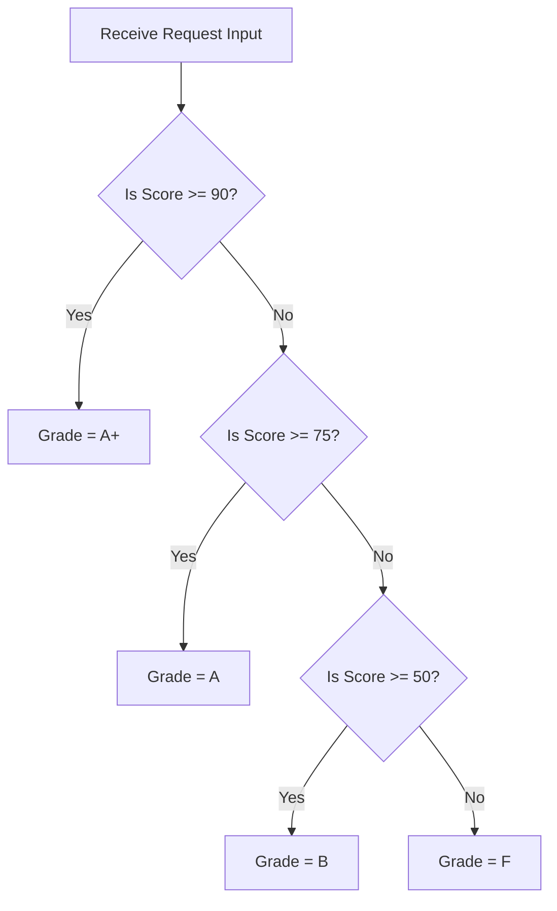

# Class 26: PHP Operators, Conditional Statements (`if-elseif-else`) & Switch Cases

**Course:** Web Technology & Cloud Computing Applications – I  
**Unit:** Unit V - Server-Side Scripting & PHP Essentials: Basics, Forms & Databases  
**Target Duration:** 2 Hours (120 Minutes Continuous Session)  
**Self-Study Guide:** Designed for complete self-study. Every technical term is explained with simple real-world analogies without omitting any technical depth.

---

## 1. Class Session Objectives
By reading and studying this lecture guide line-by-line, you will be able to:
1. Master PHP Arithmetic, String Concatenation (`.`), Assignment, and Comparison Operators.
2. Understand PHP Spaceship Operator (`<=>`) and Null Coalescing Operator (`??`).
3. Construct PHP Decision Branching using `if`, `elseif`, `else`, and Ternary operators.
4. Build multi-way switch statements (`switch`) for server-side route and option handling.

---

## 2. Recommended 2-Hour Time Allocation

| Time Range | Duration | Activity / Teaching Strategy |
|---|---|---|
| **00:00 - 00:20** | 20 Mins | **Recap & Hook:** Review PHP variables. Show string concatenation using dot operator (`.`) vs addition operator (`+`). |
| **00:20 - 00:50** | 30 Mins | **Deep Dive Theory:** PHP Operators, Spaceship operator (`<=>`), Null coalescing (`??`), `if-elseif-else`, `switch` cases. |
| **00:50 - 01:20** | 30 Mins | **Visual Diagram Breakdown:** PHP Decision Tree Flowchart & Spaceship Comparison Matrix. |
| **01:20 - 01:45** | 25 Mins | **Live Code Walkthrough:** Building a server-side grade evaluator & discount calculator script in PHP. |
| **01:45 - 02:00** | 15 Mins | **Spot Quiz & Session Wrap-Up:** Student quiz questions, Next Class Teaser. |

---

## 3. Visual Flowcharts & Architectural Diagrams

### A. PHP Decision Branching Sequence Diagram


---

## 4. Key Jargon & Beginner Vocabulary Dictionary

> [!NOTE]
> * **String Concatenation Operator (`.`):** In PHP, the single dot operator (`.`) is used to join two strings together (e.g., `"Hello " . "World"`).
> * **Spaceship Operator (`<=>`):** A 3-way comparison operator introduced in PHP 7 that compares two expressions, returning `-1` (if left < right), `0` (if left == right), or `1` (if left > right).
> * **Null Coalescing Operator (`??`):** A convenient PHP operator that returns its first operand if it exists and is not `null`; otherwise it returns its second operand (e.g., `$name = $_GET['name'] ?? 'Guest'`).
> * **Ternary Operator (`? :`):** A shorthand 3-part conditional operator (`$status = ($age >= 18) ? 'Adult' : 'Minor'`).
> * **Switch Case:** A multi-branch control structure comparing an expression against multiple matching `case` values.

---

## 5. In-Depth Topic Breakdown

### 5.1 Real-World Analogy for PHP Operators

1. **String Concatenation (`.`) vs Addition (`+`) (Glue Tape vs Math Calculator):**
   * **In PHP, `+` is strictly for math calculations!** If you write `"10" + "20"`, PHP acts like a calculator and adds them up to `30`.
   * **The Dot (`.`) is a roll of glue tape!** If you write `"10" . "20"`, PHP tapes them side-by-side to produce `"1020"`.
2. **Null Coalescing Operator (`??`) (The Backup Spare Tire):**
   * Imagine getting a flat tire on a road trip. You check your trunk for a primary tire (`$_GET['user']`). If it's missing or flat (`null`), you automatically use your backup spare tire (`'Guest'`) without crashing your trip!

---

### 5.2 PHP Spaceship Operator (`<=>`) Evaluation Table

| Expression | Comparison Condition | Return Value | Meaning |
|---|---|---|---|
| `$a <=> $b` | `$a < $b` (e.g., `1 <=> 2`) | `-1` | Left is smaller |
| `$a <=> $b` | `$a == $b` (e.g., `2 <=> 2`) | `0` | Both are equal |
| `$a <=> $b` | `$a > $b` (e.g., `3 <=> 2`) | `1` | Left is larger |

---

## 6. Practical Code Examples

### A. Grade Calculator, Null Coalescing & Switch Script

```php
<?php
// Class 26 - PHP Operators & Conditionals Script

// 1. Null Coalescing Operator (Safe fallback for parameters)
$userName = $_GET['user'] ?? "Guest Student";

// 2. Spaceship Operator Comparison
$scoreA = 85;
$scoreB = 90;
$comparison = $scoreA <=> $scoreB; // Returns -1 because 85 < 90

echo "<h2>Welcome, " . htmlspecialchars($userName) . "!</h2>";
echo "<p>Spaceship Comparison (85 <=> 90): " . $comparison . "</p>";

// 3. Decision Branching (if - elseif - else)
$marks = 78;
$grade = "";

if ($marks >= 90) {
    $grade = "A+";
} elseif ($marks >= 75) {
    $grade = "A";
} elseif ($marks >= 60) {
    $grade = "B";
} elseif ($marks >= 40) {
    $grade = "C";
} else {
    $grade = "F";
}

echo "<p>Marks: $marks | Calculated Grade: <strong>$grade</strong></p>";

// 4. Switch Case for Stream Route Selection
$streamCode = "SACS";
$streamName = "";

switch ($streamCode) {
    case "SACS":
        $streamName = "System Administration & Cyber Security";
        break;
    case "BCC":
        $streamName = "Cloud Computing Applications";
        break;
    default:
        $streamName = "General Computer Applications";
        break;
}

echo "<p>Stream Code: $streamCode -> Stream Name: $streamName</p>";
?>
```

#### Line-by-Line Code Breakdown:
1. `$_GET['user'] ?? "Guest Student"`: Uses the Null Coalescing operator to default to `"Guest Student"` if `$_GET['user']` is missing.
2. `$scoreA <=> $scoreB`: Performs 3-way spaceship comparison returning `-1`.
3. `.` operator: Concatenates strings and variables into a single output string.
4. `switch ($streamCode)`: Compares `$streamCode` string against matching stream case options.

---

## 7. Interactive Discussion & Spot Quiz

### Discussion Questions
1. How does the single dot operator (`.`) in PHP differ from the addition operator (`+`) when operating on numeric strings?
2. What is the value returned by the Null Coalescing operator (`$a ?? $b`) when `$a` is set to `null`?

### Spot Quiz
1. Which PHP operator is used for string concatenation?
   - A) `+`
   - B) `.` (Dot)
   - C) `&`
   - D) `->`
2. What does `5 <=> 10` evaluate to in PHP?
   - A) `true`
   - B) `1`
   - C) `0`
   - D) `-1`

---

## 8. Class Summary & Next Session Teaser

* **Summary:** Today we covered PHP arithmetic and string operators (`.`), the spaceship operator (`<=>`), null coalescing (`??`), `if-elseif-else` decision trees, and `switch` case routing.
* **Next Class Teaser (Class 27):** Next class we explore **PHP Iteration Loops (`while`, `for`, `foreach`), Array Processing & Script Exit Statements**!
