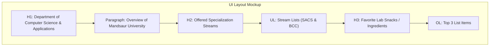

# Lab 01: Basic HTML Structure, Text Formatting, Lists & Departmental Page Creation

**Course:** Web Technology Lab & Cloud Computing Applications – I Lab  
**Course Code:** 25SACS070P / 25BCC100P  
**Covered Merged Exp:** Merged Exp 1 `[Covers: 25SACS070P Exp 1, 12 | 25BCC100P Exp 1]`  
**Target Duration:** 2 Hours (120 Minutes Continuous Lab)  
**Scaffolding Method:** 100% Scratch Coding (Blank File)  

---

## 1. Lab Session Objectives & Target Output
By the end of this 2-hour lab session, students will be able to:
1. Write a complete HTML5 document structure from scratch without using copy-paste.
2. Format text content using headings (`<h1>` to `<h6>`), paragraphs (`<p>`), and emphasis tags (`<strong>`, `<em>`).
3. Construct structured Unordered (`<ul>`) and Ordered (`<ol>`) lists.
4. Build a basic Departmental Overview Web Page detailing university course offerings.

---

## 2. 120-Minute Lab Time Breakdown

| Time Range | Duration | Activity & Teaching Strategy |
|---|---|---|
| **00:00 - 00:15** | 15 Mins | **Visual Target & Wireframe Briefing:** Show the finished departmental web page in browser and sketch DOM tree on whiteboard. |
| **00:15 - 00:45** | 30 Mins | **Guided Live-Coding Part I (Structure):** Create blank file `index.html`. Live-code `<!DOCTYPE html>`, `<html>`, `<head>`, `<body>`, and headings. |
| **00:45 - 01:15** | 30 Mins | **Guided Live-Coding Part II (Formatting & Lists):** Add paragraphs, bold/italic text, and nested lists for department streams. |
| **01:15 - 01:45** | 30 Mins | **Independent Student Challenge ("You Do"):** Add a section listing 3 main ingredients of a favorite dish or 3 lab rules using `<ol>`. |
| **01:45 - 02:00** | 15 Mins | **Troubleshooting & Viva Sign-off:** Review common unclosed tag errors, conduct viva Q&A, and sign lab record. |

---

## 3. UI Wireframe & DOM Hierarchy



---

## 4. Code Scaffolding Setup

> [!IMPORTANT]
> **Pedagogical Rule (Phase 1):** Students must open an **empty file** named `index.html` in VS Code. Do NOT use Emmet abbreviations (`!`) or copy-paste boilerplate. Type every tag manually to build syntax muscle memory.

---

## 5. Step-by-Step Guided Implementation Code Walkthrough

```html
<!DOCTYPE html>
<html lang="en">
<head>
    <meta charset="UTF-8">
    <title>CSA Department - Mandsaur University</title>
</head>
<body>

    <!-- Main Department Heading -->
    <h1>Department of Computer Science & Applications</h1>
    <p>
        Welcome to the <strong>Department of CSA</strong> at <em>Mandsaur University</em>. 
        Our department offers state-of-the-art education in web technologies, cloud computing, and cyber security.
    </p>

    <hr>

    <!-- Sub-heading for Academic Programs -->
    <h2>Bachelor of Computer Applications (BCA) - Semester III</h2>
    <p>We offer specialized streams tailored for modern industry demands:</p>

    <!-- Unordered List of Streams -->
    <ul>
        <li>
            <strong>System Administration & Cyber Security (SACS)</strong>
            <p>Focuses on network administration, operating systems, and security protocols.</p>
        </li>
        <li>
            <strong>Cloud Computing Applications (BCC)</strong>
            <p>Focuses on virtualization, cloud architecture, and server management.</p>
        </li>
    </ul>

    <h3>Core Subjects Covered This Semester:</h3>
    <!-- Ordered List of Subjects -->
    <ol type="1">
        <li>Web Technology & Cloud Computing Applications - I</li>
        <li>Operating Systems & System Administration</li>
        <li>Data Structures & Algorithms</li>
    </ol>

</body>
</html>
```

---

## 6. Student Extension Challenge Task ("You Do")

**Task Requirements (Time: 30 Mins):**
1. Add a new `<h2>` section titled `"Lab Rules & Regulations"`.
2. Create an Ordered List (`<ol type="A">`) listing at least 3 mandatory lab safety/operational rules.
3. Add a paragraph describing your favorite food dish, using `<strong>` to highlight the dish name and an Unordered List (`<ul>`) to list 3 key ingredients used in making it `[Covers: SACS Exp 12]`.

---

## 7. Common Bugs & Troubleshooting Guide

* **Bug 1: Tags rendering as plain text on screen.**
  * *Cause:* Student forgot to wrap tag in angle brackets (e.g., typing `h1 Heading h1` instead of `<h1>Heading</h1>`).
  * *Fix:* Ensure all HTML tags start with `<` and end with `>`.
* **Bug 2: Nested lists appearing unindented or broken.**
  * *Cause:* Student closed the outer `<li>` tag before placing the inner `<ol>` or `<ul>` list inside it.
  * *Fix:* Place child `<ol>`/`<ul>` elements inside parent `<li>...</li>` tags before closing.

---

## 8. Viva Voce Oral Questions & Answers

1. **Q: What is the purpose of `<!DOCTYPE html>` at the top of an HTML file?**  
   *A:* It tells the web browser that the document is written in modern HTML5 so that the browser renders it in standards mode.
2. **Q: What is the difference between an Unordered List (`<ul>`) and an Ordered List (`<ol>`)?**  
   *A:* `<ul>` renders bullet points (unordered), whereas `<ol>` renders numbered or alphabetical sequences (ordered).
