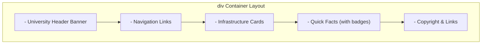

# Lab 04: Semantic Page Layout using `<div>` and `<span>` Structural Elements

**Course:** Web Technology Lab & Cloud Computing Applications – I Lab  
**Course Code:** 25SACS070P / 25BCC100P  
**Covered Merged Exp:** Merged Exp 4 `[Covers: 25SACS070P Exp 7 | 25BCC100P Exp 7]`  
**Target Duration:** 2 Hours (120 Minutes Continuous Lab)  
**Scaffolding Method:** 100% Scratch Coding (Blank File)  

---

## 1. Lab Session Objectives & Target Output
By the end of this 2-hour lab session, students will be able to:
1. Understand why modern web development replaces legacy `<table>` layouts with `<div>` containers.
2. Utilize `<div>` block elements to structure header, navigation, content, sidebar, and footer sections.
3. Utilize `<span>` inline elements to target specific words/phrases for inline styling and micro-formatting.
4. Construct a complete modular University Infrastructure web page using `<div>` and `<span>` tags.

---

## 2. 120-Minute Lab Time Breakdown

| Time Range | Duration | Activity & Teaching Strategy |
|---|---|---|
| **00:00 - 00:15** | 15 Mins | **Visual Target & Wireframe Briefing:** Compare the legacy table layout from Lab 03 with a modern `<div>` container layout. |
| **00:15 - 00:45** | 30 Mins | **Guided Live-Coding Part I (Structure):** Code header `<div>`, nav `<div>`, main content `<div>`, and footer `<div>`. |
| **00:45 - 01:15** | 30 Mins | **Guided Live-Coding Part II (Inline Spans):** Wrap specific text phrases inside `<span style="...">` tags to format badges. |
| **01:15 - 01:45** | 30 Mins | **Independent Student Challenge ("You Do"):** Add a sidebar `<div>` container with 2 status badge `<span>` tags. |
| **01:45 - 02:00** | 15 Mins | **Troubleshooting & Viva Sign-off:** Review Block vs Inline element behaviors, conduct viva Q&A, sign lab record. |

---

## 3. UI Wireframe & Container Structure



---

## 4. Code Scaffolding Setup

> [!IMPORTANT]
> Students will open a blank file named `infrastructure_div.html` and author the code line-by-line alongside the instructor.

---

## 5. Step-by-Step Guided Implementation Code Walkthrough

```html
<!DOCTYPE html>
<html lang="en">
<head>
    <meta charset="UTF-8">
    <title>University Infrastructure - Div & Span Layout</title>
</head>
<body style="font-family: Arial, sans-serif; margin: 0; padding: 0;">

    <!-- Header Block Division -->
    <div id="header" style="background-color: #003366; color: white; padding: 20px; text-align: center;">
        <h1>Mandsaur University Infrastructure</h1>
        <p>Department of Computer Science & Applications</p>
    </div>

    <!-- Navigation Block Division -->
    <div id="nav" style="background-color: #002244; color: white; padding: 10px; text-align: center;">
        <a href="#" style="color: white; margin: 0 15px; text-decoration: none;">Home</a>
        <a href="#" style="color: white; margin: 0 15px; text-decoration: none;">Labs</a>
        <a href="#" style="color: white; margin: 0 15px; text-decoration: none;">Library</a>
        <a href="#" style="color: white; margin: 0 15px; text-decoration: none;">Contact</a>
    </div>

    <!-- Main Content Container Division -->
    <div id="main-container" style="width: 80%; margin: 20px auto; overflow: hidden;">
        
        <!-- Main Content Area Division -->
        <div id="content" style="width: 65%; float: left; padding: 15px; box-sizing: border-box;">
            <h2>High-Tech Computing Labs</h2>
            <p>
                Our department features 
                <span style="color: #28a745; font-weight: bold;">5 state-of-the-art computer labs</span> 
                housing over 200 high-performance workstations connected via 1 Gbps fiber LAN.
            </p>

            <h2>Central Library Facility</h2>
            <p>
                The library offers an extensive collection of 
                <span style="background-color: #fff3cd; padding: 2px 5px;">50,000+ technical volumes</span> 
                and subscriptions to IEEE & ACM digital libraries.
            </p>
        </div>

        <!-- Sidebar Division -->
        <div id="sidebar" style="width: 35%; float: right; background-color: #f8f9fa; padding: 15px; box-sizing: border-box; border-left: 3px solid #003366;">
            <h3>Quick Campus Facts</h3>
            <ul>
                <li>Status: <span style="background-color: #28a745; color: white; padding: 2px 6px; border-radius: 4px; font-size: 0.8rem;">OPEN</span></li>
                <li>Wi-Fi Coverage: <span style="color: #003366; font-weight: bold;">100% Campus-Wide</span></li>
                <li>Hostel Capacity: <span style="color: #6c757d;">1500+ Students</span></li>
            </ul>
        </div>

    </div>

    <!-- Footer Block Division -->
    <div id="footer" style="clear: both; background-color: #333; color: white; text-align: center; padding: 15px; margin-top: 20px;">
        <p>&copy; 2026 Mandsaur University. All Rights Reserved.</p>
    </div>

</body>
</html>
```

---

## 6. Student Extension Challenge Task ("You Do")

**Task Requirements (Time: 30 Mins):**
1. Add a new `<div>` block container inside `#content` titled `"Sports & Recreation Complex"`.
2. Add a `<span>` inline element inside the sports paragraph with a red background (`#dc3545`) displaying `"NEWLY OPENED"`.
3. Add a footer `<span>` displaying `"Page Last Updated: Today"`.

---

## 7. Common Bugs & Troubleshooting Guide

* **Bug 1: Sidebar drops down below content instead of floating side-by-side.**
  * *Cause:* The total percentage width of content (65%) + sidebar (35%) + padding exceeds 100% of the parent width.
  * *Fix:* Add `box-sizing: border-box;` to both floating `<div>` elements.
* **Bug 2: Footer overlaps the floating content.**
  * *Cause:* Floating elements (`float: left`/`right`) are taken out of normal document flow.
  * *Fix:* Apply `clear: both;` CSS property to the `#footer` div container.

---

## 8. Viva Voce Oral Questions & Answers

1. **Q: What is the main structural difference between `<div>` and `<span>` tags?**  
   *A:* `<div>` is a block-level element that starts on a new line and occupies 100% width; `<span>` is an inline element that wraps text without forcing a new line.
2. **Q: Why is `clear: both` used on a footer element following floated `<div>` containers?**  
   *A:* It forces the footer element down below any preceding floated elements, preventing layout overlap.
