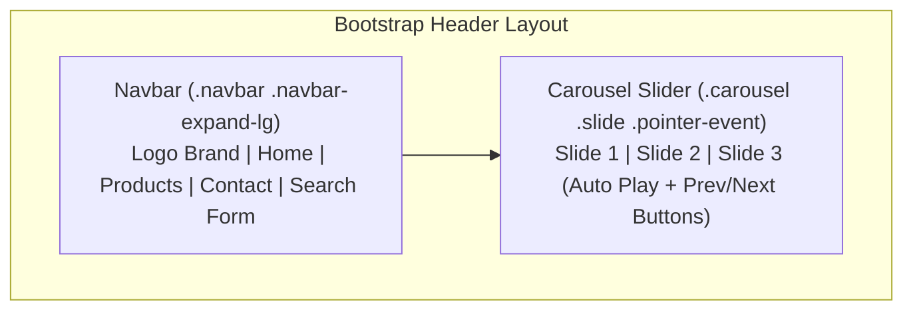

# Lab 08: Bootstrap Navigation Bar & Interactive Image Carousel

**Course:** Web Technology Lab & Cloud Computing Applications – I Lab  
**Course Code:** 25SACS070P / 25BCC100P  
**Covered Merged Exp:** Merged Exp 7 (Part 2) `[Covers: 25SACS070P Exp 18, 19 | 25BCC100P Exp 15, 16]`  
**Target Duration:** 2 Hours (120 Minutes Continuous Lab)  
**Scaffolding Method:** Scaffolded Starter Template (`TODO:` Comment Placeholders)  

---

## 1. Lab Session Objectives & Target Output
By the end of this 2-hour lab session, students will be able to:
1. Construct a responsive navigation bar (`navbar`) with branding, navigation links, and hamburger toggle menu.
2. Build an automated interactive image slider (`carousel`) with slide indicators and previous/next controls.
3. Integrate Navbar and Carousel components into a unified responsive web header layout `[Covers: SACS Exp 18, 19]`.

---

## 2. 120-Minute Lab Time Breakdown

| Time Range | Duration | Activity & Teaching Strategy |
|---|---|---|
| **00:00 - 00:15** | 15 Mins | **Visual Target & Component Briefing:** Demonstrate responsive navbar collapsing into hamburger menu and auto-sliding carousel. |
| **00:15 - 00:45** | 30 Mins | **Guided Live-Coding Part I (Navbar):** Open starter file. Complete `TODO: 1` building `.navbar`, brand logo, nav links, and collapse button. |
| **00:45 - 01:15** | 30 Mins | **Guided Live-Coding Part II (Carousel):** Complete `TODO: 2` building `.carousel`, `.carousel-inner`, slide items, indicators, and controls. |
| **01:15 - 01:45** | 30 Mins | **Independent Student Challenge ("You Do"):** Add a 3rd slide to the carousel and add a search input form inside the navbar. |
| **01:45 - 02:00** | 15 Mins | **Troubleshooting & Viva Sign-off:** Fix broken Bootstrap JS bundle links (hamburger toggle not opening), conduct viva Q&A, sign lab record. |

---

## 3. UI Wireframe & Component Architecture



---

## 4. Code Scaffolding / Starter Template

> [!NOTE]
> Provide students with this starter file (`bootstrap_nav_carousel_starter.html`).

```html
<!DOCTYPE html>
<html lang="en">
<head>
    <meta charset="UTF-8">
    <meta name="viewport" content="width=device-width, initial-scale=1.0">
    <title>Bootstrap Navbar & Carousel - Lab 08 Starter</title>
    <link href="https://cdn.jsdelivr.net/npm/bootstrap@5.3.0/dist/css/bootstrap.min.css" rel="stylesheet">
</head>
<body>

    <!-- TODO 1: Construct Responsive Navigation Bar (.navbar) -->

    <!-- TODO 2: Construct Interactive Image Carousel (.carousel) -->

    <script src="https://cdn.jsdelivr.net/npm/bootstrap@5.3.0/dist/js/bootstrap.bundle.min.js"></script>
</body>
</html>
```

---

## 5. Step-by-Step Guided Implementation Code Walkthrough

```html
<!DOCTYPE html>
<html lang="en">
<head>
    <meta charset="UTF-8">
    <meta name="viewport" content="width=device-width, initial-scale=1.0">
    <title>TechStore - Navbar & Carousel Banner</title>
    <link href="https://cdn.jsdelivr.net/npm/bootstrap@5.3.0/dist/css/bootstrap.min.css" rel="stylesheet">
</head>
<body>

    <!-- Step 1: Responsive Navigation Bar Component -->
    <nav class="navbar navbar-expand-lg navbar-dark bg-dark sticky-top">
        <div class="container">
            <a class="navbar-brand fw-bold text-primary" href="#">TechStore</a>
            
            <!-- Hamburger Menu Toggle Button for Mobile -->
            <button class="navbar-toggler" type="button" data-bs-toggle="collapse" data-bs-target="#navbarNav">
                <span class="navbar-toggler-icon"></span>
            </button>
            
            <div class="collapse navbar-collapse" id="navbarNav">
                <ul class="navbar-nav me-auto">
                    <li class="nav-item"><a class="nav-link active" href="#">Home</a></li>
                    <li class="nav-item"><a class="nav-link" href="#">Laptops</a></li>
                    <li class="nav-item"><a class="nav-link" href="#">Smartphones</a></li>
                    <li class="nav-item"><a class="nav-link" href="#">Deals</a></li>
                </ul>
                <form class="d-flex">
                    <input class="form-control me-2" type="search" placeholder="Search products...">
                    <button class="btn btn-outline-primary" type="submit">Search</button>
                </form>
            </div>
        </div>
    </nav>

    <!-- Step 2: Interactive Image Carousel Component -->
    <div id="heroCarousel" class="carousel slide" data-bs-ride="carousel">
        
        <!-- Slide Indicators -->
        <div class="carousel-indicators">
            <button type="button" data-bs-target="#heroCarousel" data-bs-slide-to="0" class="active"></button>
            <button type="button" data-bs-target="#heroCarousel" data-bs-slide-to="1"></button>
        </div>

        <!-- Carousel Slides -->
        <div class="carousel-inner">
            <div class="carousel-item active" data-bs-interval="3000">
                
                <div class="carousel-caption d-none d-md-block">
                    <h2>Mega Electronics Sale</h2>
                    <p>Upgrade your developer gear today with exclusive student discounts.</p>
                </div>
            </div>
            <div class="carousel-item" data-bs-interval="3000">
                
                <div class="carousel-caption d-none d-md-block">
                    <h2>High-Performance Laptops</h2>
                    <p>Pre-configured for Docker, Kubernetes, and Web Development.</p>
                </div>
            </div>
        </div>

        <!-- Carousel Controls (Previous / Next) -->
        <button class="carousel-control-prev" type="button" data-bs-target="#heroCarousel" data-bs-slide="prev">
            <span class="carousel-control-prev-icon"></span>
        </button>
        <button class="carousel-control-next" type="button" data-bs-target="#heroCarousel" data-bs-slide="next">
            <span class="carousel-control-next-icon"></span>
        </button>

    </div>

    <script src="https://cdn.jsdelivr.net/npm/bootstrap@5.3.0/dist/js/bootstrap.bundle.min.js"></script>

</body>
</html>
```

---

## 6. Student Extension Challenge Task ("You Do")

**Task Requirements (Time: 30 Mins):**
1. Add a 3rd slide to the carousel showcasing `"Cyber Security Tools & Accessories"`.
2. Add a dropdown menu item inside the Navbar under a `"Categories"` dropdown menu link.
3. Make the Navbar fixed to the top of the viewport using `fixed-top`.

---

## 7. Common Bugs & Troubleshooting Guide

* **Bug 1: Clicking the hamburger menu toggle button does nothing on mobile screens.**
  * *Cause:* Student omitted the Bootstrap JavaScript Bundle script tag (`bootstrap.bundle.min.js`) or mis-matched the `data-bs-target` ID with `#navbarNav`.
  * *Fix:* Verify that `data-bs-target="#idName"` matches the exact `id="idName"` of the collapse container div.
* **Bug 2: Carousel slides do not advance automatically.**
  * *Cause:* Missing `data-bs-ride="carousel"` attribute on the root `.carousel` div.
  * *Fix:* Add `data-bs-ride="carousel"` to the root carousel container.

---

## 8. Viva Voce Oral Questions & Answers

1. **Q: What is the purpose of the `navbar-expand-lg` class in Bootstrap?**  
   *A:* It specifies the breakpoint ($\ge 992\text{px}$) at which the navigation bar expands into a horizontal layout rather than collapsing into a mobile hamburger menu.
2. **Q: Why is including `bootstrap.bundle.min.js` required for Carousels and Navbars?**  
   *A:* Bootstrap interactive components rely on JavaScript event handlers (such as Popper.js and collapse scripts) bundled inside `bootstrap.bundle.min.js`.
