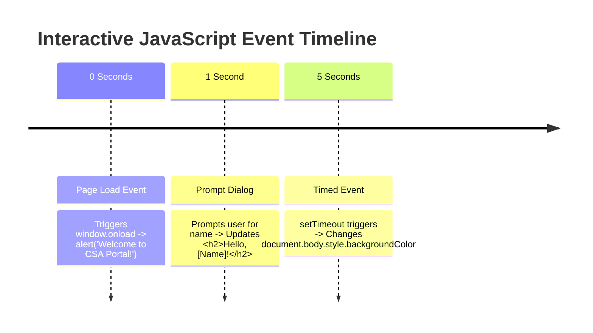

# Lab 09: JavaScript Basics, User Interaction (`prompt`, `alert`), Greetings & Timed Events

**Course:** Web Technology Lab & Cloud Computing Applications – I Lab  
**Course Code:** 25SACS070P / 25BCC100P  
**Covered Merged Exp:** Merged Exp 8 `[Covers: 25SACS070P Exp 14, 21, 22 | 25BCC100P Exp 18, 19]`  
**Target Duration:** 2 Hours (120 Minutes Continuous Lab)  
**Scaffolding Method:** Scaffolded Starter Template (`TODO:` Comment Placeholders)  

---

## 1. Lab Session Objectives & Target Output
By the end of this 2-hour lab session, students will be able to:
1. Capture user text input using `prompt()` and display welcome messages using `alert()`.
2. Dynamically render personalized user greetings inside an `<h2>` heading element `[Covers: SACS Exp 14]`.
3. Display an automatic information box popup as soon as the web page loads `[Covers: SACS Exp 21]`.
4. Program a JavaScript `setTimeout()` timer function to change page background color 5 seconds after load `[Covers: SACS Exp 22 | BCC Exp 19]`.

---

## 2. 120-Minute Lab Time Breakdown

| Time Range | Duration | Activity & Teaching Strategy |
|---|---|---|
| **00:00 - 00:15** | 15 Mins | **Visual Target & Script Briefing:** Demonstrate automatic page-load alert, prompt input greeting, and timed background color change. |
| **00:15 - 00:45** | 30 Mins | **Guided Live-Coding Part I (Prompt Greeting):** Open starter file. Complete `TODO: 1` (`prompt()`) and `TODO: 2` (DOM text update). |
| **00:45 - 01:15** | 30 Mins | **Guided Live-Coding Part II (Load Alert & Timed Event):** Complete `TODO: 3` (`window.onload` alert) and `TODO: 4` (`setTimeout` background change). |
| **01:15 - 01:45** | 30 Mins | **Independent Student Challenge ("You Do"):** Add a countdown timer text on screen showing seconds remaining before background changes. |
| **01:45 - 02:00** | 15 Mins | **Troubleshooting & Viva Sign-off:** Troubleshoot null check bugs on `prompt()`, conduct viva Q&A, sign lab record. |

---

## 3. UI Wireframe & Event Timeline



---

## 4. Code Scaffolding / Starter Template

> [!NOTE]
> Provide students with this starter file (`js_basics_starter.html`).

```html
<!DOCTYPE html>
<html lang="en">
<head>
    <meta charset="UTF-8">
    <title>JS Interactivity & Timed Events - Lab 09 Starter</title>
</head>
<body>

    <h1 id="main-heading">JavaScript Interactive Portal</h1>

    <!-- Placeholder for Personalized Greeting -->
    <h2 id="greeting-display">Waiting for user input...</h2>

    <script>
        // TODO 1: Write page-load event to trigger welcome alert()

        // TODO 2: Write prompt() to capture user name and update #greeting-display

        // TODO 3: Write setTimeout() to change background color after 5000ms (5 seconds)
    </script>

</body>
</html>
```

---

## 5. Step-by-Step Guided Implementation Code Walkthrough

```html
<!DOCTYPE html>
<html lang="en">
<head>
    <meta charset="UTF-8">
    <title>JS Interactivity & Timed Events - Lab 09 Completed</title>
    <style>
        body {
            font-family: Arial, sans-serif;
            text-align: center;
            padding: 50px;
            transition: background-color 1s ease; /* Smooth background transition */
            background-color: #ffffff;
        }
        .greeting-box {
            background: rgba(255,255,255,0.9);
            padding: 30px;
            border-radius: 10px;
            display: inline-block;
            box-shadow: 0 4px 10px rgba(0,0,0,0.1);
        }
    </style>
</head>
<body>

    <div class="greeting-box">
        <h1>Mandsaur University CSA Portal</h1>
        
        <!-- Target Greeting Heading Element -->
        <h2 id="greeting-display" style="color: #003366;">Welcome Student!</h2>
        
        <p id="timer-status">Background color will change in 5 seconds...</p>
    </div>

    <script>
        // Step 1: Display Info Box on Page Load (Exp 21)
        window.onload = function() {
            alert("Welcome to the Web Technology & Cloud Computing Interactive Lab!");
            
            // Step 2: Prompt User for Name (Exp 14)
            const userName = prompt("Please enter your full name:", "Rahul Dhangar");

            // Null check and string validation
            if (userName !== null && userName.trim() !== "") {
                const greetingElement = document.getElementById("greeting-display");
                greetingElement.innerText = "Hello, " + userName + "!";
                greetingElement.style.color = "#28a745";
            }
        };

        // Step 3: Timed Background Color Change after 5 Seconds (Exp 22 / BCC Exp 19)
        setTimeout(function() {
            // Change body background color to light teal (#e0f7fa)
            document.body.style.backgroundColor = "#e0f7fa";
            
            // Update status text
            document.getElementById("timer-status").innerText = "Background color changed automatically after 5 seconds!";
            document.getElementById("timer-status").style.color = "#006699";
        }, 5000); // 5000 milliseconds = 5 seconds
    </script>

</body>
</html>
```

---

## 6. Student Extension Challenge Task ("You Do")

**Task Requirements (Time: 30 Mins):**
1. Add a second `setTimeout()` timer that resets the background color back to light yellow (`#fffde7`) after 10 seconds.
2. Add a button `<button onclick="askNameAgain()">Change Name</button>` allowing the user to re-trigger the prompt greeting manually.
3. Display the exact timestamp of when the user entered their name.

---

## 7. Common Bugs & Troubleshooting Guide

* **Bug 1: Heading text displays `"Hello, null!"` when user clicks Cancel.**
  * *Cause:* Student did not include a `null` check on the string returned by `prompt()`.
  * *Fix:* Wrap DOM update inside `if (userName !== null && userName !== "") { ... }`.
* **Bug 2: Background color changes instantly instead of waiting 5 seconds.**
  * *Cause:* Passing invoked function `setTimeout(changeColor(), 5000)` instead of function reference `setTimeout(changeColor, 5000)`.
  * *Fix:* Omit parentheses `()` when passing callback functions into `setTimeout`.

---

## 8. Viva Voce Oral Questions & Answers

1. **Q: What is the unit of time used in JavaScript's `setTimeout()` function?**  
   *A:* Milliseconds ($1\text{ second} = 1000\text{ milliseconds}$).
2. **Q: What does `prompt()` return if the user clicks the "Cancel" button?**  
   *A:* It returns `null`.
