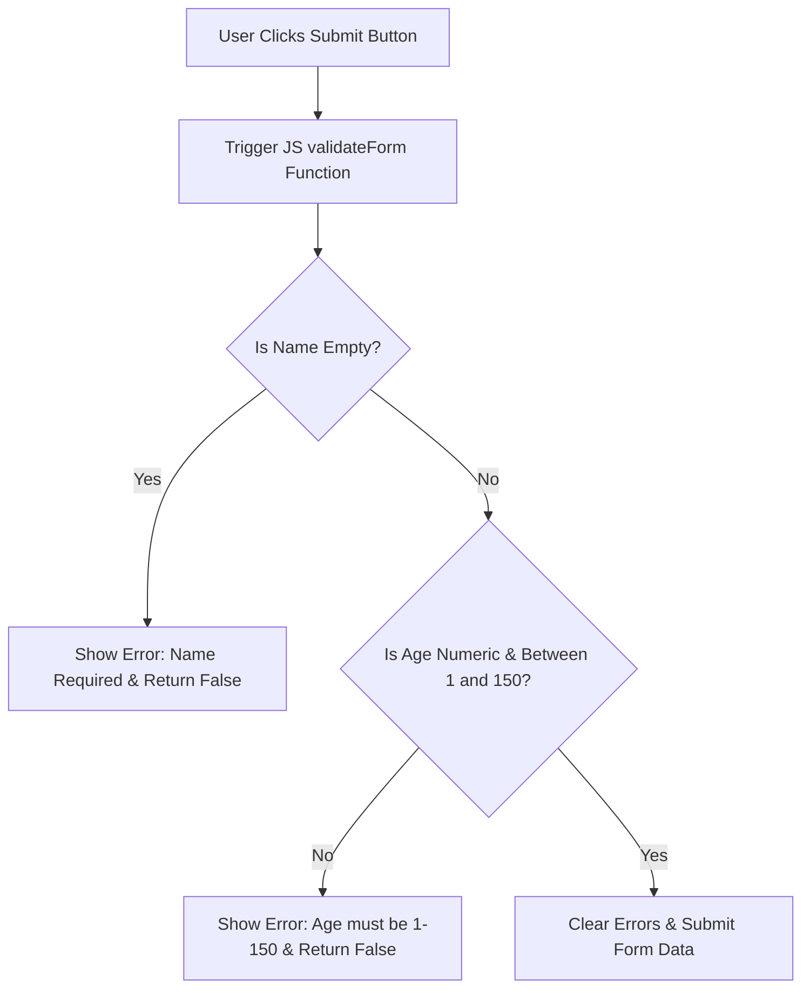

# Lab 10: Client-Side Form Validation using JavaScript

**Course:** Web Technology Lab & Cloud Computing Applications – I Lab  
**Course Code:** 25SACS070P / 25BCC100P  
**Covered Merged Exp:** Merged Exp 9 `[Covers: 25SACS070P Exp 20 | 25BCC100P Exp 17]`  
**Target Duration:** 2 Hours (120 Minutes Continuous Lab)  
**Scaffolding Method:** Scaffolded Starter Template (`TODO:` Comment Placeholders)  

---

## 1. Lab Session Objectives & Target Output
By the end of this 2-hour lab session, students will be able to:
1. Attach JavaScript submit event handlers (`onsubmit`) to HTML forms.
2. Validate user input constraints (Non-empty text, numeric age limits between 1 and 150) `[Covers: SACS Exp 20 | BCC Exp 17]`.
3. Prevent form submission when validation fails using `event.preventDefault()` or `return false`.
4. Render inline error messages next to invalid form fields dynamically.

---

## 2. 120-Minute Lab Time Breakdown

| Time Range | Duration | Activity & Teaching Strategy |
|---|---|---|
| **00:00 - 00:15** | 15 Mins | **Visual Target & Script Briefing:** Demonstrate submitting invalid form data vs valid data. Show inline red validation messages. |
| **00:15 - 00:45** | 30 Mins | **Guided Live-Coding Part I (Form Setup):** Open starter file. Complete `TODO: 1` building form fields and error message `<span>` elements. |
| **00:45 - 01:15** | 30 Mins | **Guided Live-Coding Part II (Validation JS):** Complete `TODO: 2` writing `validateForm()` JS checking age (1–150) and returning false on error. |
| **01:15 - 01:45** | 30 Mins | **Independent Student Challenge ("You Do"):** Add a validation rule requiring Password length to be at least 6 characters. |
| **01:45 - 02:00** | 15 Mins | **Troubleshooting & Viva Sign-off:** Fix form submitting despite validation errors, conduct viva Q&A, sign lab record. |

---

## 3. UI Wireframe & Form Validation Logic



---

## 4. Code Scaffolding / Starter Template

> [!NOTE]
> Provide students with this starter file (`form_validation_starter.html`).

```html
<!DOCTYPE html>
<html lang="en">
<head>
    <meta charset="UTF-8">
    <title>JS Form Validation - Lab 10 Starter</title>
</head>
<body>

    <h2>Student Registration Form Validation</h2>

    <form id="regForm" action="success.html" onsubmit="return validateForm()">
        
        <!-- TODO 1: Add Name Field with Error Span -->

        <!-- TODO 2: Add Age Field with Error Span (Must be 1 - 150) -->

        <!-- TODO 3: Add Submit Button -->

    </form>

    <script>
        // TODO 4: Write validateForm() JavaScript function
    </script>

</body>
</html>
```

---

## 5. Step-by-Step Guided Implementation Code Walkthrough

```html
<!DOCTYPE html>
<html lang="en">
<head>
    <meta charset="UTF-8">
    <title>JS Form Validation - Lab 10 Completed</title>
    <style>
        body { font-family: Arial, sans-serif; padding: 30px; background-color: #f4f6f9; }
        .form-card { max-width: 450px; margin: 0 auto; background: white; padding: 25px; border-radius: 8px; box-shadow: 0 4px 8px rgba(0,0,0,0.1); }
        .form-group { margin-bottom: 15px; }
        .form-group label { display: block; margin-bottom: 5px; font-weight: bold; }
        .form-group input { width: 100%; padding: 8px; box-sizing: border-box; }
        .error-msg { color: #dc3545; font-size: 0.85rem; margin-top: 4px; display: block; }
    </style>
</head>
<body>

    <div class="form-card">
        <h2>Student Registration</h2>

        <!-- Step 1: Form with onsubmit event returning validateForm() -->
        <form id="regForm" action="#" onsubmit="return validateForm()">
            
            <div class="form-group">
                <label for="studentName">Full Name:</label>
                <input type="text" id="studentName" name="studentName">
                <span id="nameError" class="error-msg"></span>
            </div>

            <div class="form-group">
                <label for="studentAge">Age (Years):</label>
                <input type="text" id="studentAge" name="studentAge">
                <span id="ageError" class="error-msg"></span>
            </div>

            <div class="form-group">
                <input type="submit" value="Validate & Submit" style="background:#003366; color:white; border:none; padding:10px; cursor:pointer;">
            </div>

        </form>
    </div>

    <!-- Step 2: Validation JavaScript Logic -->
    <script>
        function validateForm() {
            // Clear previous error messages
            document.getElementById("nameError").innerText = "";
            document.getElementById("ageError").innerText = "";

            let isValid = true;

            // Extract input values
            const nameValue = document.getElementById("studentName").value.trim();
            const ageValue = document.getElementById("studentAge").value.trim();

            // 1. Validate Name Non-Empty
            if (nameValue === "") {
                document.getElementById("nameError").innerText = "Full Name is required.";
                isValid = false;
            }

            // 2. Validate Age Numeric & Between 1 and 150 (Exp 20 Task)
            const ageNumber = Number(ageValue);
            if (ageValue === "" || isNaN(ageNumber)) {
                document.getElementById("ageError").innerText = "Age must be a valid number.";
                isValid = false;
            } else if (ageNumber < 1 || ageNumber > 150) {
                document.getElementById("ageError").innerText = "Age must be a value between 1 and 150.";
                isValid = false;
            }

            // Return true if all checks pass; false prevents form submission
            if (isValid) {
                alert("Validation Passed! Form data ready for submission.");
            }
            return isValid;
        }
    </script>

</body>
</html>
```

---

## 6. Student Extension Challenge Task ("You Do")

**Task Requirements (Time: 30 Mins):**
1. Add an Email field and validate that it contains an `@` symbol and a dot `.`.
2. Highlight input border in red (`border: 2px solid red`) when a field fails validation.
3. Reset input border back to normal when user re-types valid input.

---

## 7. Common Bugs & Troubleshooting Guide

* **Bug 1: Form submits to server despite validation errors.**
  * *Cause:* Missing `return` keyword in HTML attribute (`onsubmit="validateForm()"` instead of `onsubmit="return validateForm()"`).
  * *Fix:* Ensure HTML attribute reads `onsubmit="return validateForm()"`.
* **Bug 2: Age "25" treated as text instead of number.**
  * *Cause:* Form input `.value` always returns a String.
  * *Fix:* Explicitly cast string to number using `Number(ageValue)` or `parseInt(ageValue, 10)`.

---

## 8. Viva Voce Oral Questions & Answers

1. **Q: Why must `return false` be returned by the `onsubmit` event handler when validation fails?**  
   *A:* Returning `false` cancels the default browser form submission event, preventing invalid data from being transmitted to the server.
2. **Q: How does `isNaN()` function work in JavaScript validation?**  
   *A:* `isNaN(val)` (Is Not a Number) returns `true` if the value cannot be parsed into a valid number.
