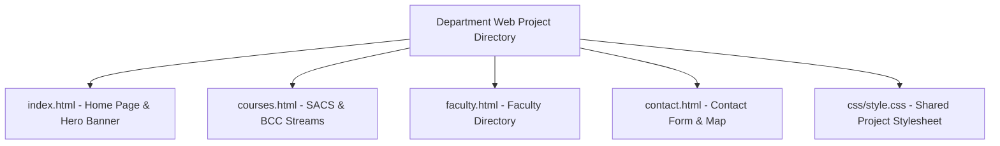

# Lab 12: Comprehensive Departmental Website Project (Part 1)

**Course:** Web Technology Lab & Cloud Computing Applications – I Lab  
**Course Code:** 25SACS070P / 25BCC100P  
**Covered Merged Exp:** Merged Exp 11 (Session 1 of 2) `[Covers: 25SACS070P Exp 25 | 25BCC100P Exp 22]`  
**Target Duration:** 2 Hours (120 Minutes Continuous Lab)  
**Scaffolding Method:** Skeleton Project Template  

---

## 1. Lab Session Objectives & Target Output
By the end of this 2-hour lab session, students will be able to:
1. Synthesize HTML, CSS, and JavaScript skills into a multi-page departmental website project.
2. Construct a multi-page site structure (`index.html`, `courses.html`, `faculty.html`, `contact.html`).
3. Build unified navigation bars, hero banners, infrastructure cards, and media galleries.
4. Implement consistent branding and layout across all departmental pages `[Covers: SACS Exp 25 | BCC Exp 22]`.

---

## 2. 120-Minute Lab Time Breakdown

| Time Range | Duration | Activity & Teaching Strategy |
|---|---|---|
| **00:00 - 00:15** | 15 Mins | **Visual Target & Project Briefing:** Demonstrate the complete multi-page departmental website structure and navigation workflow. |
| **00:15 - 00:45** | 30 Mins | **Guided Live-Coding Part I (Homepage & Layout):** Set up project directory. Build shared `header`, `navbar`, and `index.html` hero section. |
| **00:45 - 01:15** | 30 Mins | **Guided Live-Coding Part II (Courses & Faculty Pages):** Build `courses.html` stream cards and `faculty.html` profile directory. |
| **01:15 - 01:45** | 30 Mins | **Independent Student Challenge ("You Do"):** Build `contact.html` with an embedded Google Map iframe and inquiry form. |
| **01:45 - 02:00** | 15 Mins | **Troubleshooting & Viva Sign-off:** Fix relative link navigation errors across subpages, conduct viva Q&A, sign lab record. |

---

## 3. Multi-Page Site Architecture



---

## 4. Code Scaffolding / Project Skeleton

> [!NOTE]
> Provide students with the multi-page folder skeleton containing `css/style.css` pre-linked.

---

## 5. Step-by-Step Guided Implementation Code Walkthrough

#### Shared Stylesheet: `css/style.css`
```css
/* css/style.css - Department Project Stylesheet */
body { font-family: 'Segoe UI', Arial, sans-serif; margin: 0; padding: 0; background-color: #f8f9fa; }
.navbar { background-color: #003366; padding: 15px; text-align: center; }
.navbar a { color: white; margin: 0 15px; text-decoration: none; font-weight: bold; }
.navbar a:hover { color: #ffeb3b; }
.container { width: 85%; max-width: 1100px; margin: 30px auto; }
.hero-banner { background: linear-gradient(rgba(0,51,102,0.8), rgba(0,51,102,0.8)), url('../images/campus.jpg'); background-size: cover; color: white; text-align: center; padding: 60px 20px; }
.card-grid { display: flex; gap: 20px; flex-wrap: wrap; margin-top: 20px; }
.card { flex: 1; min-width: 280px; background: white; border-radius: 8px; padding: 20px; box-shadow: 0 4px 6px rgba(0,0,0,0.1); }
footer { background: #111; color: white; text-align: center; padding: 20px; margin-top: 40px; }
```

#### Homepage: `index.html`
```html
<!DOCTYPE html>
<html lang="en">
<head>
    <meta charset="UTF-8">
    <title>Dept of CSA - Mandsaur University</title>
    <link rel="stylesheet" href="css/style.css">
</head>
<body>

    <!-- Shared Header Navigation -->
    <div class="navbar">
        <a href="index.html">Home</a>
        <a href="courses.html">Courses & Streams</a>
        <a href="faculty.html">Faculty Directory</a>
        <a href="contact.html">Contact Us</a>
    </div>

    <!-- Hero Banner -->
    <div class="hero-banner">
        <h1>Department of Computer Science & Applications</h1>
        <p>Empowering Innovation in Web Technologies, Cloud Computing & Cyber Security</p>
    </div>

    <div class="container">
        <h2>Department Overview</h2>
        <p>The Department of CSA at Mandsaur University provides rigorous academic and practical training...</p>
        
        <div class="card-grid">
            <div class="card">
                <h3>SACS Stream</h3>
                <p>System Administration & Cyber Security specialization focusing on network defenses.</p>
                <a href="courses.html">Learn More &rarr;</a>
            </div>
            <div class="card">
                <h3>BCC Stream</h3>
                <p>Cloud Computing Applications specialization focusing on AWS, Azure & Docker.</p>
                <a href="courses.html">Learn More &rarr;</a>
            </div>
        </div>
    </div>

    <footer>
        <p>&copy; 2026 Department of CSA, Mandsaur University.</p>
    </footer>

</body>
</html>
```

---

## 6. Student Extension Challenge Task ("You Do")

**Task Requirements (Time: 30 Mins):**
1. Complete `faculty.html` with a grid of 3 faculty profiles (Name, Designation, Specialization, Email).
2. Complete `contact.html` embedding an inquiry form and university map iframe.
3. Highlight the active page link in the navigation bar using class `active`.

---

## 7. Common Bugs & Troubleshooting Guide

* **Bug 1: CSS styles fail to load on subpages (`courses.html`).**
  * *Cause:* Incorrect relative path in `<link href="...">` (e.g. `style.css` instead of `css/style.css`).
  * *Fix:* Verify relative path `css/style.css` across all HTML files.

---

## 8. Viva Voce Oral Questions & Answers

1. **Q: Why is modular multi-page directory structuring important in web projects?**  
   *A:* It separates concerns, organizes assets (HTML, CSS, JS, Images) logically, and ensures scalable maintainability.
2. **Q: How do you maintain visual consistency across multiple web pages?**  
   *A:* By linking a shared external CSS stylesheet (`css/style.css`) and maintaining standardized header/footer structures.
